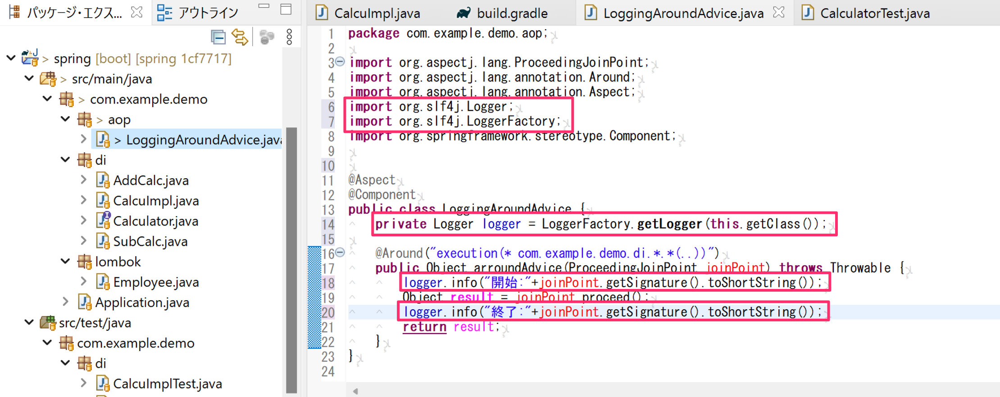

# AOP

## AOPの確認

### AOPの依存関係の追加

- AOPを利用するためには、プロジェクトにAOPの依存関係を追加する必要があります。
- 下図のように`build.gradle`ファイルの`dependencies`のブロックにAOPの依存関係を追加します。
  - `implementation 'org.springframework.boot:spring-boot-starter-aop'`

### AOPクラス（Aspect）の作成

`src/main/java`の中の`com.example.demo`パッケージの中に`aop`パッケージを作り、`LoggingAroundAdvice.java`クラスを作成します。
- 下図のようにAOPクラスを実装します。
  - `@Aspect`アノテーションを付与
  - `@Component`アノテーションを付与
  - `@Arround`アノテーションを付与した`arroundAdvice`メソッドを実装

- AOPが処理前後に処理する対象のクラスである`com.example.demo.di`パッケージのクラスである`AddCalc`を動かしてみます。
- `CalclatorTest`を実行してみるとコンソールにてAspectクラスの処理が実行されている事が確認できます。

## 演習

- 上記で作った`LoggingAroundAdvice`クラスについて実行前後のコンソール出力を`System.out.println`ではなく`org.slf4j.Logger`を使って出力するように修正してください。
- 次の情報を参考に修正してください。

### 修正内容

### 出力結果

- `CalculatorTest`を実行すると下記のログが出力されることを確認してください。
  - 次のようにテストケース実行毎にログ形式でコンソール出力される。
  - 「開始」および「終了」の後ろに「クラス名.メソッド名()」が出力される。
    - `jointPoint.getSignature().toShortString()`で出力している。

### 解答例

