# DIの演習

## クラス依存（実装依存）の確認

- テキストに書いてあるクラス依存についてDIを使って確認します。
- `src/main/java`の`com.example.demo.di`パッケージの中に`CalcuImple.java`クラスを作成します。

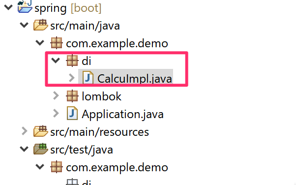

- 下図のように`@Component`アノテーションを付与し、addメソッドを実装します。

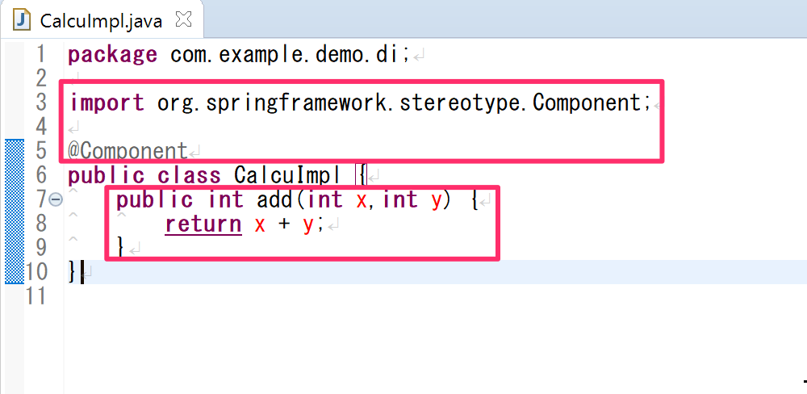

- `src/test/java`の`com.example.demo.di`パッケージの中に`CalcuImpleTest.java`クラスを作成します。

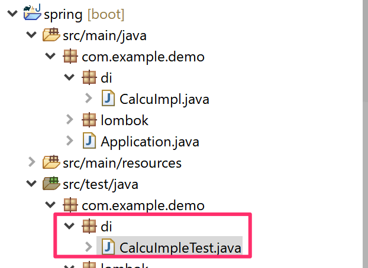

- 下図のようにテストクラスを実装します。
  - クラス名の上に`@SpringBootTest`と`@ExtendWith`アノテーションを追加する。
    - SpringBootを起動させてテストする場合には`@SpringBootTest`と`@ExtendWith`アノテーションが必要です。
  - `@Autowired`アノテーションで`CalcuImple`インスタンスをDIする。
  - `@Test`アノテーションを付与した`testAdd`メソッドを実行して`add`メソッドが動くか確認する。

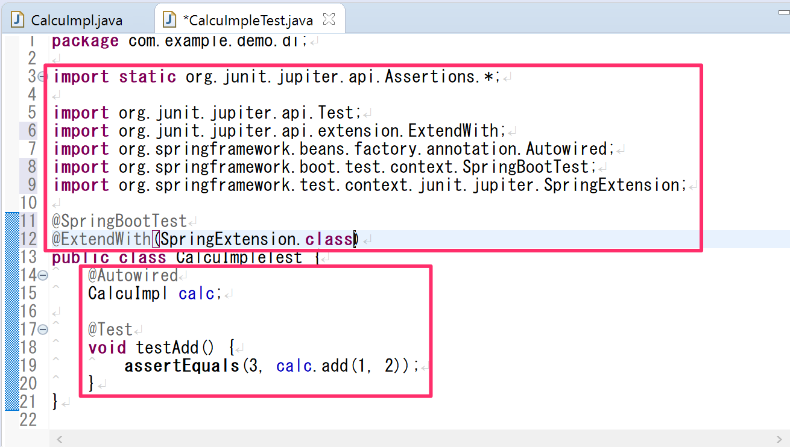

テストに合格する事を確認してください。

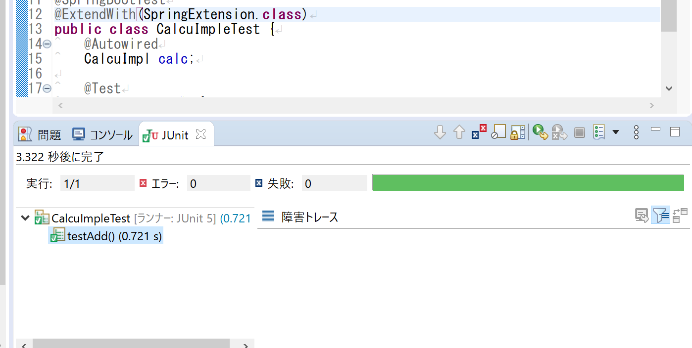

## インターフェース依存の確認

- テキストに書いてあるインターフェイス依存についてDIを使って確認します。
- `src/main/java`の`com.example.demo.di`パッケージの中に`Calculator.java`インターフェースを作成して`calc`の抽象メソッドを定義します。

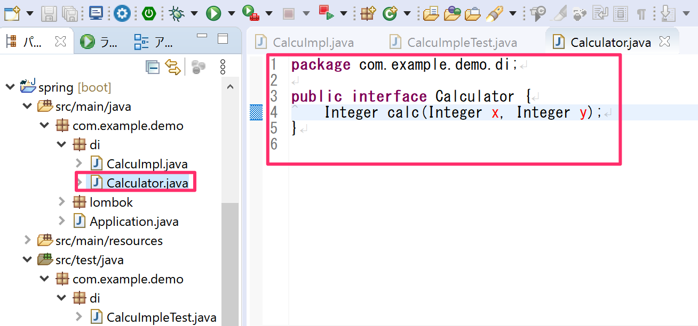

- 次に`src/main/java`の`com.example.demo.di`パッケージの中に`AddCalc.java`クラスを作成して`Calculator`インターフェースの`calc`の抽象メソッドをオーバーライドして実装します。

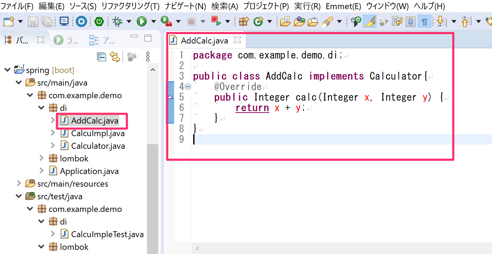

同様に`src/main/java`の`com.example.demo.di`パッケージの中に`SubCalc.java`クラスを作成して`Calculator`インターフェースの`calc`の抽象メソッドをオーバーライドして実装します。

- `src/test/java`の`com.example.demo.di`パッケージの中に`CalculatorTest.java`のテストクラスを作成し下記のようにテストを実装します。
  - `@SpringBootTest`と`@ExtendWith`アノテーションを付与する。
  - `@Autowired`アノテーションで`Calculator`のインスタンスをDIする。
  - `@Test`アノテーションを付与した`testAdd`メソッドを実行して`add`メソッドが動くか確認する。

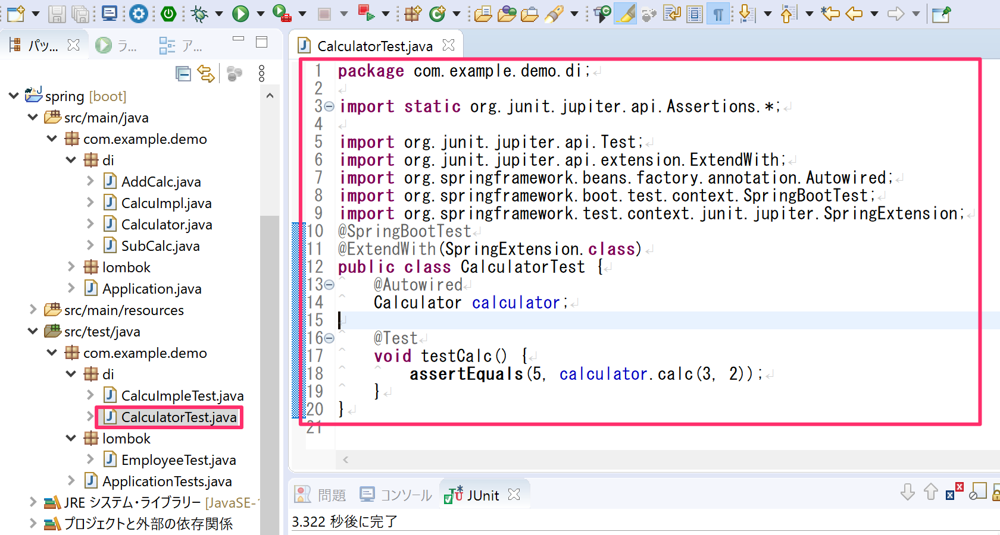

- テストに失敗する事を確認してください。
  - 今はまだ`Calculator`インターフェースを実装したクラスに`@Component`アノテーションを付与していないので`UnsatisfiedDependencyException`が発生します。

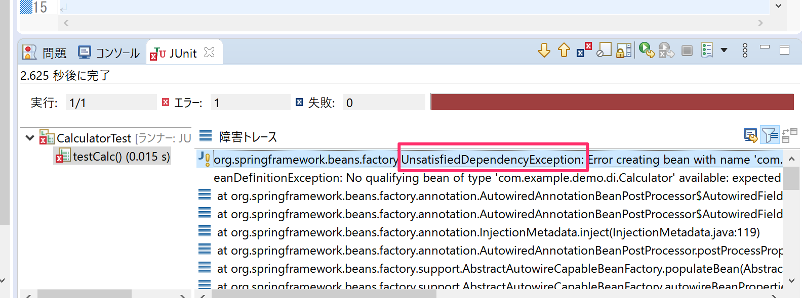

`AddCalc`に`@Component`アノテーションを付与しましょう。

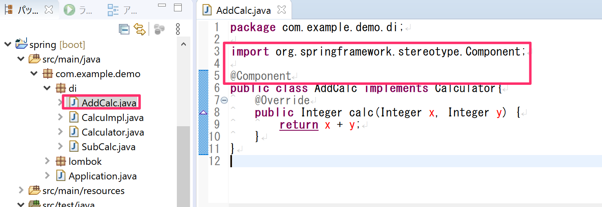

- テストに合格する事を確認してください。

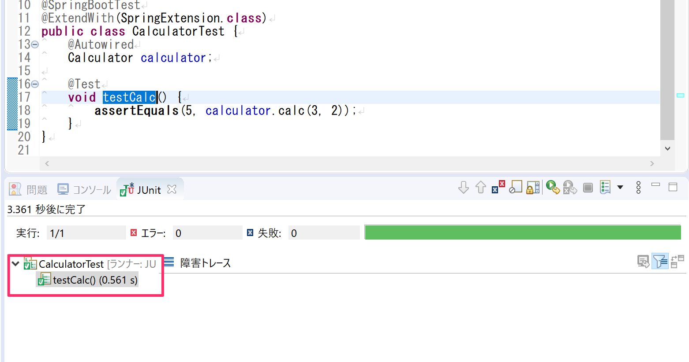

- 次に`SubCalc`にも`@Component`アノテーションを付与します。

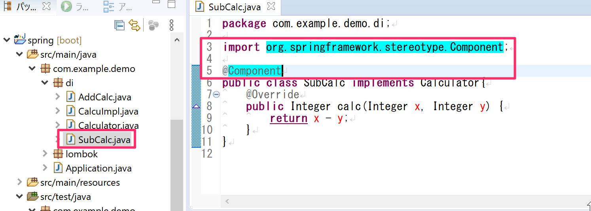

- この状態でテストを実行するとまた`UnsatisfiedDependencyException`が発生してテストに失敗します。
  - これは`Calculator`インターフェースを実装した2つのクラスに`@Component`アノテーションを付与した事によりどちらの実装クラスをDIすべきか判断できなくなったためです。

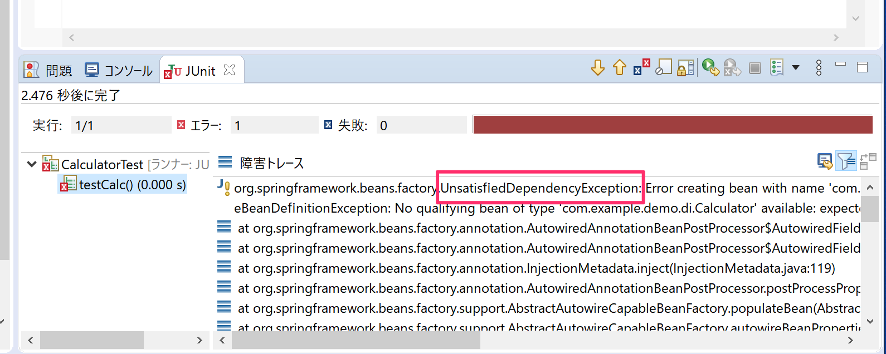

- このように同じインターフェースを実装したクラスが複数ある場合は、DIしたいクラスの先頭を小文字にした変数名をつけることによりDIするクラスを指定する事ができます。

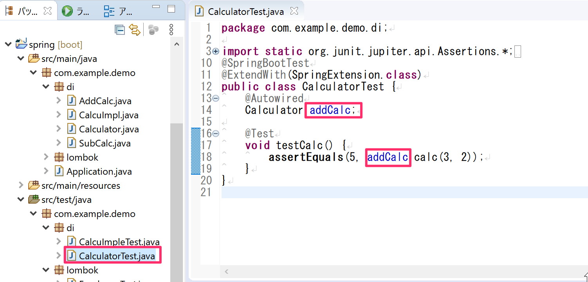

- これでテストがまた合格するようになります。

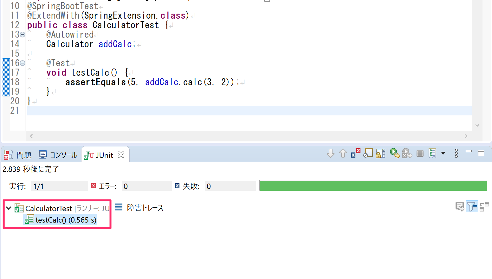

## 演習1

- Spring FrameworkのDIを使ってクラス依存を確認しなさい。
  - `src/main/java`の`com.example.demo.di`パッケージの中に`MorningGreet.java`クラスを作成する。
  - `@Component`アノテーションを付与する。
  - 下記のメソッドを実装する。

戻り値型|メソッド名|引数|内容
---|---|---|---
String|say|String name|「nameさん、おはようございます」を戻す

- `src/test/java`の`com.example.demo.di`パッケージの中に`MorningGreetTest.java`クラスを作成する。
- 下記のメソッドを実装する。

戻り値型|メソッド名|引数|内容
---|---|---|---
void|testSay|なし|「nameさん、おはようございます」が戻ることをテストする

## 演習2

- Spring FrameworkのDIを使ってインターフェース依存を確認しなさい。
  - `src/main/java`の`com.example.demo.di`パッケージの中に`Greetable.java`インターフェースを作成する。
  - 下記の抽象メソッドを定義する。

戻り値型|メソッド名|引数
---|---|---
String|say|String name

- `src/main/java`の`com.example.demo.di`パッケージの中に`EveningGreet.java`クラスを作成する。
- `@Component`アノテーションを付与する。
- 下記のメソッドを実装する。

戻り値型|メソッド名|引数|内容
---|---|---|---
String|say|String name|「nameさん、こんばんは」を戻す

- `src/test/java`の`com.example.demo.di`パッケージの中に`GreetableTest.java`クラスを作成する。
- 下記のメソッドを実装する。

戻り値型|メソッド名|引数|内容
---|---|---|---
void|testSay|なし|「nameさん、こんばんは」が戻ることをテストする