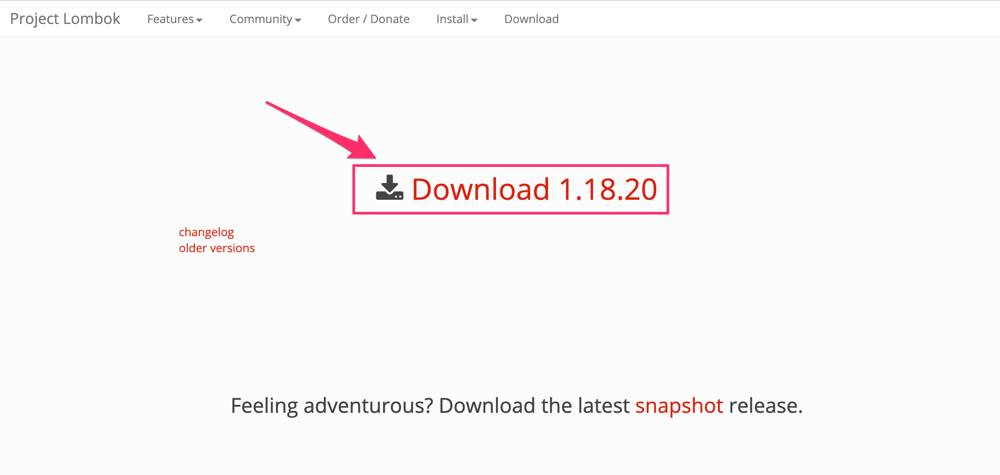
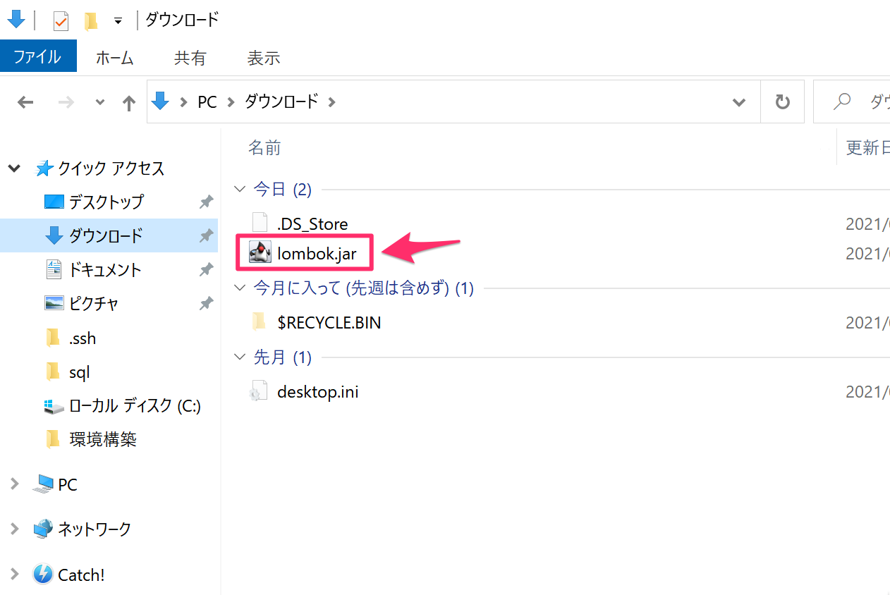
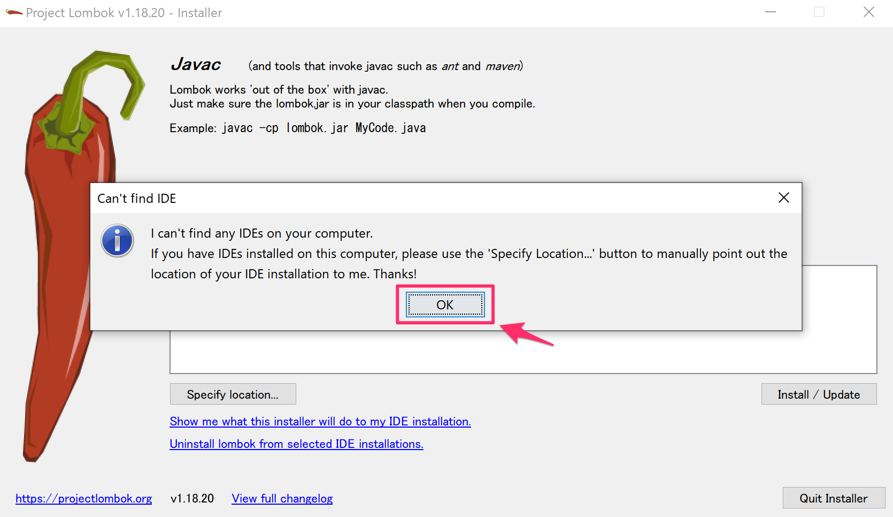
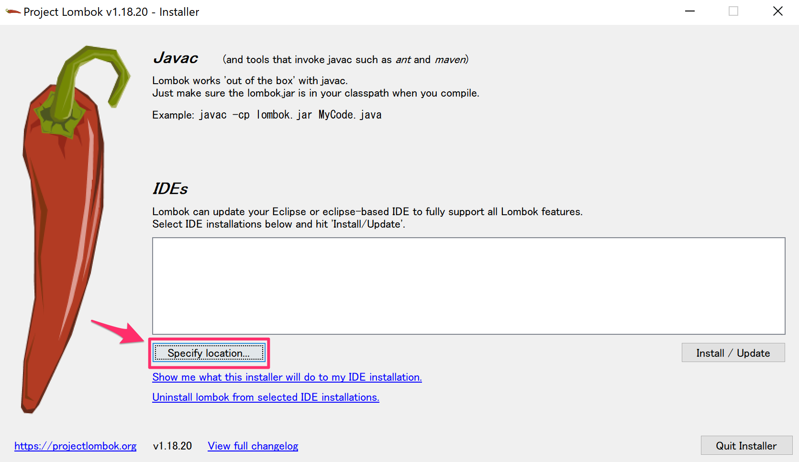
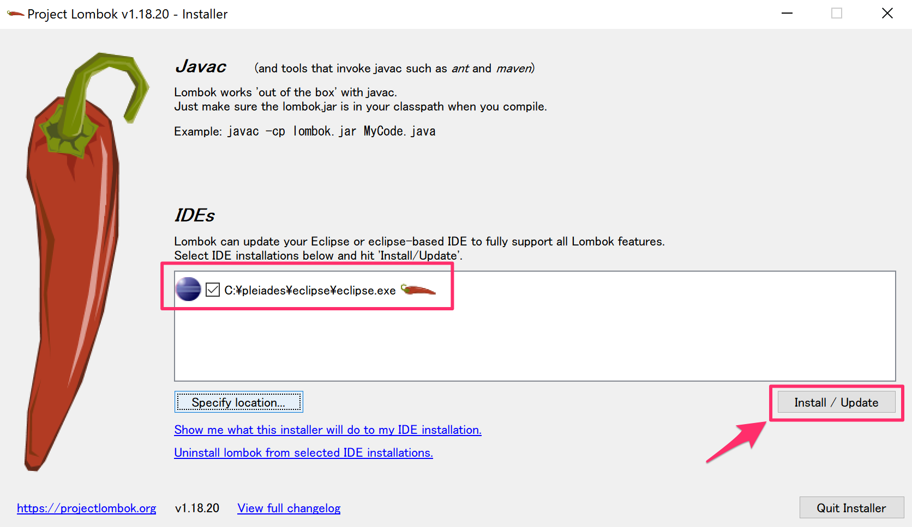
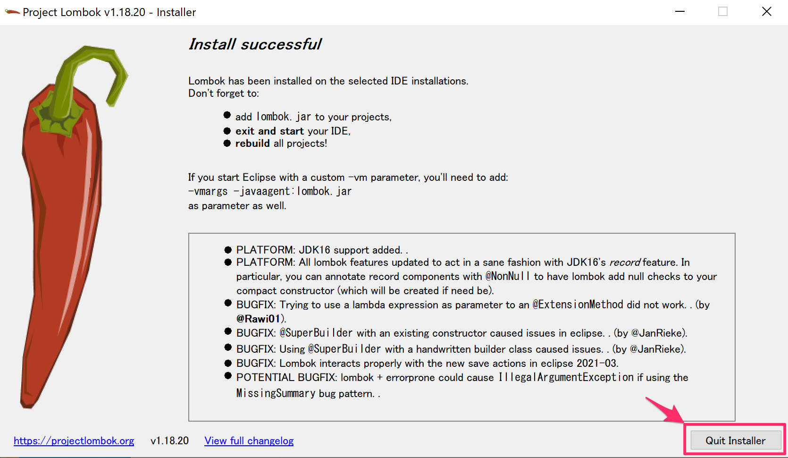

# eclipseにlombokをインストール

## lombok.jarのダウンロード

ブラウザで下記のURLにアクセスします。

https://projectlombok.org/download

矢印の箇所をクリックしてlombok.jarをダウンロードします。

ダウンロードしたlombok.jarファイルをダブルクリックします。

下図のようにダイアログが表示した場合は「OK」ボタンをクリックしてください。

「Specify location...」のボタンをクリックし、eclipse.exeがある場所を選択してください。

「Install/Update」ボタンをクリックします。

「Quit Installer」ボタンをクリックして終了してください。

以上