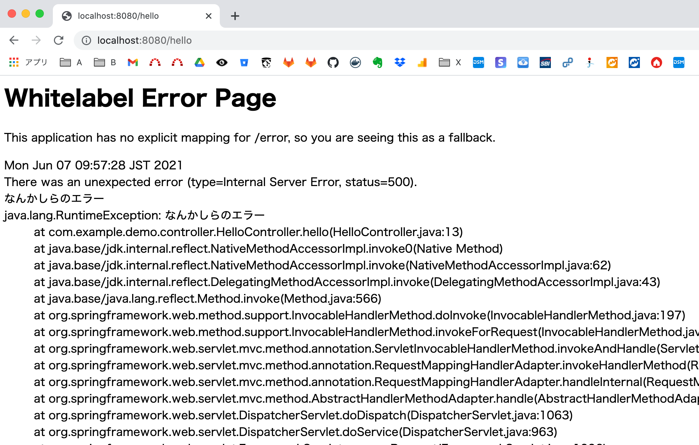
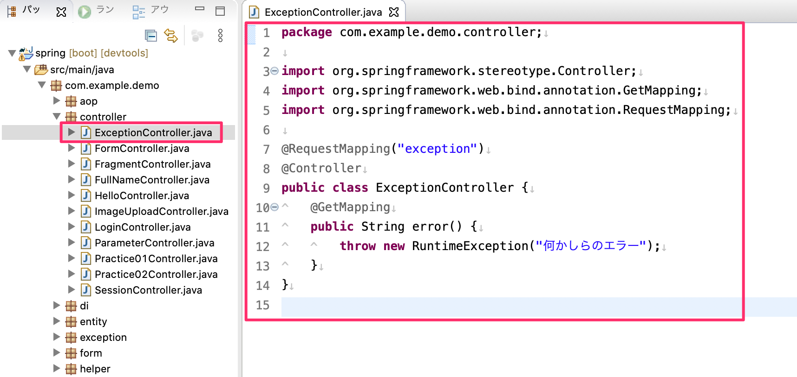
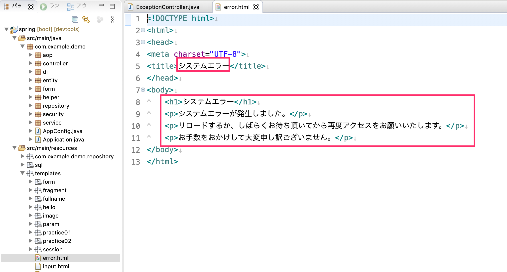
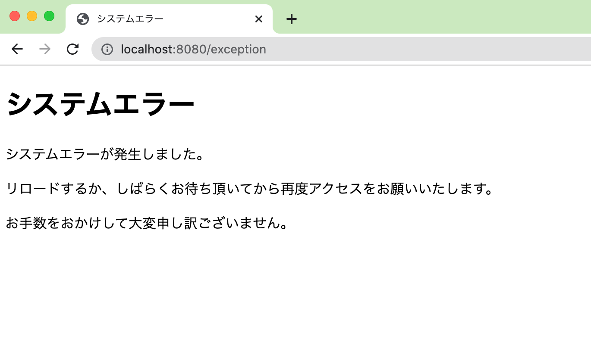
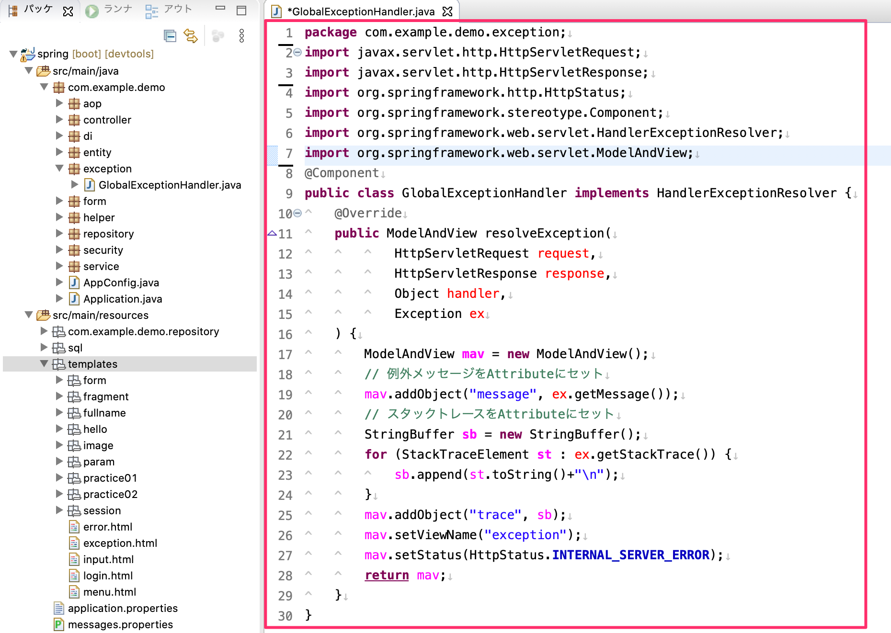
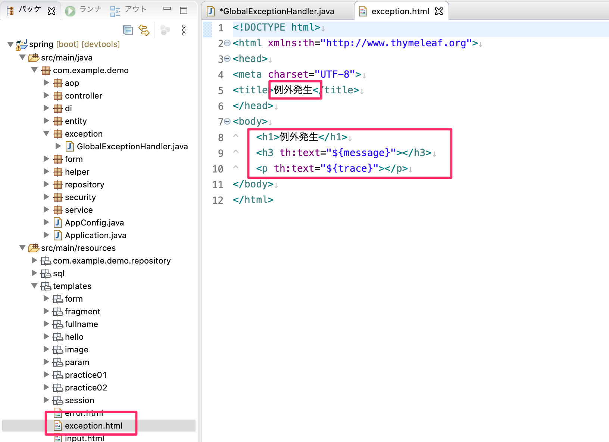
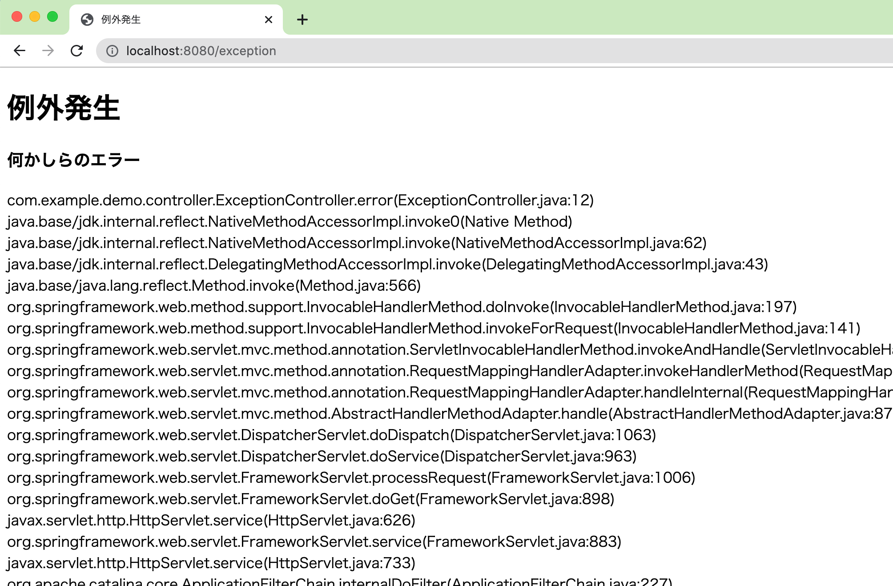

# 例外処理

例外発生時は現在、次のような例外メッセージを表示したエラー画面がSpring MVCの標準として出力されていると思います。

この状態だと知っている人からすればすぐSpring Frameworkで作られているかがわかってしまうのでよろしくありません。

## 意図的に例外を発生させるコントローラーを作成

意図的に例外を発生させるコントローラーを作成します。
- `controller`パッケージの中に`ExceptionController`をクラスを作成します。
  - `@GetMapping`のハンドラメソッドで意図的に`RuntimeException`のエラーを発生させます。

## エラー画面の作成

Spring Framework（MVC）から出力されているものから独自の画面に変更したい場合は`src/main/resources/template`の直下に`error.html`を配置します。

これによりSpring Frameworkからだすエラー画面ではなく、任意に実装したViewを表示することができます。

### 動作の確認

それでは意図的に例外を発生させます。`http://localhost:8080/exception`にアクセスして下図の画面を表示する事を確認してください。

これでSpring Frameworkから出力されるメッセージは隠蔽できます。

**もし、このエラー画面を出し続ける場合にはこれ以降は問題発生時はコンソールを見て問題解決してください。（納品直前までこのhtmlはつくらなくてもいいかもしれませんね。）**

## Spring Boot全体の例外をキャッチする方法

### 全体の例外をキャッチするクラスの作成

Spring Bootアプリケーション実行後で発生した例外を一つのクラスで受け取り、何か処理を加えてViewをかえしたい場合には`HandlerExceptionResolver`インターフェースを実装したクラスを作成します。
- 今回は`GlobalExceptionHandler`という名前のクラスを`com.example.demo.exception`パッケージに作成しています。
- `@Component`を付与してDI対象（Bean）にします。
- `HandlerExceptionResolver`インターフェースをクラスに追加します。
- `HandlerExceptionResolver`インターフェースの`resolveException`メソッドをオーバーライドします。
  - このメソッドもハンドラメソッドなのですが、戻り値が`ModelAndView`になっているのが特徴です。
  - `ModelAndView`はModelインターフェースとViewの両方を内包しているオブジェクトです。
  - `ModelAndView`にAttributeを追加するには`addObject`でセットできます。
    - 今回は例外のメッセージ内容`message`とスタックトレース文字列を`trace`にセットしています。
  - `ModelAndView`の`setViewName`メソッドにView名を文字列で入れます。
    - `exception`を指定する事で`src/main/resources`直下の`exception.html`を出力します。
  - `ModelAndView`の`setStatus`メソッドでHTTPのステータスコードを500系（Internal Server Error）にてHTTPレスポンスを返却しています。

### Viewの作成

`GlobalExceptionHandler`クラスから呼ばれるViewを作成します。

`src/main/resources`直下の`exception.html`を作成して下図のとおり実装します。

### 動作確認

それでは例外が発生した場合に`exception.html`をViewが表示される事を確認してください。

**一般的には本番のサイトでスタックトレース内容をHTMLの画面に表示することもセキュリティ上好ましくないので、実際の開発の場合はログに出力するなどしてください。**

