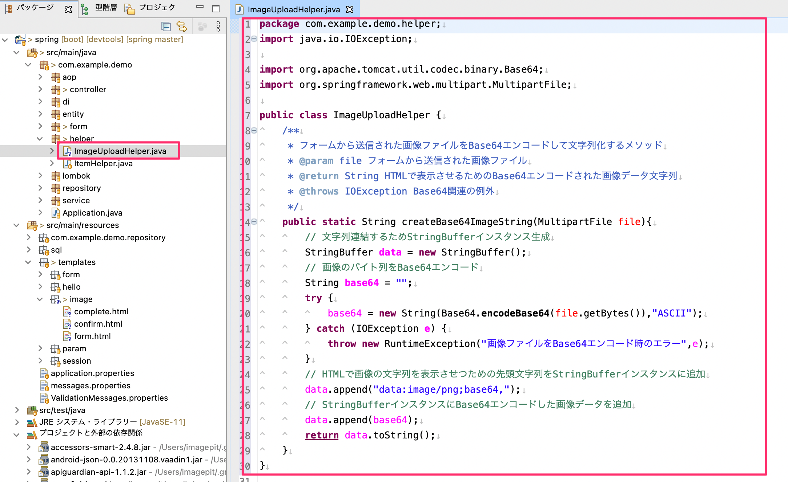
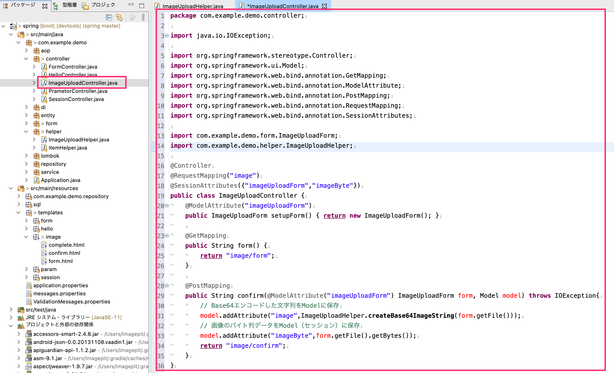
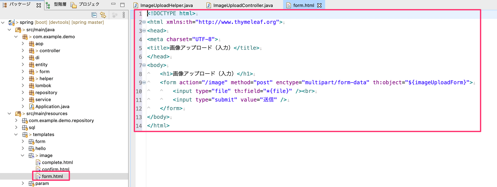
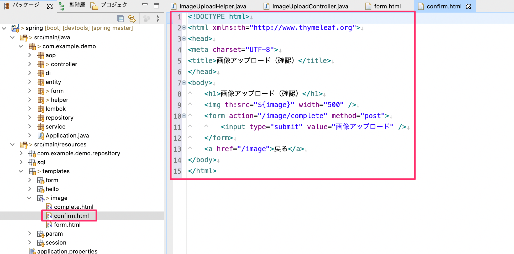
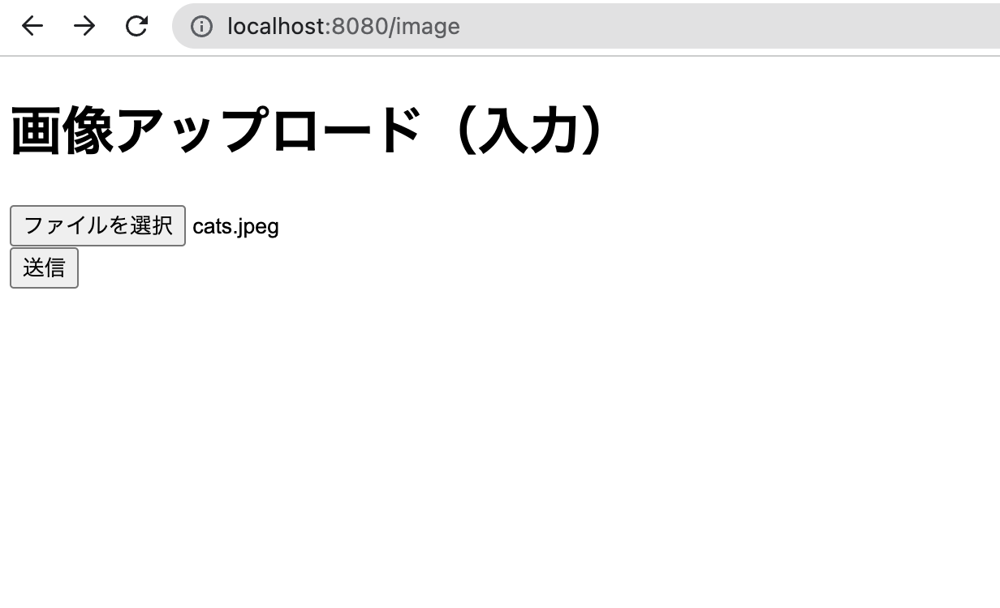
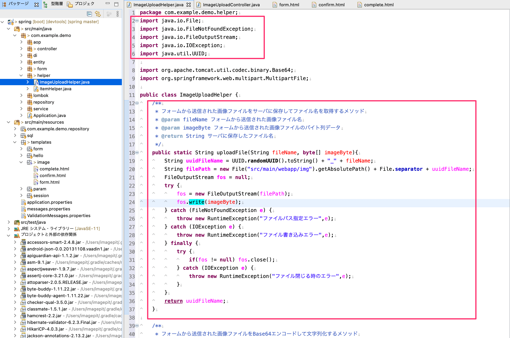
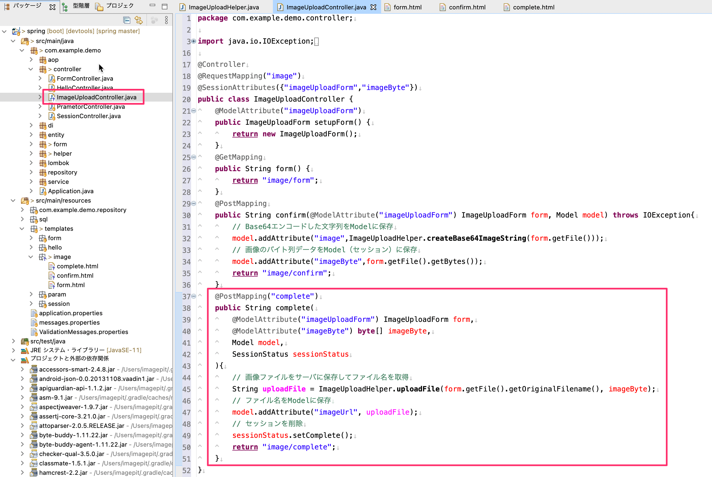
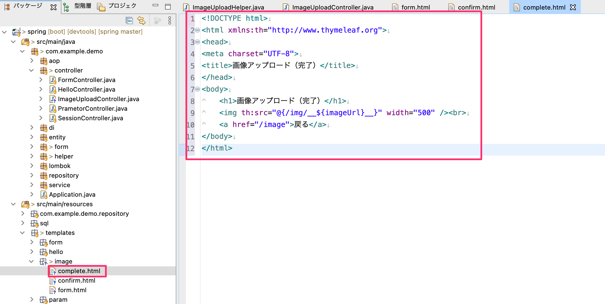
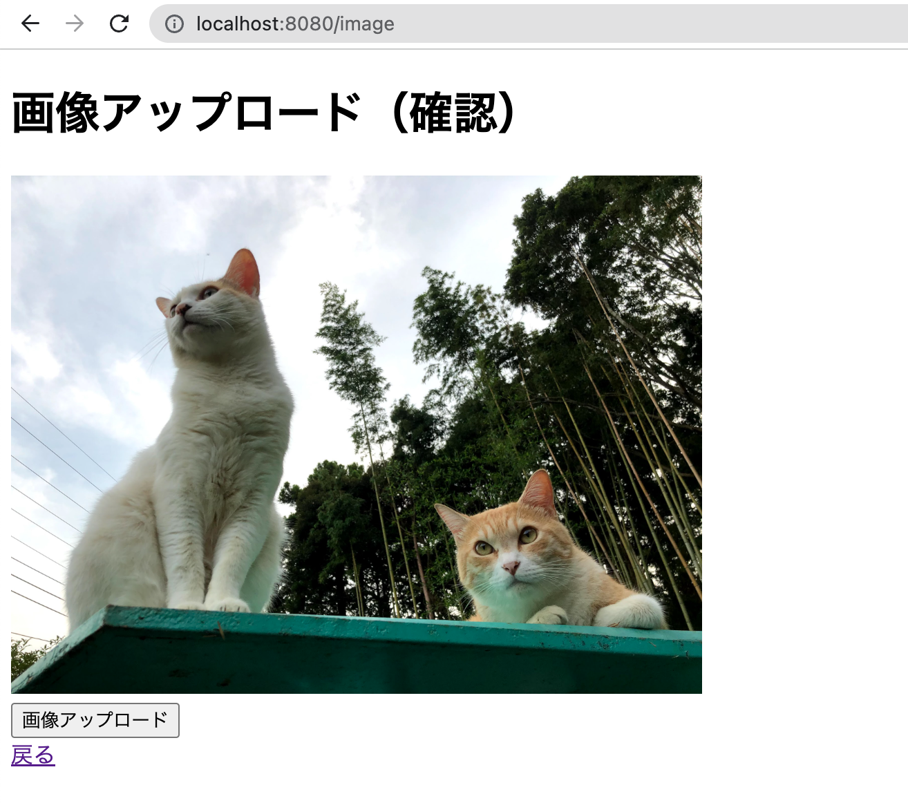
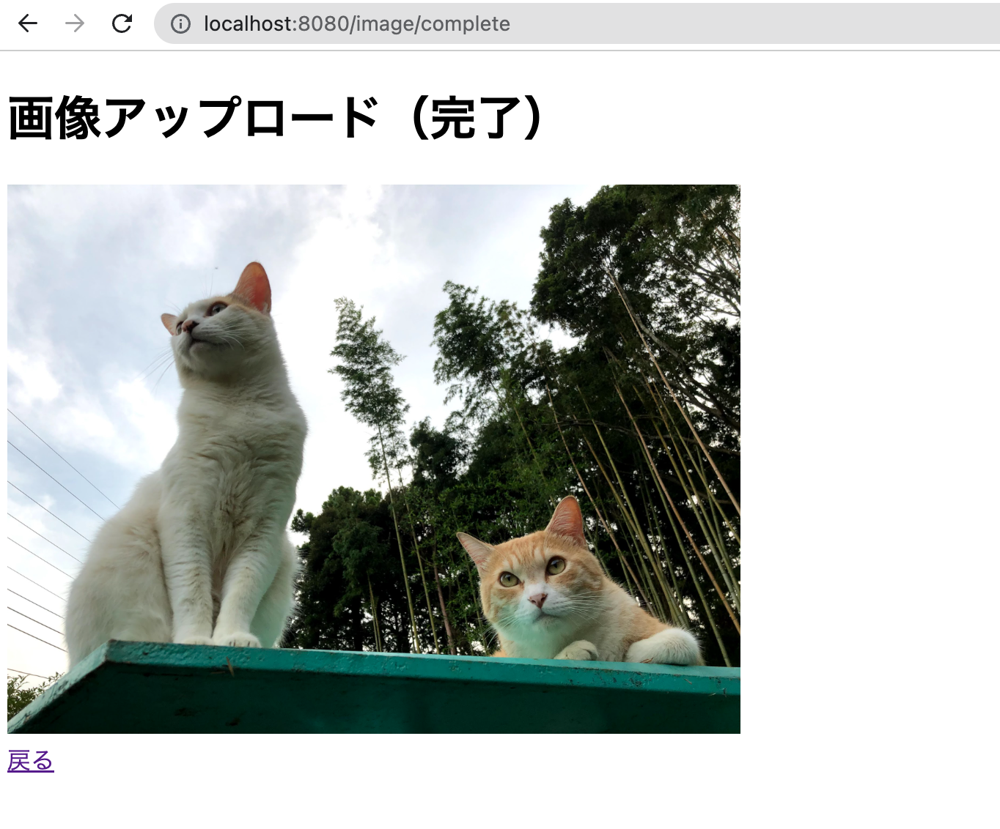

# 画像アップロードの方法

Spring MVCにてブラウザから画像をアップロードしてサーバに保存する方法について確認していきます。

## フォームの作成

画像ファイルを入力するためのFormクラスを作成します。
- `com.example.demo.form`パッケージの中に`ImageUploadForm.java`のクラスを作成します。
  - ファイルをアップロードする入力項目として`MultipartFile`のフィールドを追加します。

## ヘルパークラスの作成

画像のアップロード、保存関連のHelperクラスを作成します。
- `com.example.demo.helper`パッケージの中に`ImageUploadHelper.java`のクラスを作成します。
  - フォームよりアップロードされた画像をBase64エンコードしてその文字列を返すスタティックメソッドを実装します。
    - 確認画面などで画像を保存する前の段階で画像を画面に表示させたい場合にはBase64エンコードした文字列を生成します。
      - その場合は確認段階で画像をサーバに保存させなくてすみます。
      - 確認画面でキャンセルされば場合はサーバに画像は保存されません。

## コントローラーの作成（入力・確認画面の実装）

画像をアップロードするフォームの入力画面と、保存前の確認画面を実装するためのコントローラー（`ImageUploadController`）を作成します。
- セッションスコープとして下記のModel Attributeを指定しています。
  - `imageUploadForm`・・・画像ファイルを入力するフォーム
  - `imageByte`・・・画像ファイルのバイト列
    - 画像ファイルのバイト列は画像をサーバに保存するために必要です。
    - 画像ファイルの保存は完了画面で行うのでバイト列はセッションスコープで保持しています。
- `form`と`confirm`のハンドラメソッドを実装しています。
  - `form`のハンドラメソッドではフォーム画面のViewを表示します。
  - `confirm`のハンドラメソッドではModelのAttributeにBase64エンコードした画像の文字列と、画像ファイルのバイト列をセットしています。

## Viewの作成

### 入力画面

入力画面のViewを作成します。
- 画像などのファイルをアップロードする場合には`form`タグに`enctype="multipart/form-data"`を追加する必要があります。
- ファイルをアップロードする入力項目は`input`タグに`type="file"`を指定します。

### 確認画面

画像保存を確認する画面のViewを作成します。
- `img`タグの部分は`th:src`属性にしてBase64エンコードの文字列を格納した`image`のAttribute名を指定しています。

### 動作確認

入力画面では「ファイルを選択」のボタンをクリックすれば端末内のファイルを指定する事ができます。

確認画面では選択した画像が次のように表示される事を確認してください。

Chromeのデベロッパーツールなどで、画像がファイルでなくBase64エンコードされた文字列によって表示されている事が確認できます。

## 画像をサーバに保存する

### Helperクラスの更新

画像ファイルをサーバーにアップロードするための処理を`UploadImageHelper`クラスに追加します。
- `uploadFile`メソッドを追加します。
  - 引数には保存に必要な画像ファイルのバイト列を指定しています。
  - `uuidFileName`のローカル変数ではUUIDを使い、ユニークになるファイル名を生成しています。
  - `filePath`のローカル変数には`src/main/webapp/img`に`uuidFileName`を連結した保存先のパスを生成しています。
    - Spring Bootでは`src/main/webapp`配下に画像などを保存すればサーバに公開されるようになります。
  - `FileOutpotStrem`インスタンスを生成して`write`メソッドでサーバに画像を保存しています。

### アップロード先のフォルダを作成

`src/main`の中に`webapp`フォルダを作りさらにその中に`img`フォルダを作成しています。

### コントローラーの更新（完了画面にて画像をサーバに保存）

完了画面用のハンドラメソッドを`ImageUploadController`に追加します。
- このハンドラメソッドで`UploadImageHelper`の`uploadFile`メソッドを実行してサーバにファイルを保存し、保存先の文字列をModelのAttributeに`imageUrl`のキー名で格納しています。

### Viewの作成（完了画面）

完了画面のViewを作成します。
- `templates/image`フォルダに`complete.html`を作成します。
  - `src/main/webapp/img`フォルダに保存した画像ファイルは`http://localhost:8080/img/<画像ファイル名>`でアクセスできます。
  - `img`タグの`th:src`属性にてModeのAttributeの`imageUrl`をパスに連結しています。
    - `th:src`では`@{/img/__${要素名}__}`とすると`${要素名}`の内容を`/img`のパスに連結して出力してくれます。

### 動作確認

それでは動作確認して確認してください。

_入力画面_

_確認画面_

_完了画面_

下図のように`src/main/webapp/img`の中にも画像ファイルが保存されていることも確認できます。

