# lombokの使い方

## lombokを使うクラスの作成

`com.example.demo`の中の`lombok`パッケージを作成して`Employee.java`のクラスを作成します。

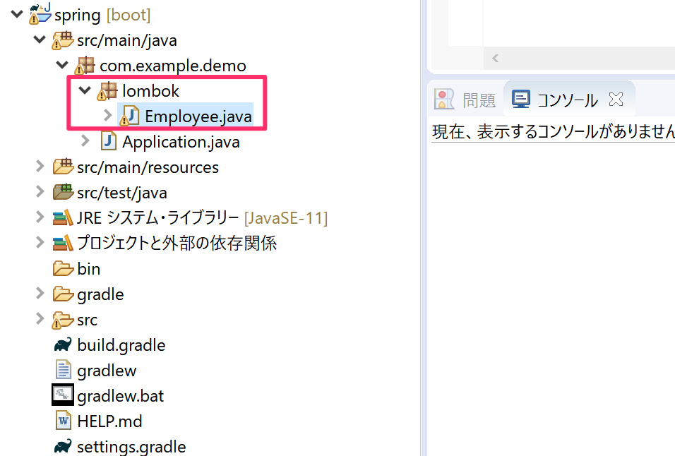

下図のように`empNo`と`empName`のフィールドを作成してください。

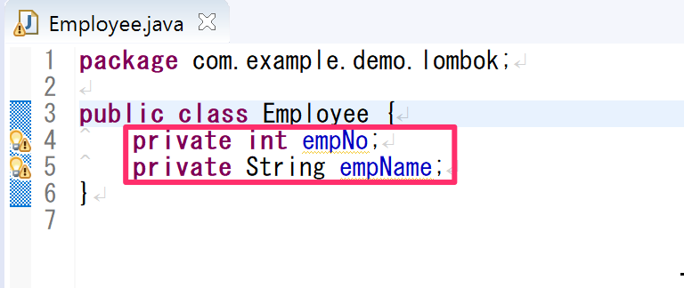

## @Dataアノテーションを付与

下図のように`@Data`のアノテーションを`Employee`クラスの上に追加します。

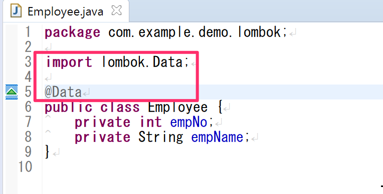

パッケージエクスプローラーの`Employee.java`の箇所の`>`を展開してみるとコンストラクタやゲッター、セッター、`equals()`、`toString()`のメソッドが追加されている事が確認できます。

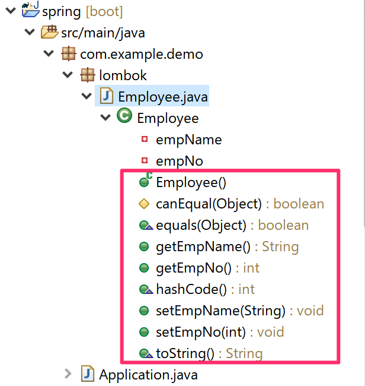

## @AllArgsConstractorアノテーションの付与

次に`@AllArgsConstractor`アノテーションを追加します。

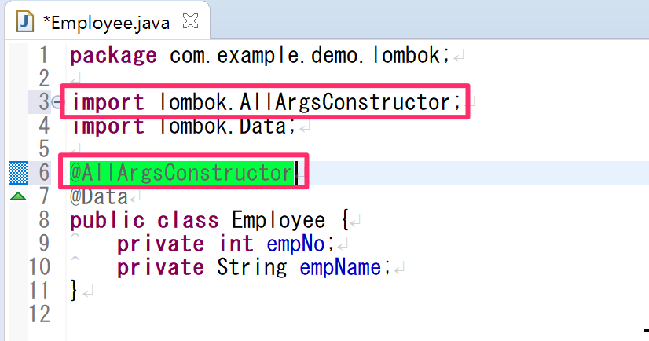

下図のようにすべてのフィールドを引数にしたコンストラクタが追加されている事が確認できます。

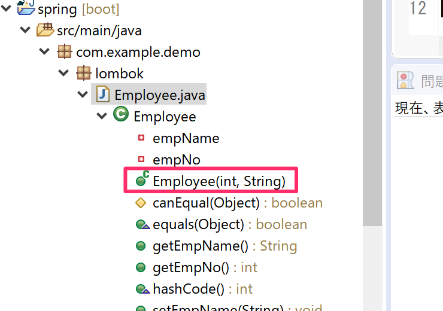

## lombokのアノテーションを付与したクラスのテスト

`src/test/java`の中の`com.example.demo`パッケージの中に`lombok`パッケージを作成して`EmployeeTest.java`のクラスを作成します。

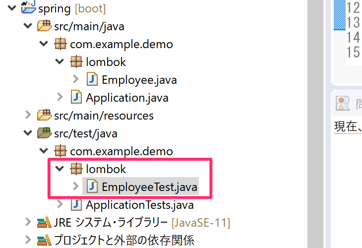

下図のようにJUnitの`@Test`を付与したメソッドを追加し、Employeeクラスに引数ありのコンストラクタやゲッター、セッターが使えるかをテストしてください。

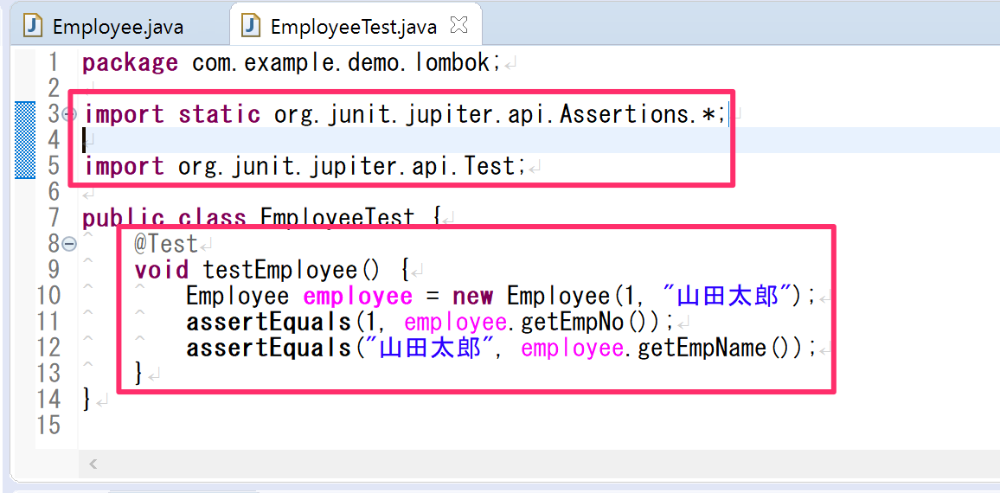

`EmployeeTest.java`の箇所で右クリックし「実行 -> JUnitテスト」を選択します。

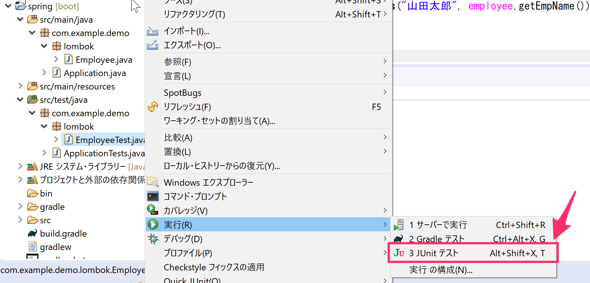

次のようにテストに合格する事を確認してください。

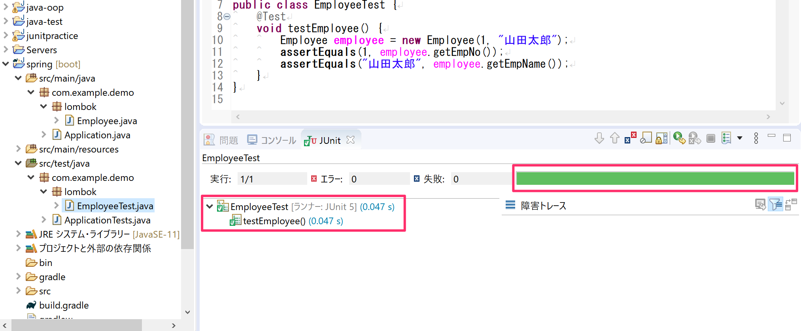

## toStringメソッドの確認

次に`@Data`アノテーションで追加された`toString`メソッドの確認もしてみます。

- `toString`メソッドは`System.out.println`でコンソール出力する場合の出力文字列を加工するためのメソッドです。

下図のように`Sytem.out.println`で`employee`をコンソール出力するプログラムを追加してください。

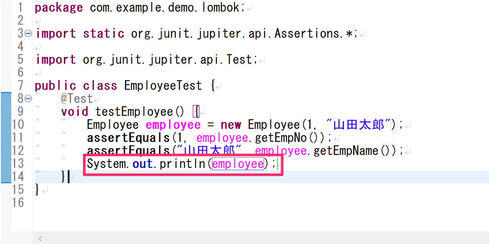

下図のようにコンソールにフォールドの値がわかりやすく表示されている事を確認してください。

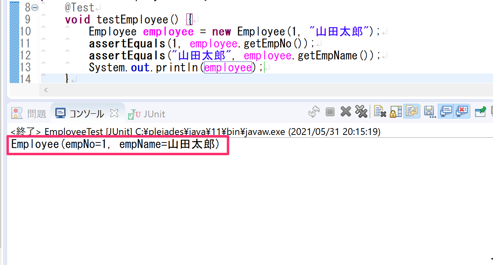

このようにlombokを使うことによって形式的に実装しなければいけない部分をアノテーションを付与するだけで実装する事ができます。

## その他のlombokアノテーションについて

その他のアノテーションの使い方を知りたい方は下記のページが参考になします。

[lombokの使い方](https://qiita.com/chenglin/items/df235a1d70b8c188b5ad#lombok%E3%81%AE%E4%BD%BF%E3%81%84%E6%96%B9)