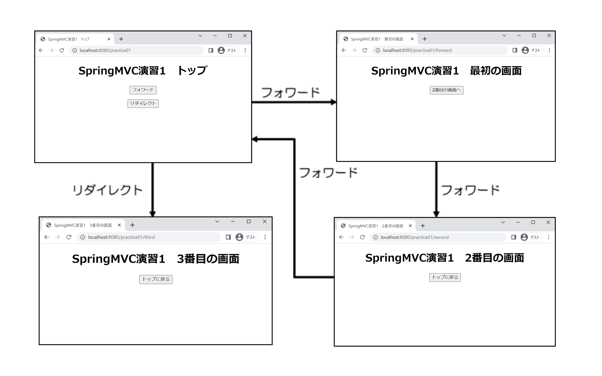

# Spring MVC

## 環境構築

### 依存関係の追加

- Spring MVCを利用するためには依存関係を追加する必要があります。下図のとおり依存関係を追加してください。
  - Spring MVCの依存関係
    - `implementation 'org.springframework.boot:spring-boot-starter-web'`
  - Thymeleaf（テンプレートエンジン）の依存関係
    - `implementation 'org.springframework.boot:spring-boot-starter-thymeleaf'`
- さらに今回は自動でプログラム修正時にアプリケーションを再起動してくれる`spring-boot-devtools`も入れています。
  - `developmentOnly 'org.springframework.boot:spring-boot-devtools'`
  - `configurations`のブロックの中に次のコードを追加します。

```
developmentOnly
runtimeClasspath {
  extendsFrom developmentOnly
}
```


## 基本的なSpring MVC機能の確認

- 基本的なControllerの作成のしかたを確認します。

### コントローラー・リクエストハンドラの実装

- `controller`パッケージを作成して`HelloController.java`クラスを作成し、下図のとおりにコントローラーに必要なアノテーション、ハンドラメソッドを追加します。
  - コントローラーにするクラスには`@Controller`を付与します。
  - またクラスの箇所に`@RequestMapping("hello")`も追加し、`http://localhost:8080/hello`のHTTPリクエストで受け取れるようにしています。
  - `hello`メソッド（メソッド名は任意）を作成して戻り値の型を`String`にし、`@GetMapping`を付与しています。
    - これで`http://localhost:8080/hello`の`GET`メソッドで受け取るハンドラメソッドになります。
    - 戻り値にはViewのパスを指定しています。
      - `src/main/resources/templates`を基点とした相対パスで`.html`の拡張子なしで指定します。


#### Viewの作成

`src/main/resources`に`templates/hello`フォルダを作成して`hello.html`を作成します。


#### 動作確認

- ベースパッケージにある`Application.java`を右クリックしてSpring Bootアプリケーションを起動します。
- ブラウザで`http://localhost:8080/hello`にアクセスしてViewで定義したHTMLが表示される事を確認してください。


### @PostMappingとリダイレクトの確認

次にHTTPのPOSTメソッドで受け取るためのハンドラメソッドを追加して、リダイレクト処理をさせてみます。

下図のように`hello.html`の`h1`タグの下に`form`タグでリダイレクトボタンを追加します。


- `HelloController`を下図のように更新します。
  - `@PostMapping`を付与した`post`のハンドラメソッドを追加します。
    - これで`hello.html`からのリダイレクトボタンをクリックした後のPOSTメソッドのHTTPリクエストを受け取れるようになります。
    - 戻り値は今回はリダイレクトさせたいので`redirect:/hello/redirect`を指定しています。
      - これで`http://localhost:8080/hello/redirect`へリダイレクトします。
  - `@GetMapping("redirect")`を付与した`post`のハンドラメソッドを追加します。
    - `http://localhost:8080/hello/redirect`のリクエストを受け取ります。
    - 戻り値は今回はリダイレクトさせたいので`hello/redirect`を指定して`src/main/resources/templates/hello`フォルダの作成して`redirect.html`のViewを表示させるようにします。


#### リダイレクト用のViewの作成

- `src/main/resources/templates/hello`フォルダの作成に`redirect.html`を作成して下図のとおりにHTMLを更新します。


#### 動作確認

- `http://localhost:8080/hello`にアクセスしリダイレクトボタンをクリックしたら`http://localhost:8080/hello/redirect`へリダイレクトされる事を確認してください。

_リダイレクトボタンをクリック_


_リダイレクト先のURLへリダイレクト_


## 演習問題

- 下図のような遷移になるようにControllerクラス・ハンドラメソッド・Viewを作成しなさい。



クラス名（FQCN）|アノテーション
---|---
`com.example.demo.controller.Practice01Controller`|`@Controller`、`@RequestMapping('practice01')`

画面名<br>URL|メソッド名|アノテーション|戻り値（View）
---|---|---|---
トップ画面<br>http://localhost:8080/practice01|home|`@GetMapping`|practice01/home
フォワード1画面<br>http://localhost:8080/practice01/forward|forward|`@GetMapping("forward")`|practice01/first
フォワード2画面<br>http://localhost:8080/practice01/second|second|`@GetMapping("second")`|practice01/second
リダイレクト<br>http://localhost:8080/practice01/redirect|redirect|`@GetMapping("redirect")`|redirect:/practice01/third
リダイレクト画面<br>http://localhost:8080/practice01/third|third|`@GetMapping("third")`|practice01/third

### 解答例

_com.example.demo.controller.Practice01Controller.java_


_src/main/resources/templates/practice01/home.html_


_src/main/resources/templates/practice01/first.html_


_src/main/resources/templates/practice01/second.html_


_src/main/resources/templates/practice01/third.html_

