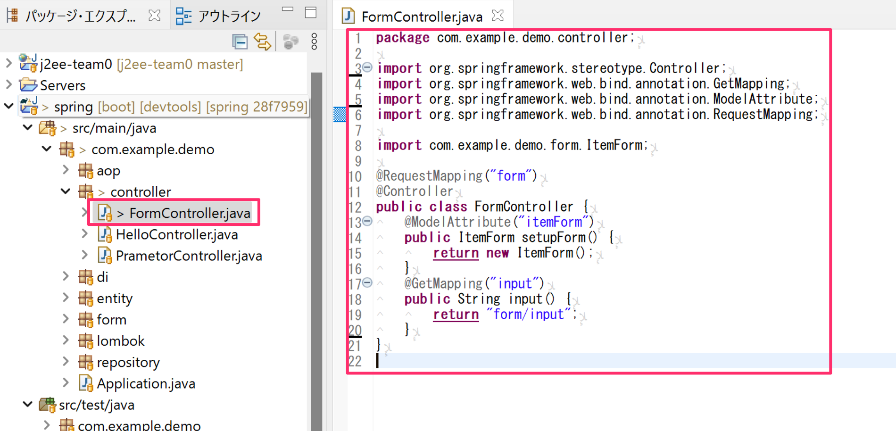

# フォームの利用

Spring MVCでフォームを使ったリクエストパラメーターの取得を行ってみます。

## フォームの動作確認

### フォームクラスの作成

ベースパッケージの中に`form`パッケージを作成して`ItemForm.java`クラスを作成します。

- このクラスを入力フォームのデータを入れます。
- `@Data`を付与してゲッター、セッター、toStringを実装します。
- `Serializable`インターフェースを実装します
- 今回は`itemName`（商品名）と`itemPrice`（商品価格）のフィールドを定義します。

### コントローラーの作成

フォームからのデータの入出力を確認するコントローラーを作成します。

- `controller`パッケージに`FormController`を作成します。
  - `@ModelAttribute`を付与したメソッド`setupForm`を実装してFormクラス（今回は`ItemForm`）を初期化します。
    - このメソッドを実装することで`FormController`のModelAttribute領域にItemFormのインスタンスがセットされます。
- `@GetMapping("input")`を付与したハンドラメソッド`input`メソッドを追加して入力フォームの画面を表示させます。

### Viewの作成

- `templates`フォルダに`form`フォルダを作成し`input.html`を作成して入力フォームを作成します。
  - `html`タグ部分にThymeleaf対応の属性を追加します。
  - `form`タグを作り`th:object`属性の箇所に`FormController`で初期化した属性`itemForm`をこのフォームにセットします。
  - `input`タグには`th:field`属性に対応させたいフィールド名を`*{}`の中に指定します。
    - これでテキストボックスの値が入力されたらその値がItemFormインスタンスにセットされます。

この状態で一度、ブラウザで`http://localhost:8080/form/input`動作確認してフォームが表示されるか確認しましょう。

### フォームから入力された値をItemFormインスタンスとして取得

- HTMLのフォームから入力された内容をItemFormインスタンスとして取得してみます。
- 新たにHTTPのポストで受け取れるハンドラメソッド`confirm`メソッドを追加しまます。
  - このメソッドの引数に`@ModelAttribute`の引数に`itemForm`を指定したItemForm型の引数を用意します。
    - これで入力フォームから送られてきたデータをItemFormインスタンスとして受け取れます。
  - Modelのオブジェクトを`model`の`addAttribute`メソッドにItemFormオブジェクトをセットしてViewに渡します。

### 確認画面の確認

確認画面にてItemFormの内容が画面に表示されるか確認します。

- ItemFormの値を表示させるために`th:text`属性に`${属性名.フィールド名}`で指定します。

### 動作確認

ブラウザで`http://localhost:8080/form/input`動作確認してフォームで入力された値が結果画面で表示されるか確認してください。

## 演習問題

- 下図のような足し算アプリになるようにFormクラス、Controllerクラス・ハンドラメソッド・Viewを作成しなさい。
  - 入力画面で2つの整数値を入力
  - 確認画面で2つの整数値を足し合わせた値を出力

_入力画面_

_結果画面_

|クラス名（FQCN）|アノテーション|
|---|---|
|`com.example.demo.controller.Practice02Controller`|`@RequestMapping("practice02")`
|`com.example.demo.form.Practice02Form`|`@Data`

_Practice02Controllerのハンドラメソッド_

画面名|メソッド名|アノテーション|戻り値
---|---|---|---
入力画面 http://localhost:8080/practice02/form|form|`@GetMapping`|practice02/form
結果画面 http://localhost:8080/practice02/result|result|`@PostMapping`|practice02/result

### 解答例

_com.example.demo.form.Practice02Form.java_

_com.example.demo.controller.Practice02Controller.java_

_src/main/resources/templates/practice02/form.html_

_src/main/resources/templates/practice02/result.html_

