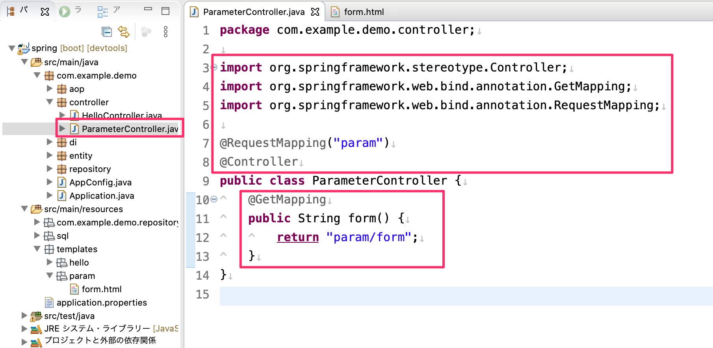
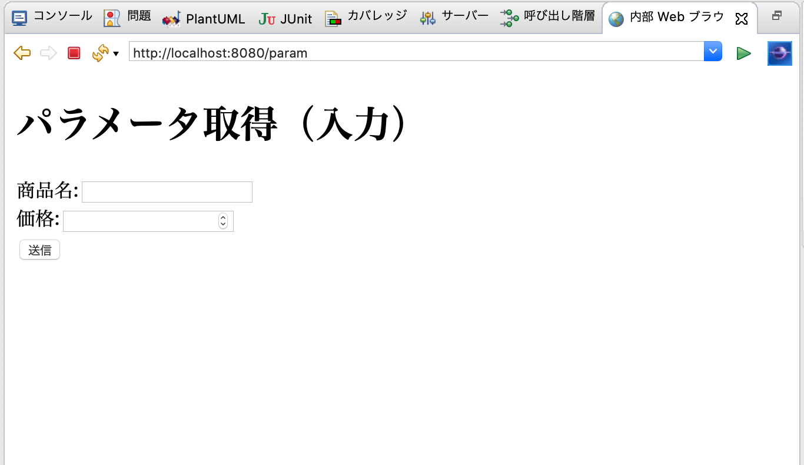
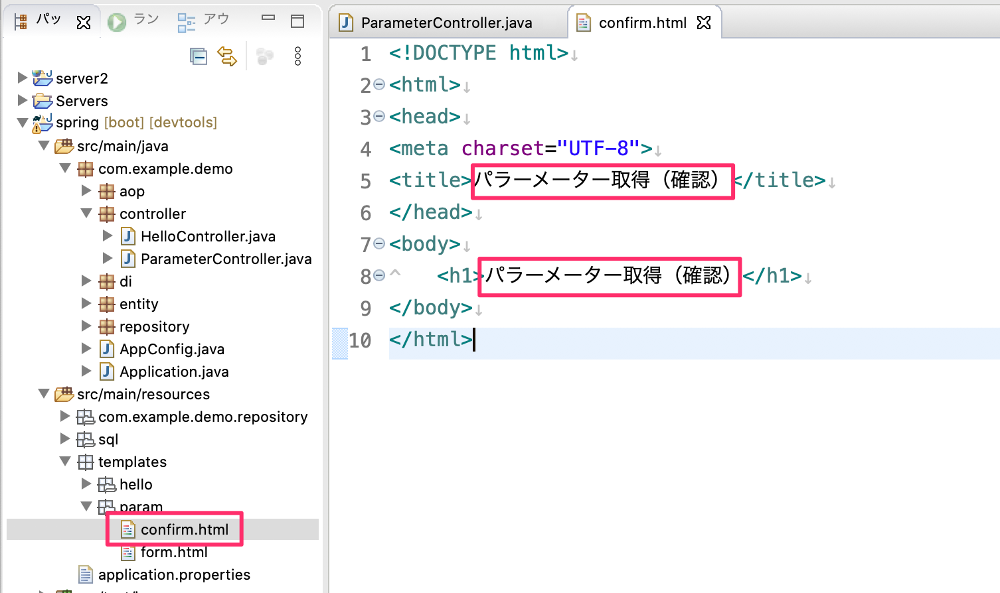
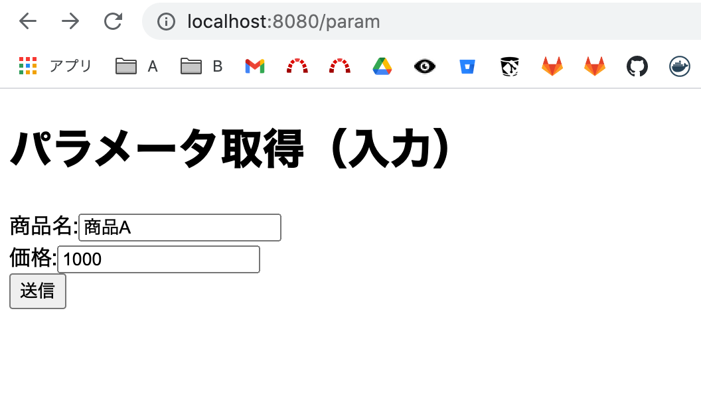
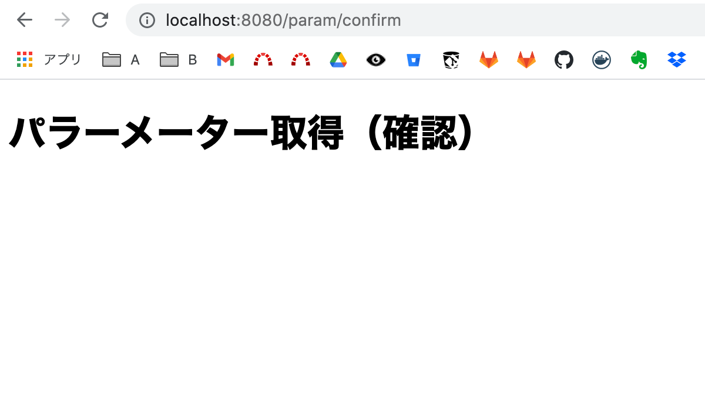
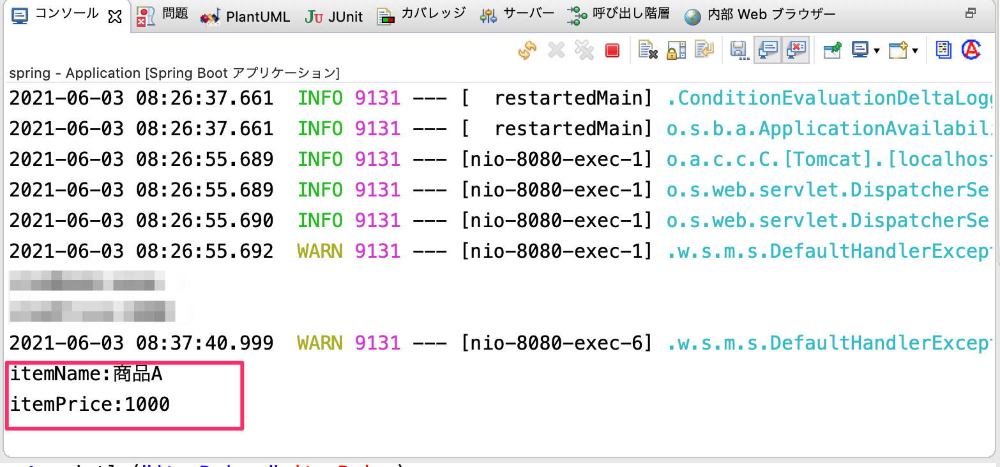
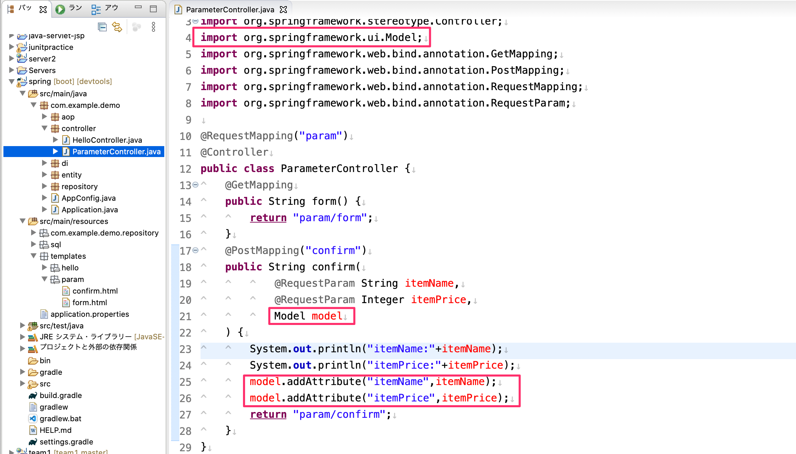
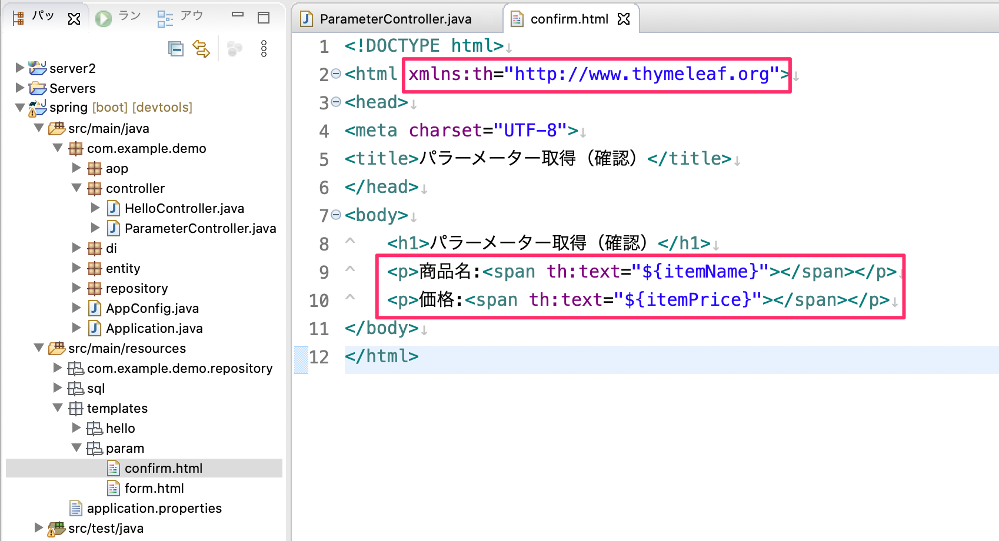
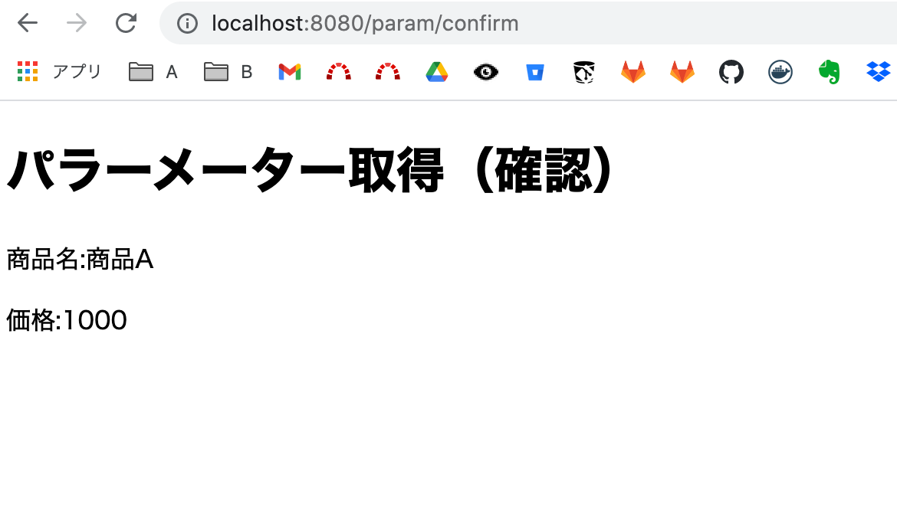

## リクエストパラメーターの取得・Modelインターフェースを使ったViewへの値の渡し方

## リクエストパラメーターの取得

### コントローラー・ハンドラメソッドの作成

入力画面用のコントローラーとハンドラメソッドを作成します。
`controller`パッケージの中に`PrametorController`を作成し、ハンドラメソッドを作成してください。

### Viewの作成

ハンドラメソッドで指定したViewを作成します。
`templates/param`フォルダを作成して下図のように`form.html`を作成します。

### 動作確認

`http://localhost:8080/param`で画面が表示されるか確認してください。

### パラメーター取得のハンドラメソッドの追加

パラメータ取得用のハンドラメソッドを追加します。
ハンドラメソッドの引数に`@RequestParam`をつけた引数を追加します。

-  `@RequestParam`をつけた引数のデータ型は取得したいデータ型を指定します。
-  `@RequestParam`をつけた引数の変数名はフォームのinputタグのname属性に合わせます。

### Viewの追加

パラーメーターを取得した画面はまだViewには渡しませんが、追加したハンドラメソッドに対応するViewを作成します。

#### 動作確認

パラメーターが取得できるか確認します。

確認画面に遷移する事を確認してください。（まだパラメータは画面に表示していなくてOKです。）

コンソール上にフォームから取得した値がデバッグとして出力している事を確認してください。

## Modelインターフェースを使ったViewへの値の渡し方１

確認画面のViewにパラメータの値を送る場合には下記が必要です。

- `Model`インタフェースの引数をハンドラメソッドに追加
- `Model`オブジェクトの`addAttribute`メソッドの引数の中にパラメーターの値をセットします。
  - 第一引数はキー名を指定します。
  - 第二引数は値を指定します。

## Tymeleafを使ったViewの作成及びModelオブジェクトの値を出力

`Model`オブジェクトの中にセットしたデータをViewで取得するにはHTMLをThymeleaf対応して取得できます。
- htmlタグの属性に`xmlns:th="http://www.thymeleaf.org"`の属性値を入れます
  - これでHTMLがThymeleaf対応になります
- 出力させたい箇所のHTML要素のタグの属性として`th:text="${キー名}"`を指定する事で画面に出力されます。

### 動作確認

下図のようにパラメーターを取得できる事を確認します。

