# Serviceの実装及び画面からの登録処理実装

これからServiceオブジェクトを作成してSessionControllerに商品登録機能を実装してみます。

## 処理の流れ

下図のように商品入力・確認後の登録時（`execute()`）に`ItemHelper`と`ItemService`を呼び出してDBに対して登録処理を実装します。
- `ItemHelper`にて`ItemForm`のフォームデータを`Item`のEntityにセットしなおしています。
- `ItemService`の`addItem`メソッドに`Item`のEntityインスタンスをセットして`ItemRepository`を使ってDBに登録処理を行っています。

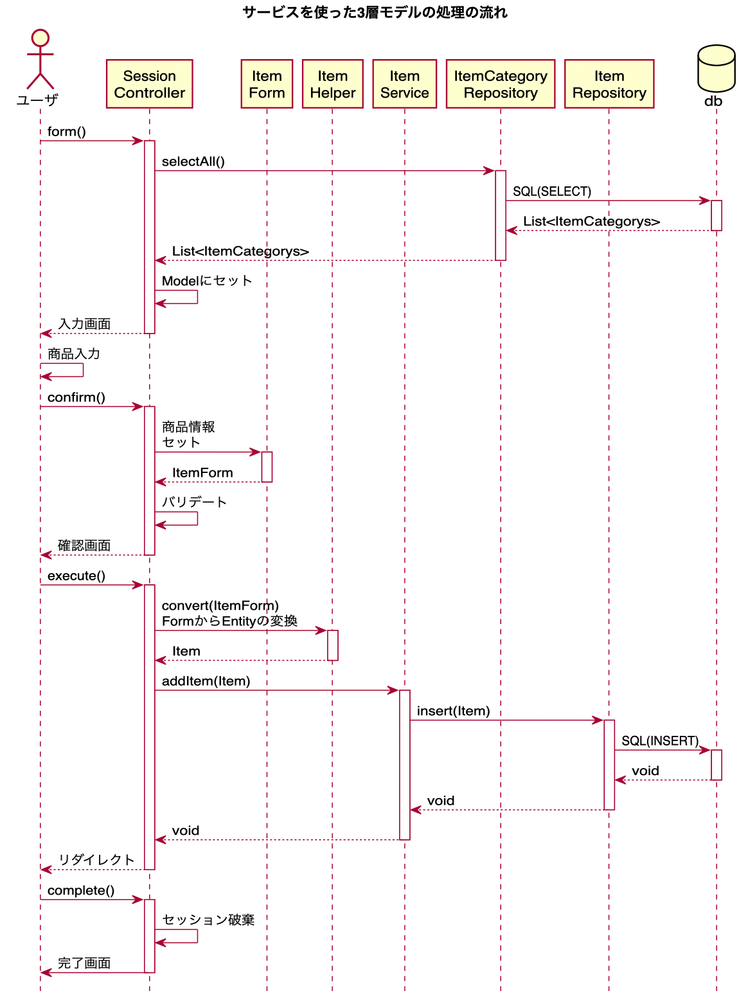

[このシーケンス図のplantumlはこちら](img/springmvc-3layer-archtecture-sequence-plantuml.png)

## ItemFormの修正

DBの`item`テーブルの仕様と合わすべく、`ItemForm`のフィールド名を修正、追加しています。
- 新たに`categoryId`のフィールドを追加しています。

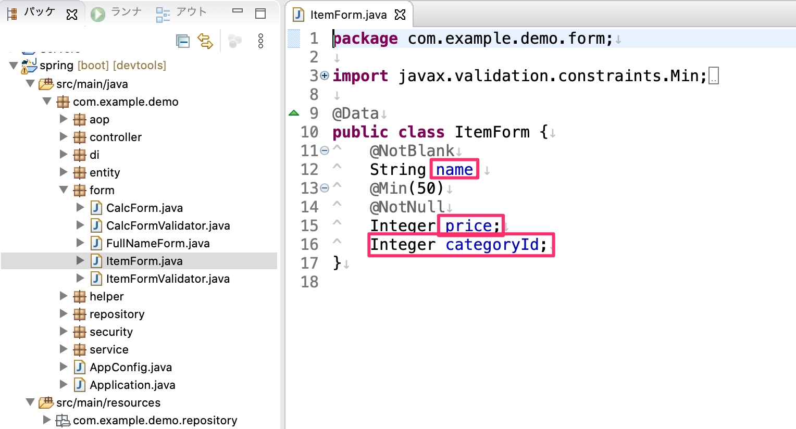

## 入力画面の修正

`ItemForm`の修正に合わせて`ItemController`とViewを修正します。

### Controllerの修正

`SessionController`の`form`メソッドを修正します。
- 商品カテゴリリストのプルダウンメニューを表示させるために`ItemCategoryRepository`をDIでフィールドとして追加し、`selectAll`メソッドの結果を`Model`インターフェースの`addAttribute`メソッドにセットしています。
- 商品カテゴリリストは確認画面で利用したいため`@SessionAttributes`にAttribute属性名を追加してセッションスコープにしています。

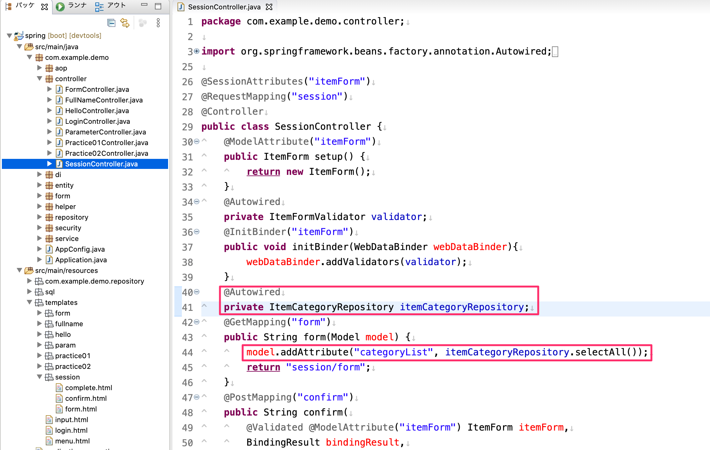

### Viewの修正

Modelにセットした商品カテゴリのコレクションを`select`タグと`option`タグを使ってプルダウン表示します。
- `select`タグには`th:field`にて`ItemForm`のカテゴリIDのフィールド名をしています。
- `option`タグには`th:each`タグを使って商品カテゴリのコレクションを繰り返し処理しています。
  - `th:value`属性の値はカテゴリIDをセットしています。
  - `th:selected`属性には`option`タグに`selected`属性を付与する条件を指定しています。
    - `ItemForm`にセットしたカテゴリIDと同じ番号の`option`タグに対して`selected`属性が付与され、確認画面から戻った場合に選択した項目が初期表示に選択されている状態になります。
  - `th:inline`属性を`text`にすることにより、`option`タグの中の箇所に`[[${category.name}]]`の形で画面表示させることができます。

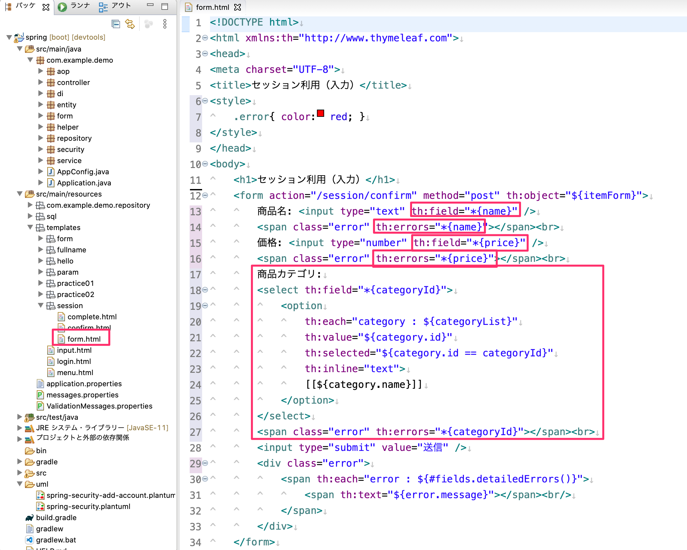

### 入力画面の確認

それではこの状態で一度画面を確認してみます。
`http://localhost:8080/session/form`にアクセスすると商品カテゴリテーブルの中にあるデータがプルダウン項目として選択できることを確認してください。

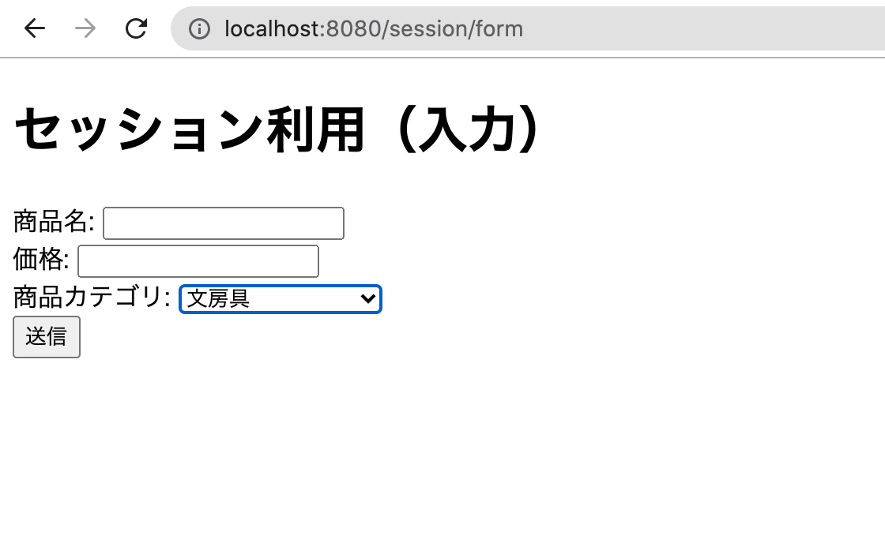

## 確認画面の修正

次に確認画面を修正していきます。

### Controllerの修正

`confirm`メソッドを修正します。
- `@ModelAttribute`を付与した商品カテゴリリストのAttribute引数`categories`を追加します。
  - これによりセッションスコープとして保持している商品カテゴリリストを取得することができます。
- `Model`インターフェースの引数を追加します。
  - 引数の`addAttribute`メソッドで選択したカテゴリ情報を`Model`インターフェースの引数にセットしています。
    - **【注意】下図の例ではAttributeに選択したカテゴリをセットするときにセッションスコープにした商品カテゴリリストからラムダ式を使って選択したカテゴリをフィルタしてセットしています。**
      - もしラムダ式がわからない場合は選択した商品カテゴリを`for`文、`if`文をして抽出してAttributeにセットしてください。

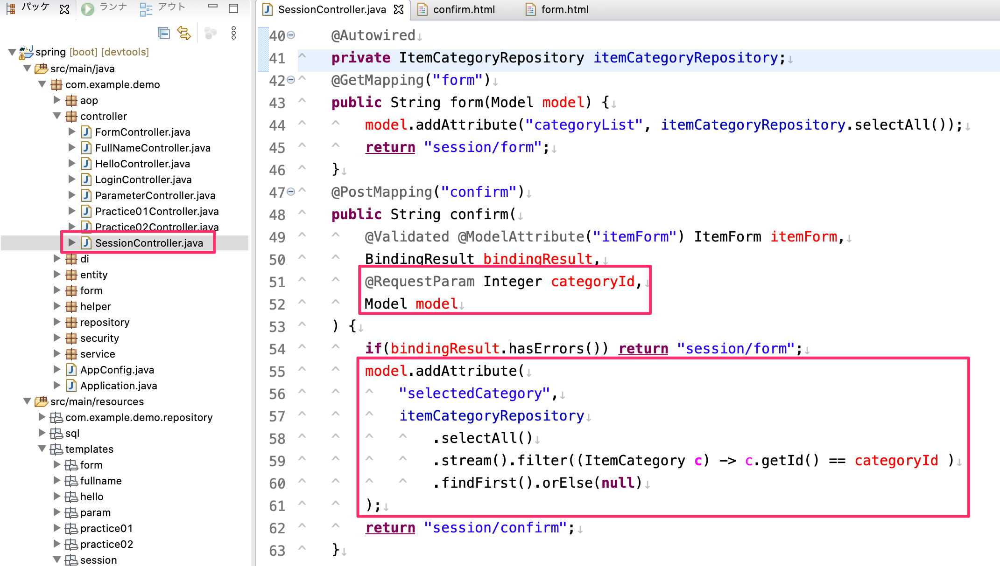

**ラムダ式を使わないで実装した例**

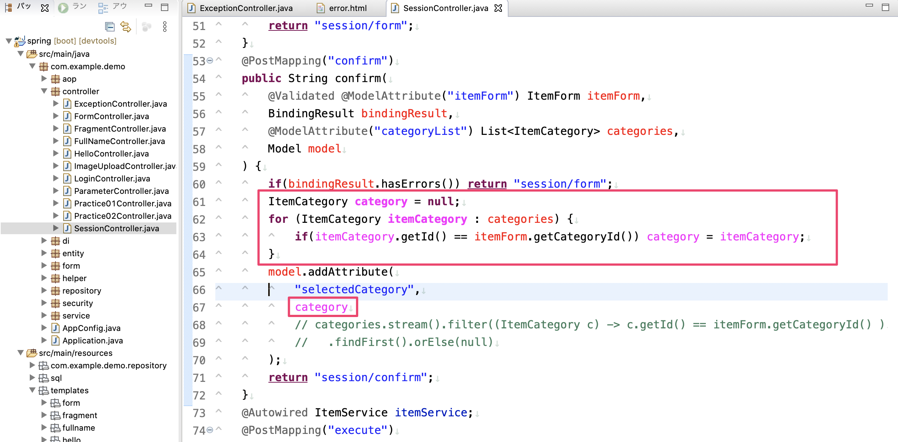

### Viewの修正

コントローラーの修正に合わせてView（`confirm.html`）を修正します。
- `ItemForm`の商品名、価格のフィールド名が修正されたのでそれに合わせて修正しています。
- 商品カテゴリを追加して選択した商品カテゴリのカテゴリ名を出力するようにしています。

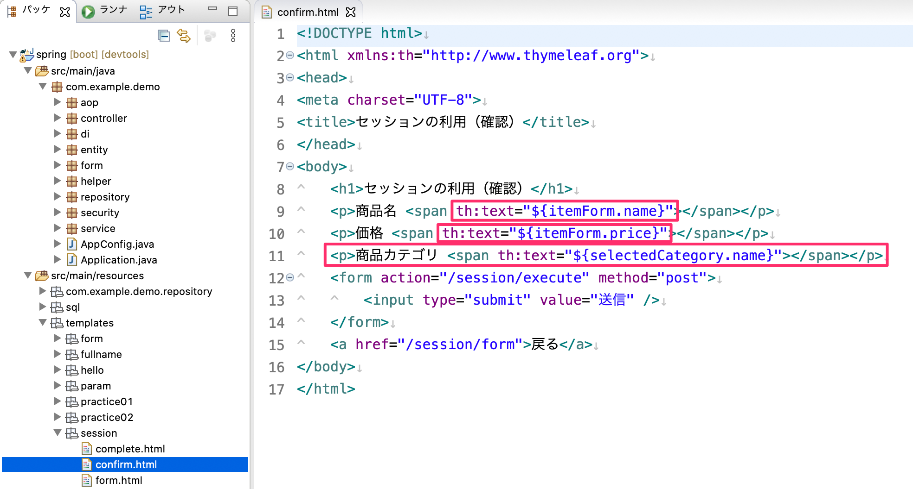

### 確認画面の確認

それでは入力画面から確認画面へ行き、商品カテゴリが表示されていることを確認してください。
- 「戻る」リンクをクリックして入力した内容が保持されていることも確認してください。

## 登録処理の実装

### Serviceインターフェースの実装

`SessionController`からDIされる想定のServiceのインターフェースを作成します。
`com.example.demo.service`パッケージに`ItemService.java`のインターフェースを作成します。
- 抽象メソッドとしては`addItem`にして`Item`のEntityを引数として受け取れるようにします。

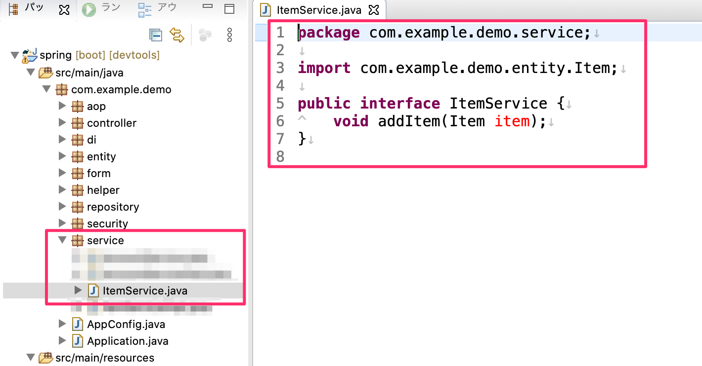

### Serviceインターフェース実装クラスの実装

`ItemService`インターフェースを実装した`ItemServiceImpl.java`クラスを`com.example.demo.service`パッケージに作成します。
- このクラスにて`ItemRepository`インターフェースのフィールドを用意してDIします。
- `addItem`メソッドをオーバーライドして`Item`のEntity引数を使って`ItemRepository`の`insert`メソッドの引数にセットしてDBへINSERT処理を行います。

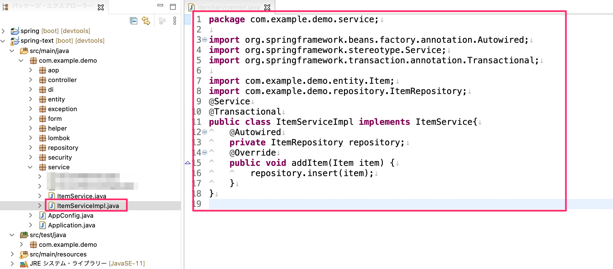

### Helperクラスの作成

ControllerにてServiceのメソッドの引数にEntityを渡すために、Helperクラスを作成してFormインスタンスからEntityインスタンスに変換する処理を定義します。
- `com.example.demo.form`パッケージに`ItemHelper`クラスを作成します。
  - `convert`のスタティックメソッドを定義して引数には`ItemForm`を受け取れるようにし、`Item`のEntityインスタンスを生成して`ItemForm`の値を`Item`インスタンスに入れ直して戻す処理を入れます。

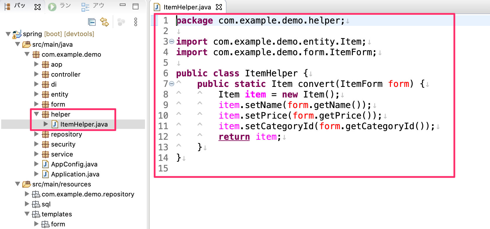

### Controllerの修正

それではServiceをControllerから呼び出して商品登録機能を実装します。
- `@Autowired`で`ItemService`インターフェースのフィールドを定義してDIします。
- `ItemService`の`addItem`メソッドを呼び出しその中には`ItemForm`から`Item`に変換したものを引数にセットします。

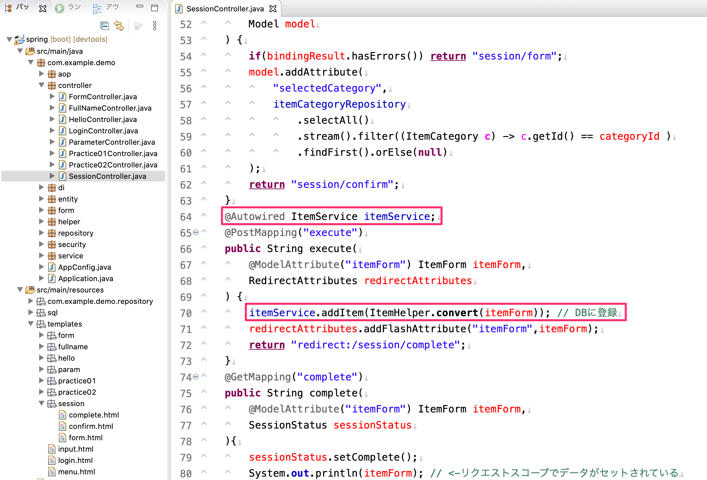

### 完了画面の修正

完了画面の修正を行います。Frashスコープで送られる`ItemForm`のフィールド名が修正されたので、それに合わせて`complete.html`の`th:text`属性を修正します。

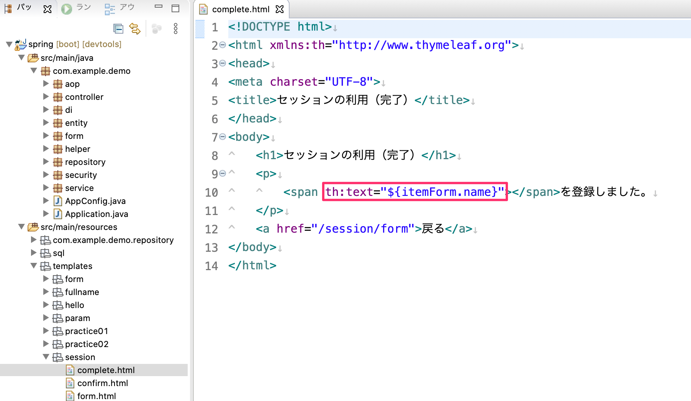

## 動作確認

それでは入力画面から確認画面に行き、完了画面に遷移する事を確認してください。

_入力画面_

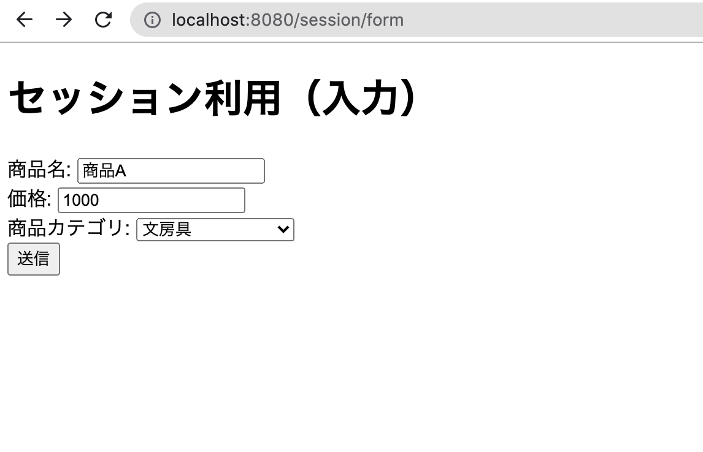

_確認画面_

_完了画面_

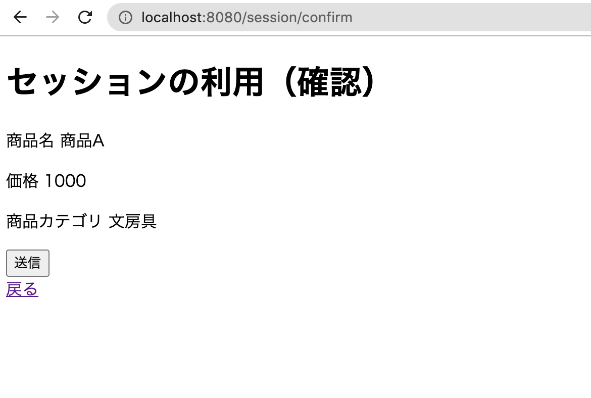

完了画面に遷移したらDBに入力した内容が登録している事を確認してください。

