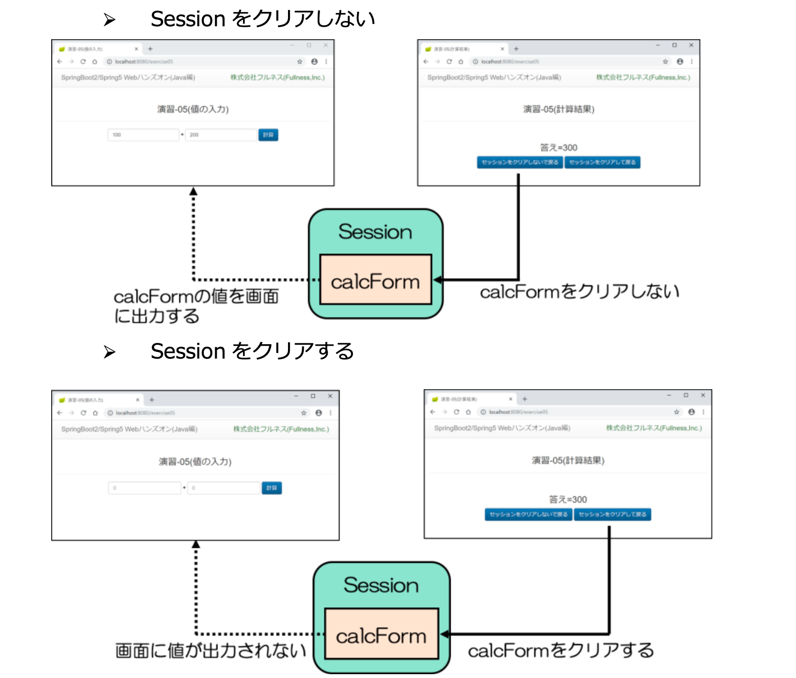

# セッション（1つのコントローラー）の利用の確認

## 動作の確認

### セッションを使ったフォーム入力・確認画面の実装

`controller`パッケージの中に`SessionController.java`のクラスを作成します。

- コントローラーの内容は[フォームの利用・確認](mvc-form.md)とほぼ同じです。
  - 違う箇所としては下図矢印の部分の`@SessionAttributes`でセッションスコープにしたいオブジェクトの属性名を指定している箇所です
    - これによりItemFormオブジェクトがセッションスコープになります


#### Viewの作成

コントローラーのハンドラメソッドに合わせてViewを作成します。

`templates`フォルダの中に`session`フォルダを作成して`form.html`を作成して入力画面を作成します。
- [フォームの利用・確認](mvc-form.md)とほぼ同じです。


`templates/session`フォルダを作成して`confirm.html`を作成して入力画面を作成します。
- [フォームの利用・確認](mvc-form.md)とほぼ同じです。
  - セッション内容が保持されているか確認するために「戻る」のリンクを追加しています。


#### 動作の確認

セッションが保持されているかを確認します。
`http://localhost:8080/session/form`にアクセスしてフォームに入力します。


確認画面にて入力内容を確認して「戻る」のリンクをクリックします。


下図のようにセッションにて入力内容が残っている事を確認してください。


### 完了画面の追加（セッションの破棄）

完了画面を作り、セッションを破棄してみます。
`SessionController`に完了画面用のハンドラメソッドを追加します。
- `@PostMapping("complete")`にします。
- `SessionStatus`の引数を追加します。
  - これにより`sessionComplete`メソッドが呼べるようになり、セッションを破棄できます。


#### Viewの作成

完了画面のViewを作成します。


#### 動作確認

完了画面まで遷移した後に「戻る」リンクをクリックして入力画面にもどり、入力内容が破棄されている事を確認してください。

`http://localhost:8080/session/form`にアクセスしてフォームに入力します。


確認画面にて入力内容を確認して「送信」ボタンをクリックします。


完了画面が表示されます。


入力画面で入力内容が破棄された事を確認してください。


### PRGパターンとFlashスコープを使い完了画面へフォーム内容を送る

PRGパターンのリダイレクト時にFormの内容をリダイレクト先にリクエストスコープで送る方法を紹介します。

- `execute`のハンドラメソッドを追加し、`RedirectAttribute`の引数を追加します。
  - その引数の`addFrashAttribute`メソッドの中にフォーム内容をセットすることによりリダイレクト先にデータをリクエストスコープで送ることができます。


確認画面のPOST送信先を`/session/complete`から`session/execute`に変更します。


`complete.html`はFlashスコープの値を表示するように追加します。


### 動作確認

完了画面まで表示させると商品名が表示されるようになります。


## 演習問題

下記の仕様の計算画面を構築せよ。



### 演習解答例

_com.example.demo.form.CalcForm.java_

```java
package com.example.demo.form;

import java.io.Serializable;

import lombok.Data;

@Data
public class CalcForm implements Serializable {
	private Integer value1;
	private Integer value2;
}
```

_com.example.demo.controller.Practice02Controller.java_

```java
package com.example.demo.controller;

import org.springframework.stereotype.Controller;
import org.springframework.ui.Model;
import org.springframework.web.bind.annotation.GetMapping;
import org.springframework.web.bind.annotation.ModelAttribute;
import org.springframework.web.bind.annotation.PostMapping;
import org.springframework.web.bind.annotation.RequestMapping;
import org.springframework.web.bind.annotation.SessionAttributes;
import org.springframework.web.bind.support.SessionStatus;

import com.example.demo.form.CalcForm;

@SessionAttributes("calcForm")
@RequestMapping("practice02")
@Controller
public class Practice02Controller {
	@ModelAttribute("calcForm")
	public CalcForm setup() {
		return new CalcForm();
	}

	@GetMapping
	public String form() {
		return "practice02/form";
	}

	@PostMapping
	public String confirm(@ModelAttribute("calcForm") CalcForm form, Model model) {
		model.addAttribute("result",form.getValue1()+form.getValue2());
		return "practice02/confirm";
	}

	@PostMapping("retain")
	public String retain() {
		return "redirect:/practice02";
	}

	@PostMapping("clear")
	public String clear(SessionStatus sessionStatus) {
		sessionStatus.setComplete();
		return "redirect:/practice02";
	}
}
```

_src/main/resources/templates/practice02/form.html_

```html
<!DOCTYPE html>
<html xmlns:th="http://www.thymeleaf.org">
<head>
<meta charset="UTF-8">
<title>入力画面</title>
</head>
<body>
	<h1>入力画面</h1>
	<form action="/practice02" method="post" th:object="${calcForm}">
		<input type="number" th:field="*{value1}" />
		+
		<input type="number" th:field="*{value2}" /><br>
		<input type="submit" value="計算" />
	</form>
</body>
</html>
```

_src/main/resources/templates/practice02/confirm.html_

```html
<!DOCTYPE html>
<html xmlns:th="http://www.thymeleaf.org">
<head>
<meta charset="UTF-8">
<title>計算結果</title>
</head>
<body>
	<h1>計算結果</h1>
	<p>答え=<span th:text="${result}"></span></p>
	<form action="/practice02/retain" method="post">
		<input type="submit" value="セッションを解除しないで戻る" />
	</form>
	<form action="/practice02/clear" method="post">
		<input type="submit" value="セッションを解除して戻る" />
	</form>
</body>
</html>
```