# セッション（1つのコントローラー）の利用の確認

## 動作の確認

### セッションを使ったフォーム入力・確認画面の実装

- `controller`パッケージの中に`SessionController.java`のクラスを作成します。
  - コントローラーの内容は[フォームの利用・確認](mvc-form.md)とほぼ同じです。
    - 違う箇所としては下図矢印の部分の`@SessionAttributes`でセッションスコープにしたいオブジェクトの属性名を指定している箇所です
      - これによりItemFormオブジェクトがセッションスコープになります

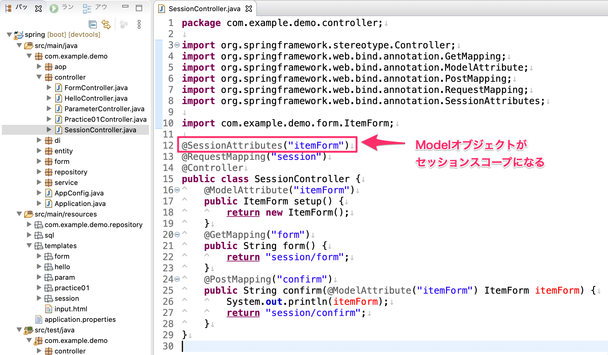

#### Viewの作成

- コントローラーのハンドラメソッドに合わせてViewを作成します。
  - `templates`フォルダの中に`session`フォルダを作成して`form.html`を作成して入力画面を作成します。
  - [フォームの利用・確認](mvc-form.md)とほぼ同じです。

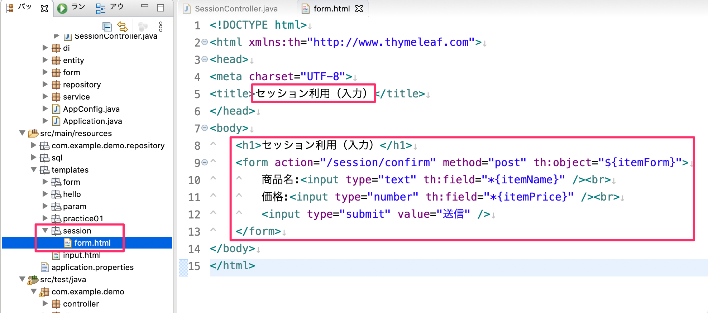

- `templates/session`フォルダを作成して`confirm.html`を作成して入力画面を作成します。
  - [フォームの利用・確認](mvc-form.md)とほぼ同じです。
    - セッション内容が保持されているか確認するために「戻る」のリンクを追加しています。

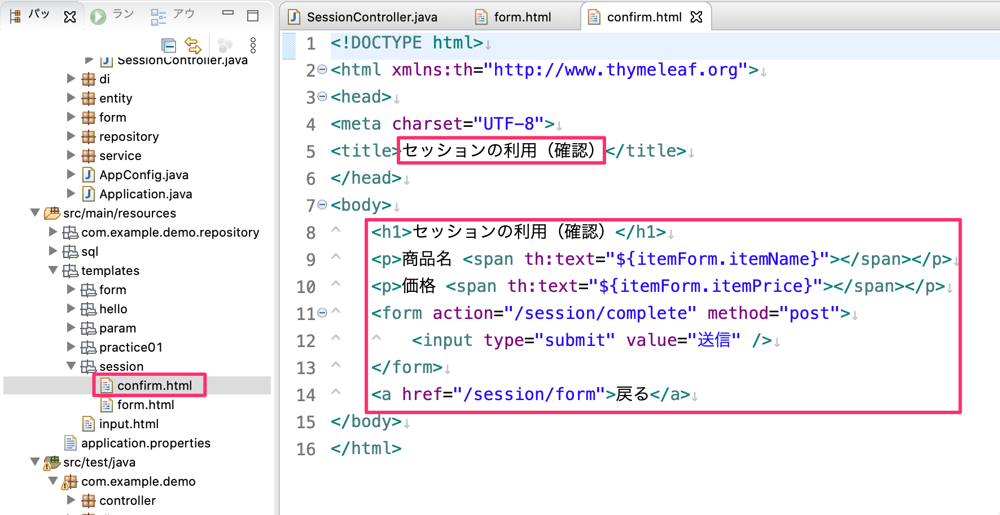

#### 動作の確認

- セッションが保持されているかを確認します。
  - `http://localhost:8080/session/form`にアクセスしてフォームに入力します。

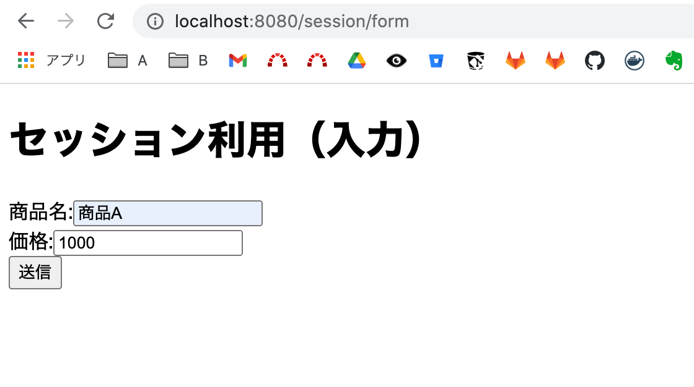

- 確認画面にて入力内容を確認して「戻る」のリンクをクリックします。

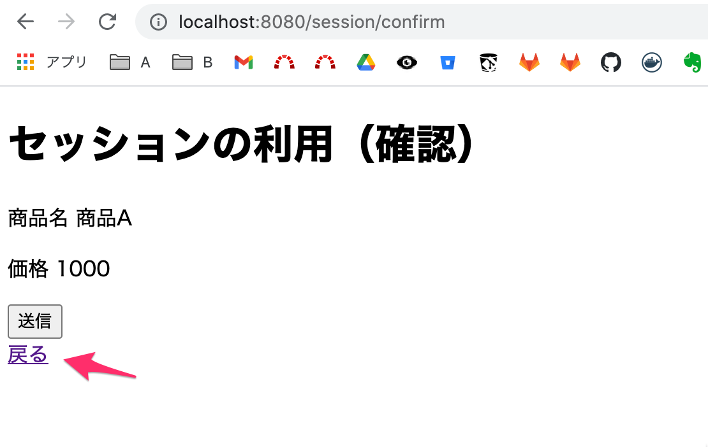

- 下図のようにセッションにて入力内容が残っている事を確認してください。

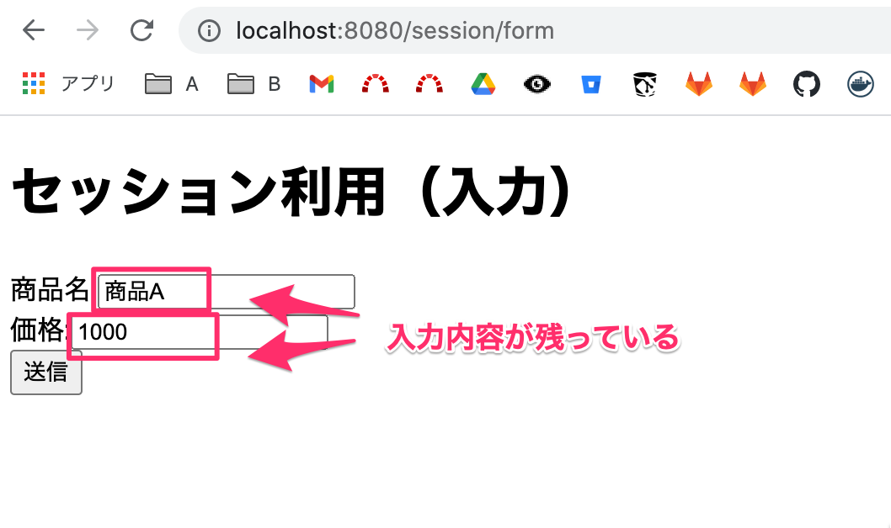

### 完了画面の追加（セッションの破棄）

- 完了画面を作り、セッションを破棄してみます。
  - `SessionController`に完了画面用のハンドラメソッドを追加します。
  - `@PostMapping("complete")`にします。
  - `SessionStatus`の引数を追加します。
    - これにより`sessionComplete`メソッドが呼べるようになり、セッションを破棄できます。

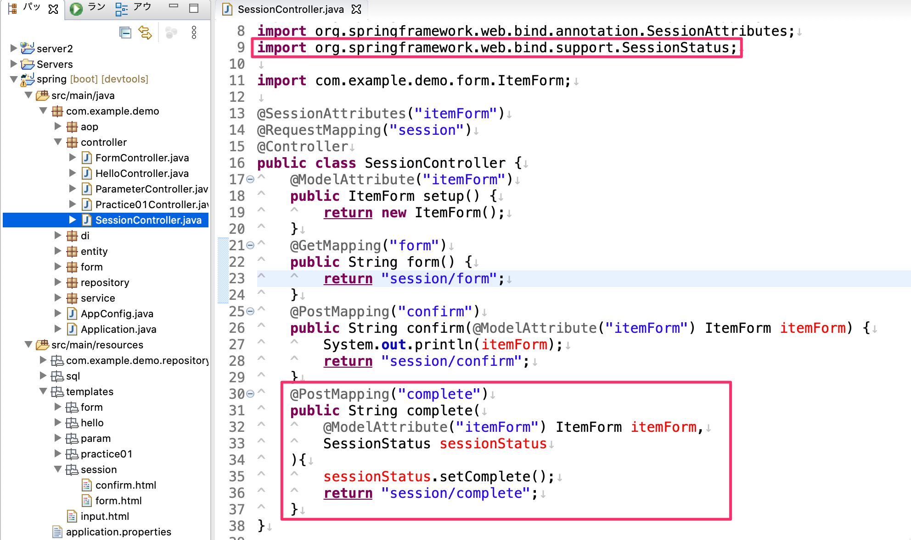

#### Viewの作成

- 完了画面のViewを作成します。

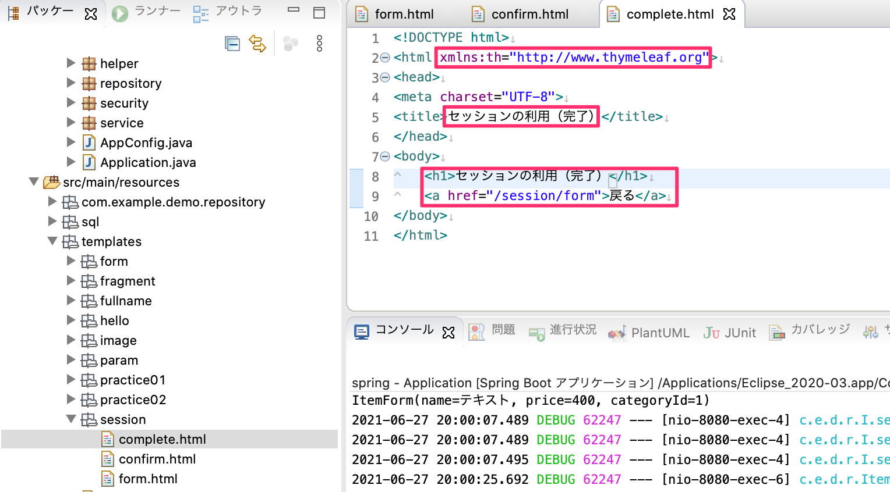

#### 動作確認

- 完了画面まで遷移した後に「戻る」リンクをクリックして入力画面にもどり、入力内容が破棄されている事を確認してください。
- `http://localhost:8080/session/form`にアクセスしてフォームに入力します。

- 確認画面にて入力内容を確認して「送信」ボタンをクリックします。

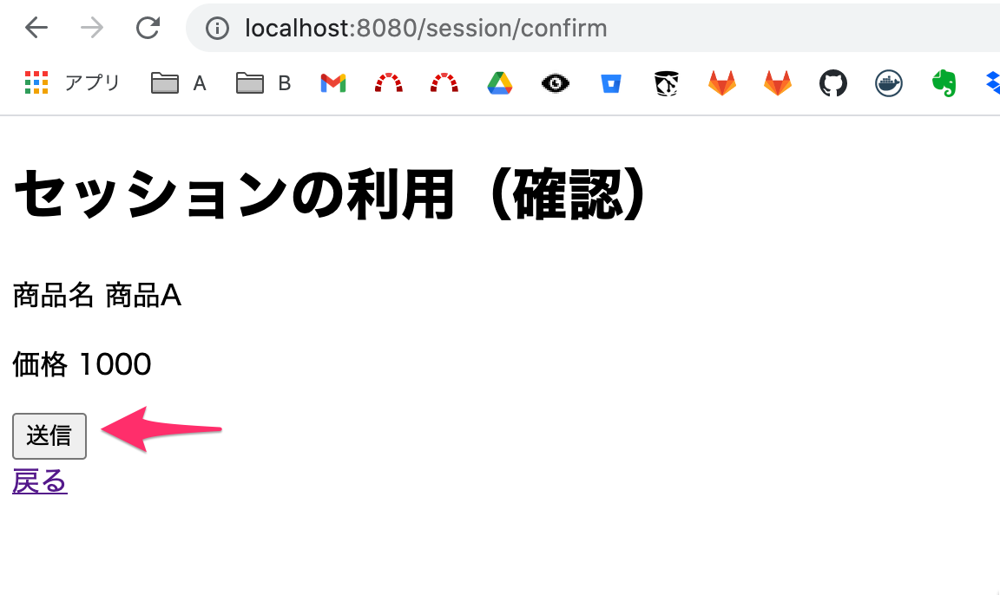

- 完了画面が表示されます。

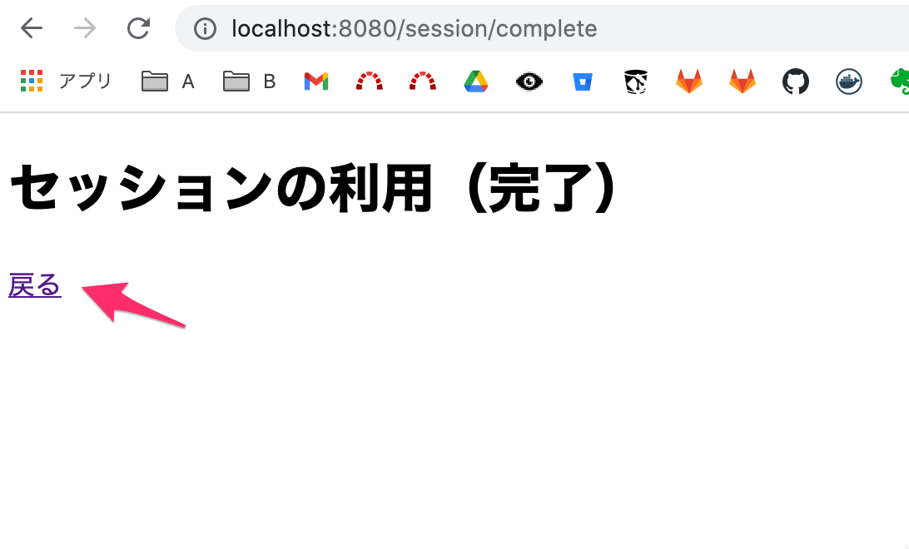

- 入力画面で入力内容が破棄された事を確認してください。

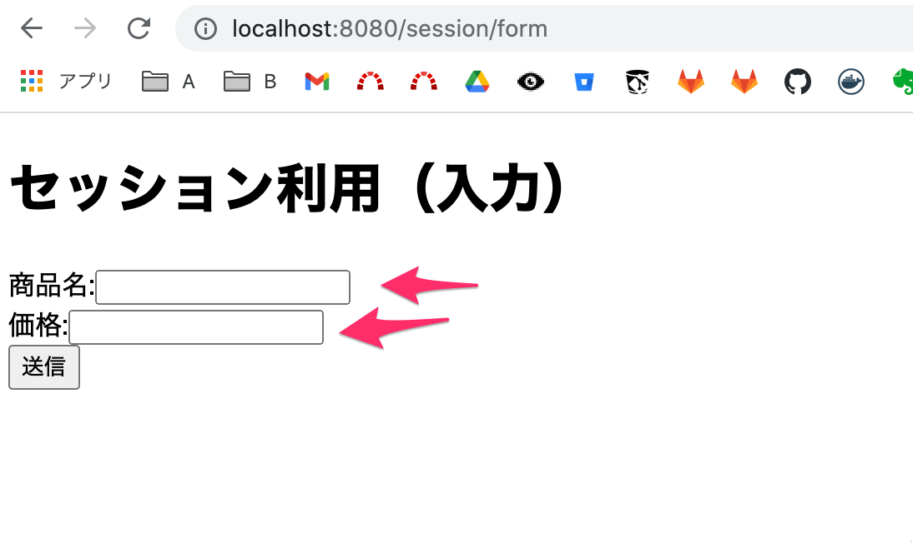

### PRGパターンとFlashスコープを使い完了画面へフォーム内容を送る

- PRGパターンのリダイレクト時にFormの内容をリダイレクト先にリクエストスコープで送る方法を紹介します。
  - PRGパターンの詳細は[こちら](https://qiita.com/furi/items/a32c106e9d7c4418fc9d#:~:text=%E4%B8%80%E8%A8%80%E3%81%A7%E8%A8%80%E3%81%86%E3%81%A8,POST%E3%81%97%E3%82%88%E3%81%86%E3%81%A8%E3%81%97%E3%81%A6%E3%81%97%E3%81%BE%E3%81%84%E3%81%BE%E3%81%99%E3%80%82)を参照してください。
  - `execute`のハンドラメソッドを追加し、`RedirectAttribute`の引数を追加します。
    - その引数の`addFrashAttribute`メソッドの中にフォーム内容をセットすることによりリダイレクト先にデータをリクエストスコープで送ることができます。

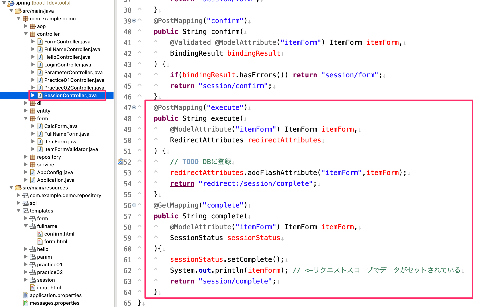

- 確認画面のPOST送信先を`/session/complete`から`session/execute`に変更します。

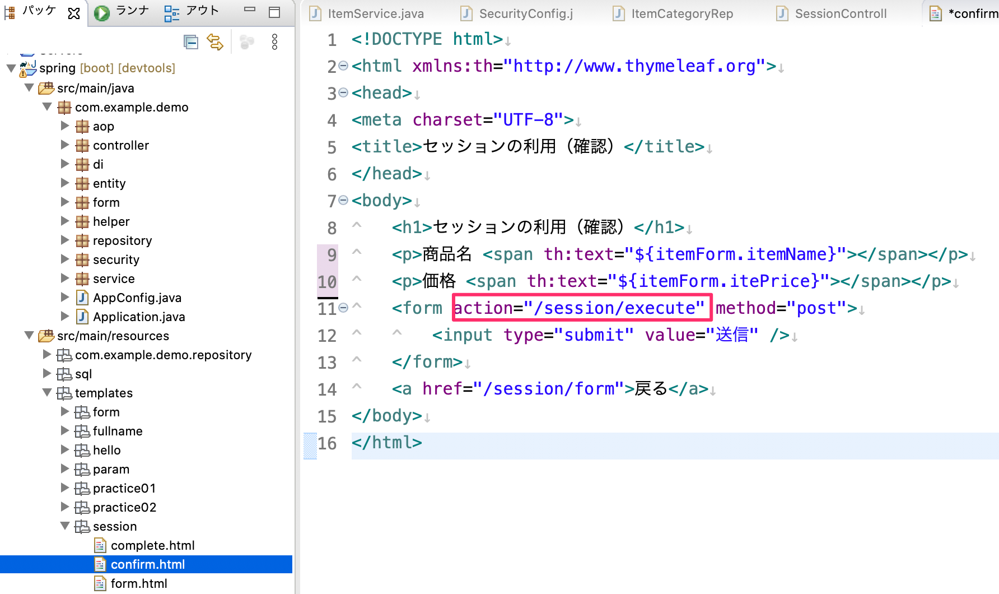

- `complete.html`はFlashスコープの値を表示するように追加します。

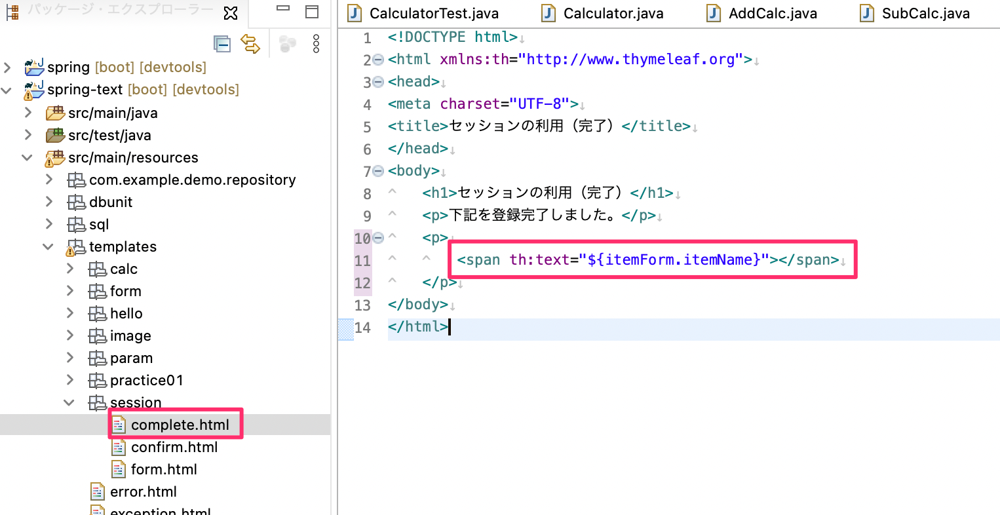

### 動作確認

- 完了画面まで表示させると商品名が表示されるようになります。

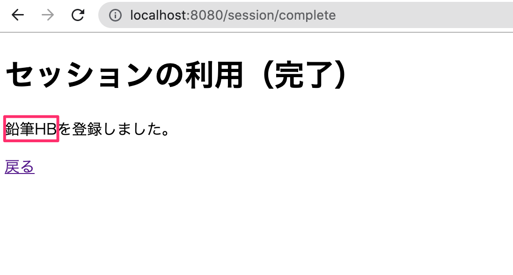

## 演習問題

- 下図のような足し算アプリになるようにFormクラス、Controllerクラス・ハンドラメソッド・Viewを作成しなさい。
  - 入力画面で2つの整数値を入力
  - 結果画面で2つの整数値を足し合わせた値を出力
- また結果画面では次のようにセッションを制御してください。
  - 「セッションを解除しないで戻る」ボタンをクリックした場合は入力画面にて入力した内容が保持されるようにしてください
  - 「セッションを解除して戻る」ボタンをクリックした場合は入力画面にて入力した内容が破棄されるようにしてください

_入力画面_

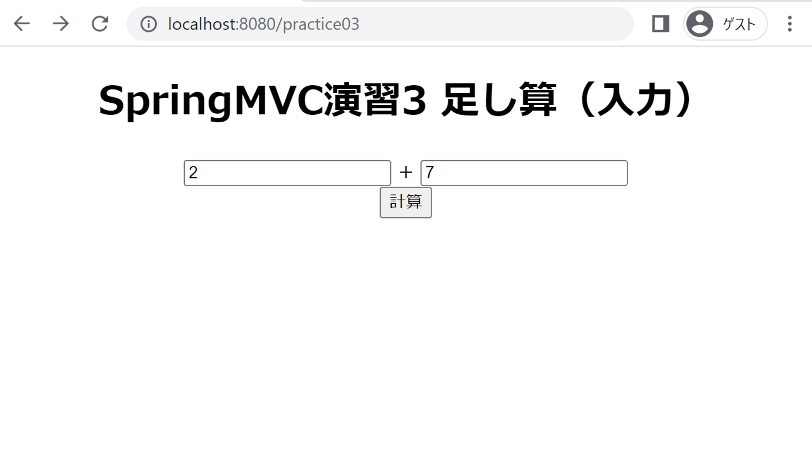

_結果画面_

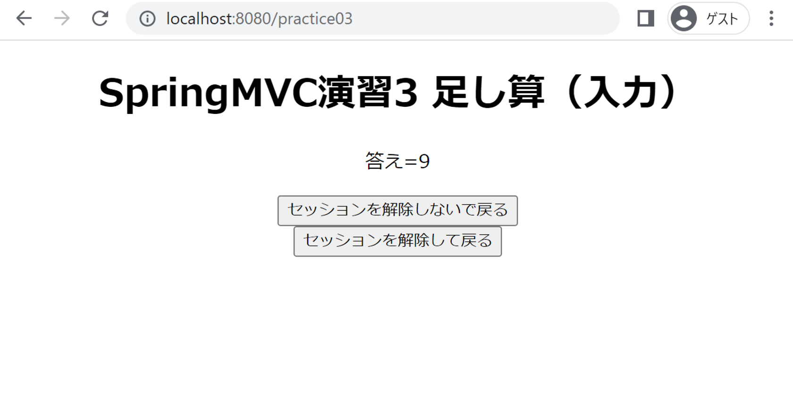

_「セッションを解除しないで戻る」ボタンをクリック時の入力画面_

_「セッションを解除して戻る」ボタンをクリック時の入力画面_

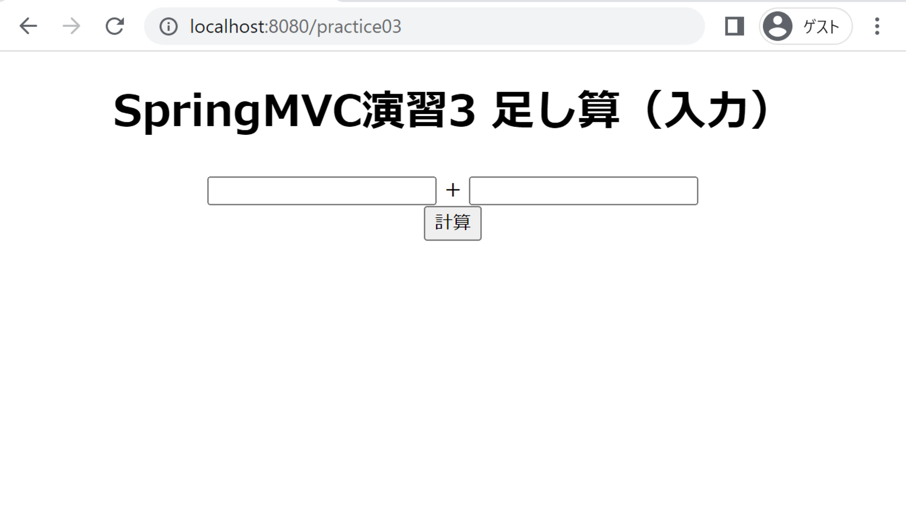

|クラス名（FQCN）|アノテーション|
|---|---|
|`com.example.demo.controller.Practice03Controller`|`@RequestMapping("practice02")`
|`com.example.demo.form.Practice03Form`|`@Data`

_Practice02Controllerのハンドラメソッド_

画面名|メソッド名|アノテーション|戻り値
---|---|---|---
入力画面 http://localhost:8080/practice03|form|`@GetMapping`|practice03/form
結果画面 http://localhost:8080/practice03|result|`@PostMapping`|practice03/result
「セッションを解除しないで戻る」ボタンをクリック時 http://localhost:8080/practice03/retain|retain|`@PostMapping`|redirect:/practice03
「セッションを解除して戻る」ボタンをクリック時 http://localhost:8080/practice03/clear|clear|`@PostMapping`|redirect:/practice03

### 演習解答例

_com.example.demo.form.Practice03Form.java_

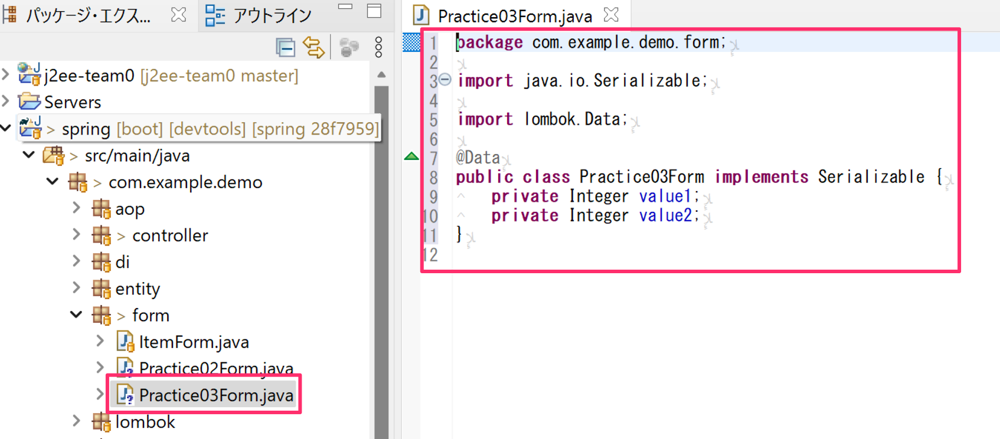

_com.example.demo.controller.Practice03Controller.java_

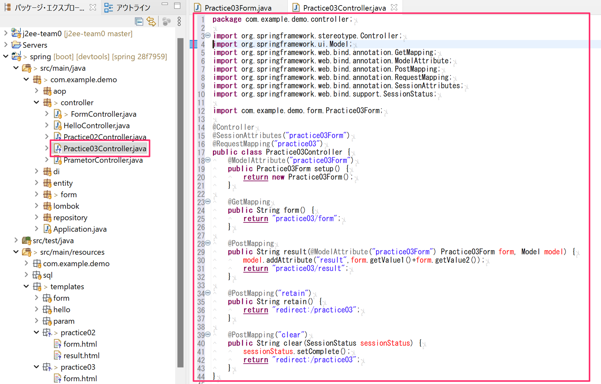

_src/main/resources/templates/practice03/form.html_

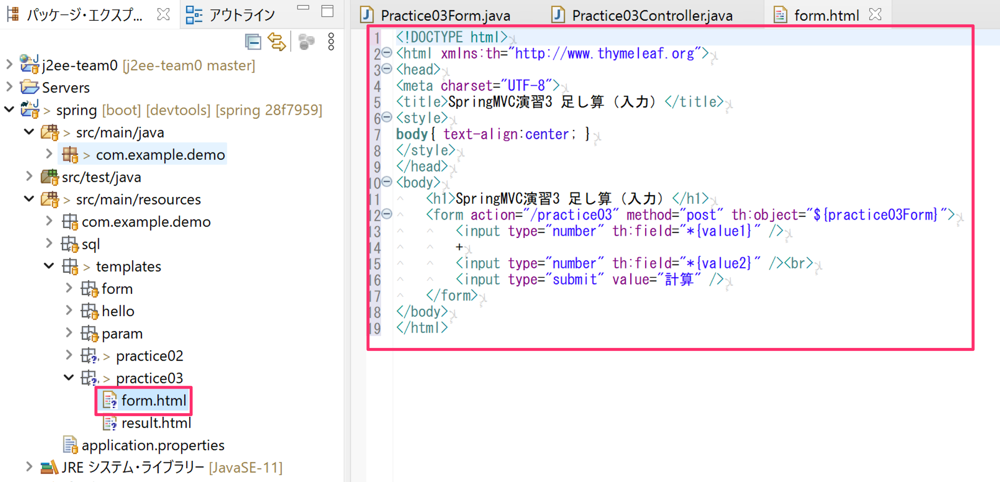

_src/main/resources/templates/practice03/result.html_

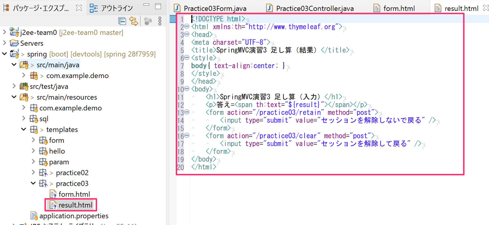