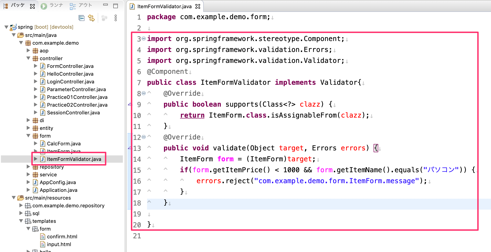
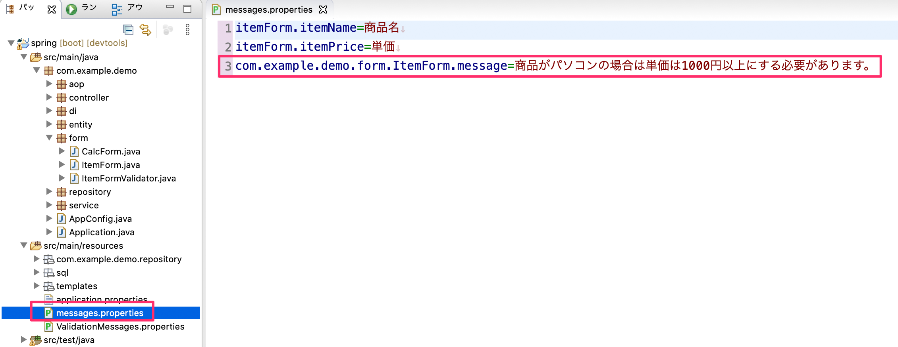
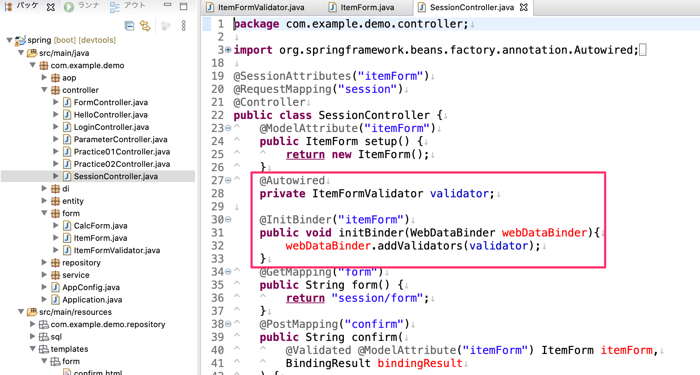
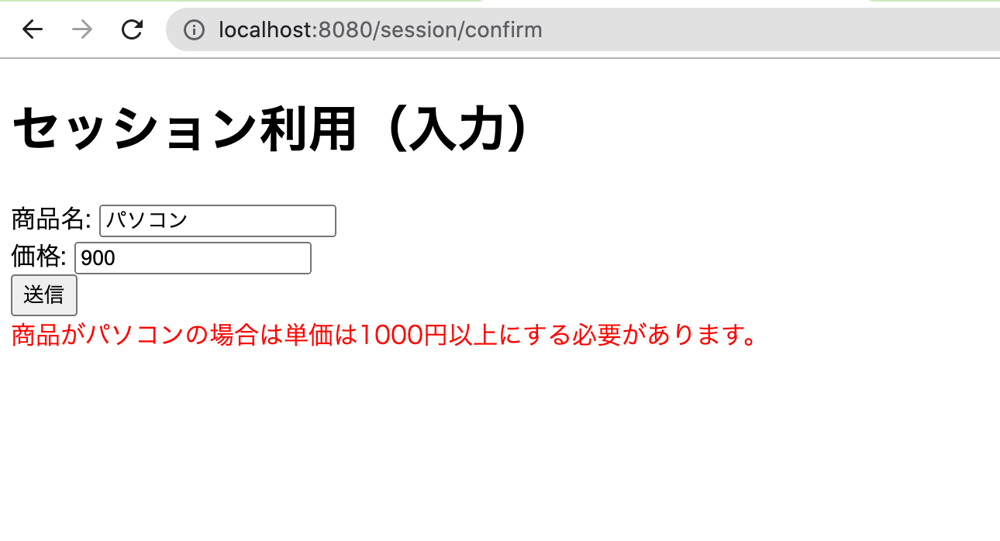

# 相関バリデートの確認

## 動作の確認

### Validatorインターフェース実装クラスの追加

`org.springframework.validation.Validator`インターフェースを実装したクラス`ItemFormValidator`クラスを`form`パッケージに追加します。

- `Validator`インターフェースを実装することにより継承しなければいけないメソッドをオーバーライドします。
  - `supports`メソッドにて相関バリデートする対象のクラスを登録しています。
  - `validate`メソッドにて相関バリデートの条件を実装します。
    - このメソッドの`target`引数に入力チェック時のFromオブジェクトのフィールドの値が取得できます。
    - target引数はObject型なのでダウンキャストしてItemForm型にしています
    - if文にて条件Formオブジェクトの複数のフィールドを条件に相関バリデートを表現し、エラー時は`errors`引数の`reject`メソッドを実行することによりエラー内容をエラー結果として登録します。
      - 今回は「商品名が"パソコン"で価格が1000円未満」はエラーとする条件をいれています。
      - `reject`メソッドの引数は`messages.properties`の中にあるメッセージの値のキー名を指定します。

### メッセージ内容の定義

Validatorクラスで実装した`reject`メソッドの引数の値のキーをもつメッセージを定義します。

### ControllerにFormValidatorクラスを登録

Validatorクラスを対象のコントローラーで利用するFormを利用するための処理を`SessionController`に追加します。
- ItemVaildatorの変数を用意し`@Autowired`でインジェクションします。
- `@InitBinder`アノテーションを付与したメソッドを追加します。
  - `@InitBinder`の引数にはこのコントローラーで利用しているFormオブジェクトのModelAttribute名を指定します。
  - メソッド引数の`WebDetaBinder`引数の`addValidator`メソッドでインジェクションするItemVaildatorの変数をセットします。

これで相関バリデートの実装は完了です。

### 動作の確認

下図のように`http://localhost:8080/session/confirm`にアクセスしてValidatorクラスで実装した相関チェック条件が動いている事を確認してください。

