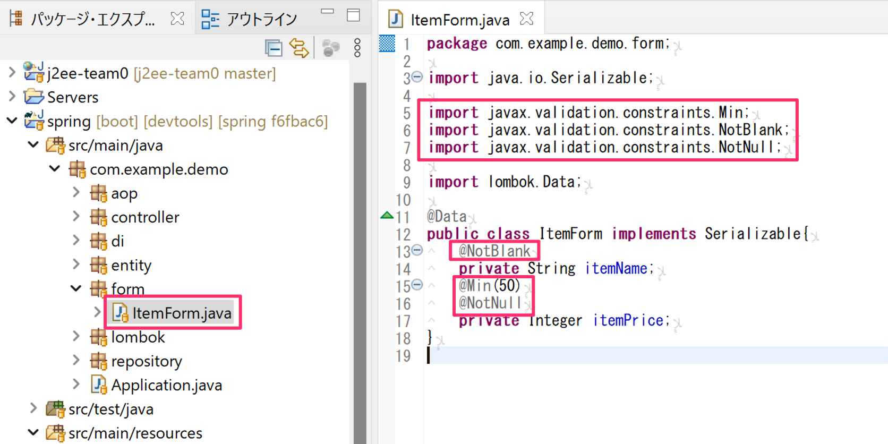

# 単項目バリデーションの実装

## 依存関係の追加

バリデーションに必要な依存関係を追加します。


## フォームにバリデーションを追加

[フォームの利用・確認](mvc-form.md)で作成した`ItemForm`に入力項目毎のバリデーション用アノテーションを追加します。

- `itemName`フィールドには文字列のnull及び空白を許容しない`@NotBlank`アノテーションを付与しています。
- `itemPrice`には次のバリデーションを付与しています。
  - `@Min`で整数で50未満の値を入力不可
  - `@NotNull`でnullを許容しない



## 入力チェック機能の実装

次に、バリデーションを追加したItemFormを利用している`SessionController`（[セッション（1つのコントローラー）の利用の確認](mvc-session.md)で作成したもの）に入力チェックの機能を追加します。

- confirmハンドラメソッドのItemFormの引数の`@ModelAttribute`を付与している前に`@Validated`を追加しています。
  - これによりItemFormのバリデーションルールで入力チェック処理されます。
- confirmハンドラメソッドに新たに`BindingResult`の引数を追加します。
  - この引数の中に入力チェック結果が格納されます。
- `BindingResult`の引数の`hasErrors`メソッドをif文で使う事によって、入力チェックエラーの条件分岐を行う事ができます。
  - エラー時はフォームのViewを呼び出すようにしています。


## Viewの更新

入力画面にエラーメッセージを表示するように更新します。
（[セッション（1つのコントローラー）の利用の確認](mvc-session.md)で作成した`templates/session/form.html`を更新します。

- エラーメッセージを赤字にするために`<style>`タグを追加しています。
- 各入力項目の箇所に`<span>`タグを追加し、その属性として`th:errors`で対象するItemFormのフィールドを指定しています。
- 画面下部にの`<span>`タグの箇所に`th:each`属性を追加してItemFormで発生したすべてのエラーを繰り返し処理で出力しているようにしています。
  - `${#fields.datailErrors()}`にて発生したすべてのエラーのコレクションを取得でき、それを`th:each`で繰り返し処理しています。


## エラーメッセージの定義

エラーメッセージの内容を任意で修正できるようにエラーメッセージ関連のプロパティファイルを作成します。

- `src/main/resources`の場所で「新規 -> ファイル」で`messages.properties`と`ValidationMessages.properties`を作成します。


作成したプロパティファイルは`ISO-8859-1`という文字コードなので日本語が文字化けしてしまうので、文字化けしないエディタで開きなおす必要があります。

`messages.properties`と`ValidationMessages.properties`それぞれを右クリックして「次で開く -> プロパティエディター」を選択してください。


このようにファイルのアイコンが黄緑の「P」になっている事を確認してください。
- たまにアイコンが更新されない場合があるので、その場合は対象フォルダをリフレッシュしてください。


`ValidationMessages.properties`にItemFormに付与したバリデーションアノテーション毎のエラーメッセージ内容を追加します。下記の内容を追加してください。

1行ごとに`アノテーションのFQCN.message`のキーとそれに対応した日本語エラーメッセージを定義しています。
- 値の`{0}`の箇所はアノテーションを付与したFormクラスのフィールド名が表示されます。（次の`messages.properties`でその名称を任意に変更できます。）

_ValidationMessages.properties_

```properties
javax.validation.constraints.AssertFalse.message={0}はFalseでなければなりません。
javax.validation.constraints.AssertTrue.message={0}はTrueでなければなりません。
javax.validation.constraints.DecimalMax.message={0}は{value}以下でなければなりません。
javax.validation.constraints.DecimalMin.message={0}は{value}以上でなければなりません。
javax.validation.constraints.Digits.message={0}は境界以外の数値（予測:<{integer}digits>.<{fraction}digits>）
javax.validation.constraints.Future.message={0}は未来日付でなければなりません。
javax.validation.constraints.Max.message={0}は{value}以下でなければなりません。
javax.validation.constraints.Min.message={0}は{value}以上でなければなりません。
javax.validation.constraints.NotNull.message={0}は入力必須です。
javax.validation.constraints.Null.message={0}はNullでなければなりません。
javax.validation.constraints.Past.message={0}は過去日付でなければなりません。
javax.validation.constraints.Pattern.message={0}はパターン（{regexp}）に一致しなければなりません。
javax.validation.constraints.Size.message={0}のサイズは{min}以上{max}以下でなければなりません。
javax.validation.constraints.NotBlank.message={0}は入力必須です。

org.hibernate.validator.constraints.CreditCardNumber.message={0}は正しいクレジットカード番号ではありません。
org.hibernate.validator.constraints.Email.message={0}は正しいE-Mailの形式ではありません。
org.hibernate.validator.constraints.Length.message={0}は長さは{min}以上{max}以下でなければなりません。
org.hibernate.validator.constraints.NotBlank.message={0}は入力必須です。
org.hibernate.validator.constraints.NotEmpty.message={0}は入力必須です。
org.hibernate.validator.constraints.Range.message={0}は{min}から{max}の範囲内でなければなりません。
org.hibernate.validator.constraints.SafeHtml.message={0}は安全ではないHTMLが含まれています。
org.hibernate.validator.constraints.ScriptAssert.message={0}は{script}による評価が不正です。
org.hibernate.validator.constraints.URL.message={0}は正しいURLではありません。
```


次に、`ValidationMessages.properties`の`{0}`の箇所に適用する要素名を`messages.properties`に追加します。

- 今回はItemFormのフィールド毎の表示名を定義しています。


## 動作確認

それではSpring Bootアプリケーションを起動して下図のようにエラーメッセージが表示されることを確認してください。

