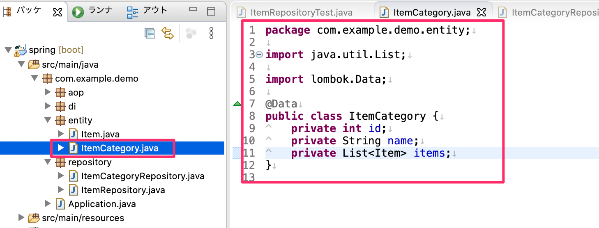
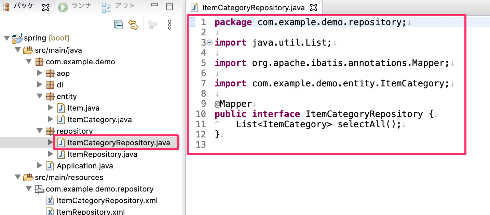
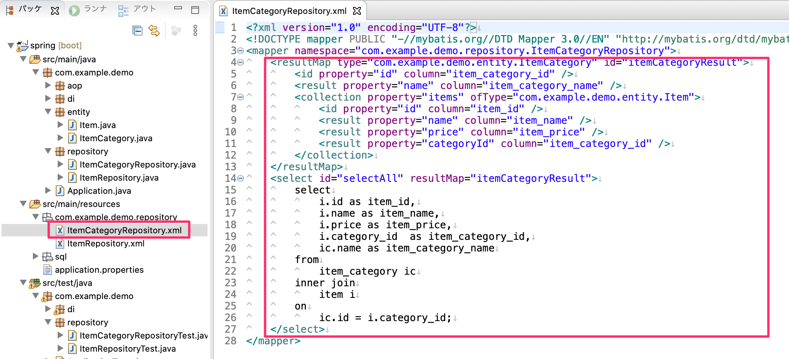
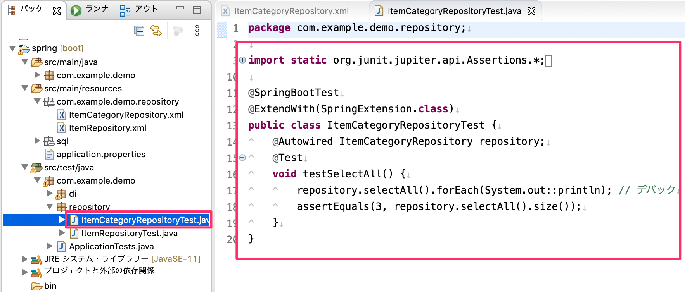
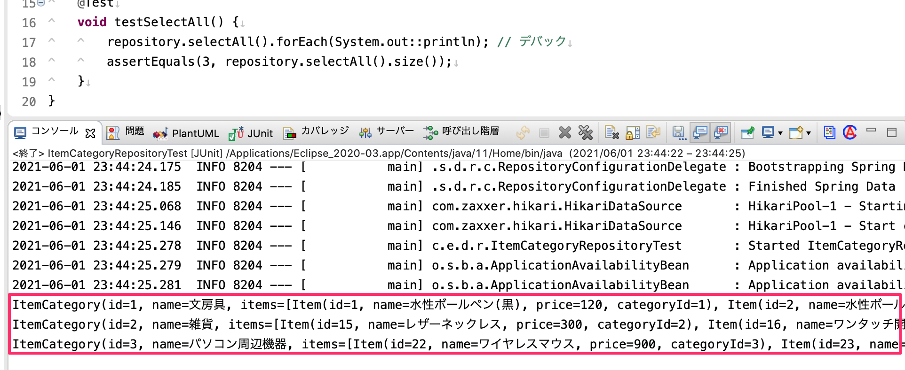
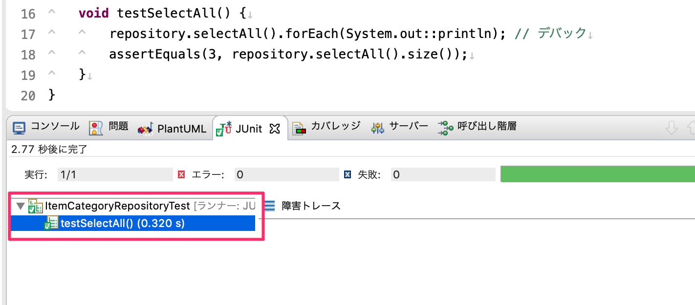
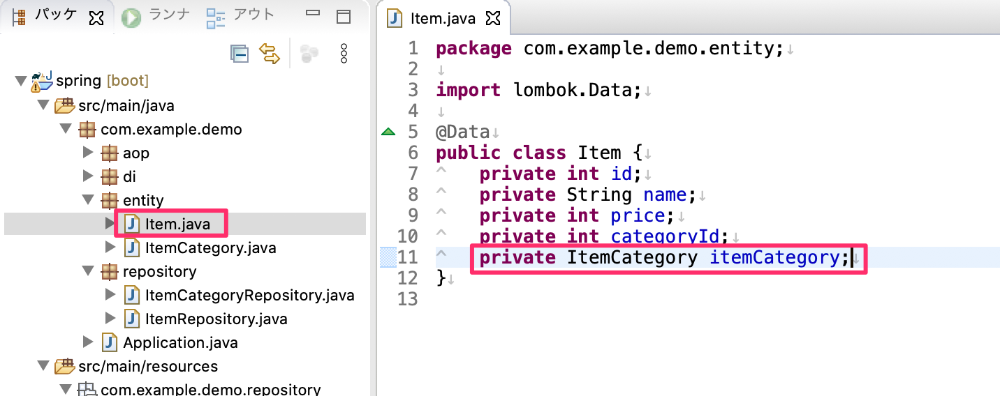
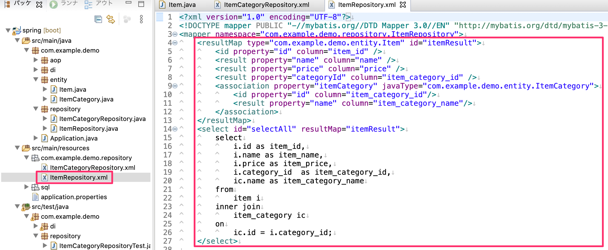
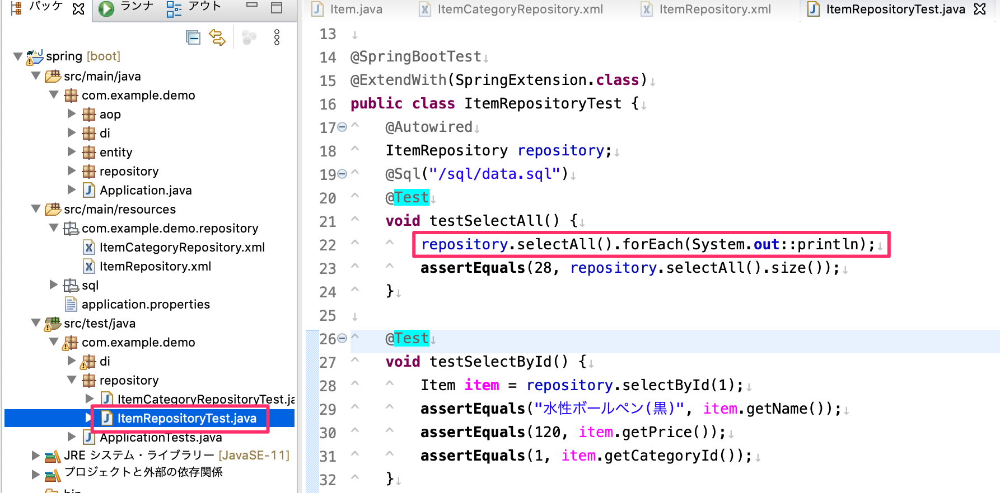
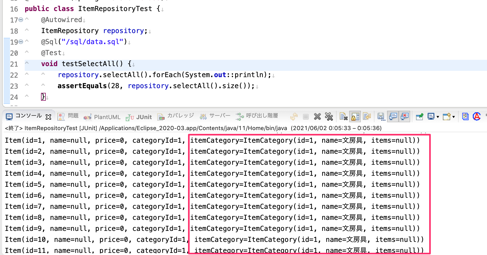

# Mybatisテーブル結合の確認

## collectionタグを使った1対多の取得

- Mybatisのcollectionタグを使って1対多でテーブルを結合した結果をORマッピングしてみます。
  - `com.example.demo.entity`に`ItemCategory.java`クラスを作成します。
  - `Item.java`と同様にitem_categoryテーブルのカラムに連動したフィールドを定義します。
  - 1つのアイテムカテゴリに属したアイテムのリストもフィールドとして定義します。

- 次に`com.example.demo.repository`に`ItemCategoryRepository.java`インターフェースを作成します。
  - `ItemRepository.java`と同様に`@Mapper`アノテーションを付与します。
  - item_categoryテーブル全件を取得する抽象メソッドを定義します。

- `src/main/resources`の`com/example/demo/repository`の中に`ItemCategoryRepository.xml`のMapperXMLを作成します。
  - 下図のように`<ResultMap>`タグを定義し、その中にコレクションとして取得したい部分を`<collection>`タグを使って指定します。
  - `<select>`タグの部分もSQLの内部結合を使ってテーブル結合しています。

- それでは1対多でデータが取れているかテストクラスを作成して確認します。
  - `src/test/java`の中の`com.example.demo.repository`パッケージの中に`ItemCategoryRepository.java`クラスを作成して下図のようにテストケースを作成します。
  - 今回はアサーション以外に1対多でデータが取れているかデバックして確認するようにコンソール出力をしています。

- 下図のようにコンソールにて1アイテムカテゴリに対して複数のアイテムが取得できていることが確認できます。

- また、テストも合格することを確認してください。

## assciateタグを使った1対1の取得

- `<assciate>`タグを使って、1つのアイテムに対して1つのアイテムカテゴリを取得できるか確認します。
- `Item.java`クラスに`ItemCategory`のフィールドを追加します。

- `ItemRepository.xml`のMapperXMLファイルの全件取得用の`<select>`タグの部分を下図のように変更します。

- 下図のように`ItemRepositoryTest.java`の全件取得テストケースにデバックのプログラムを追加します。

- コンソールにて下図のとおり1アイテム毎に1アイテムカテゴリが取得できている事を確認できます。

