# mybatis

## 環境構築

### PostgreSQLにDB、テーブル追加

- [DB、ロール作成用SQL](sql/create_user.sql)
- [テーブル作成用SQL](sql/create_table.sql)

### mybatipseプラグインのインストール

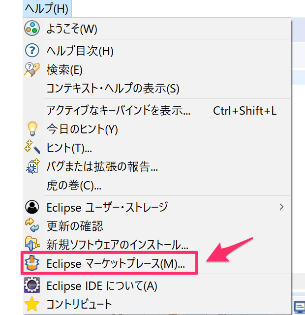

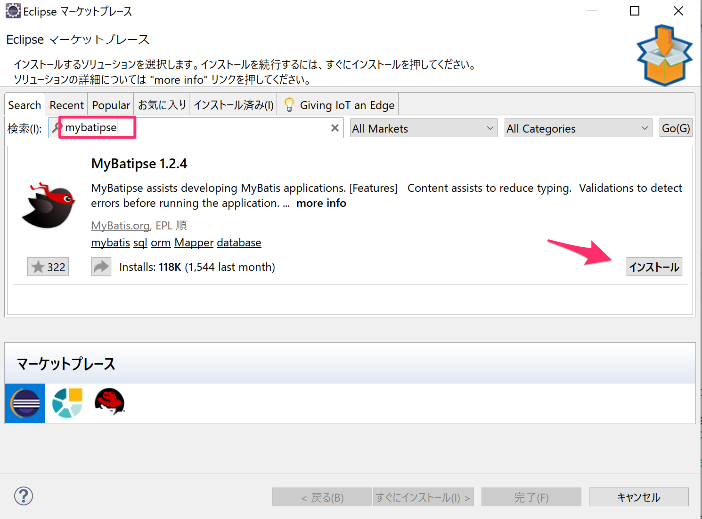

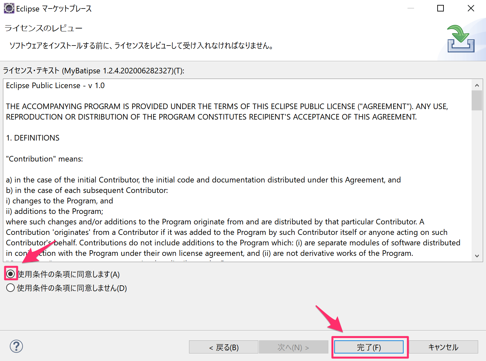

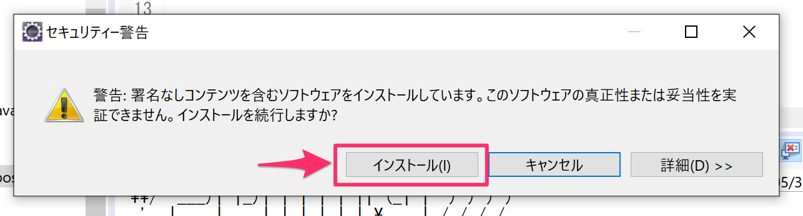

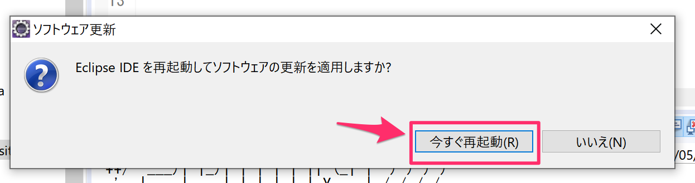

## 動作確認

### 依存関係の追加

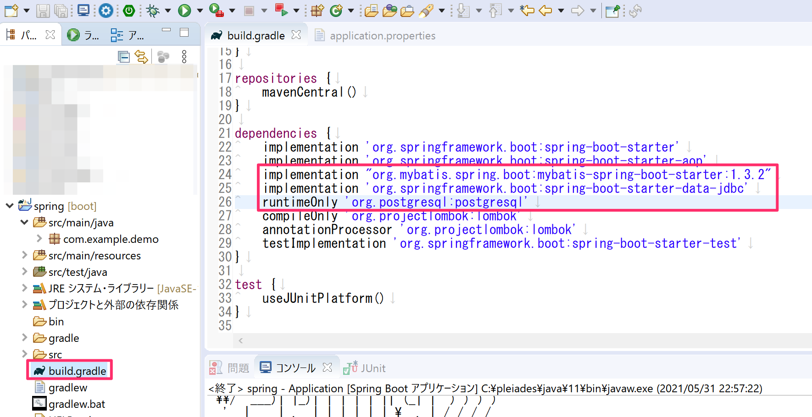

### DB接続情報の設定

### Entityの作成

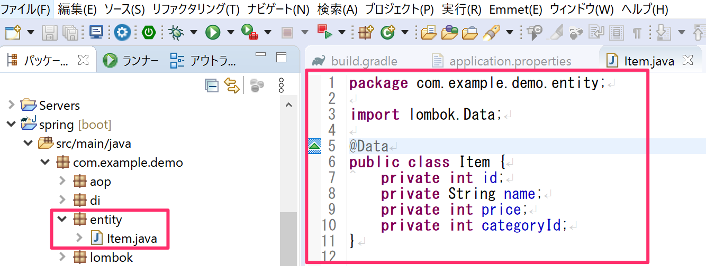

### Mapperインターフェースの作成

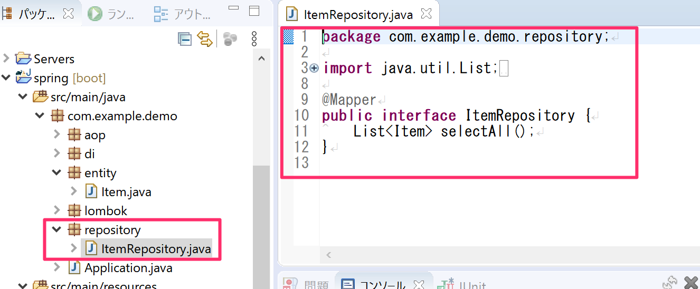

### MapperXMLの作成

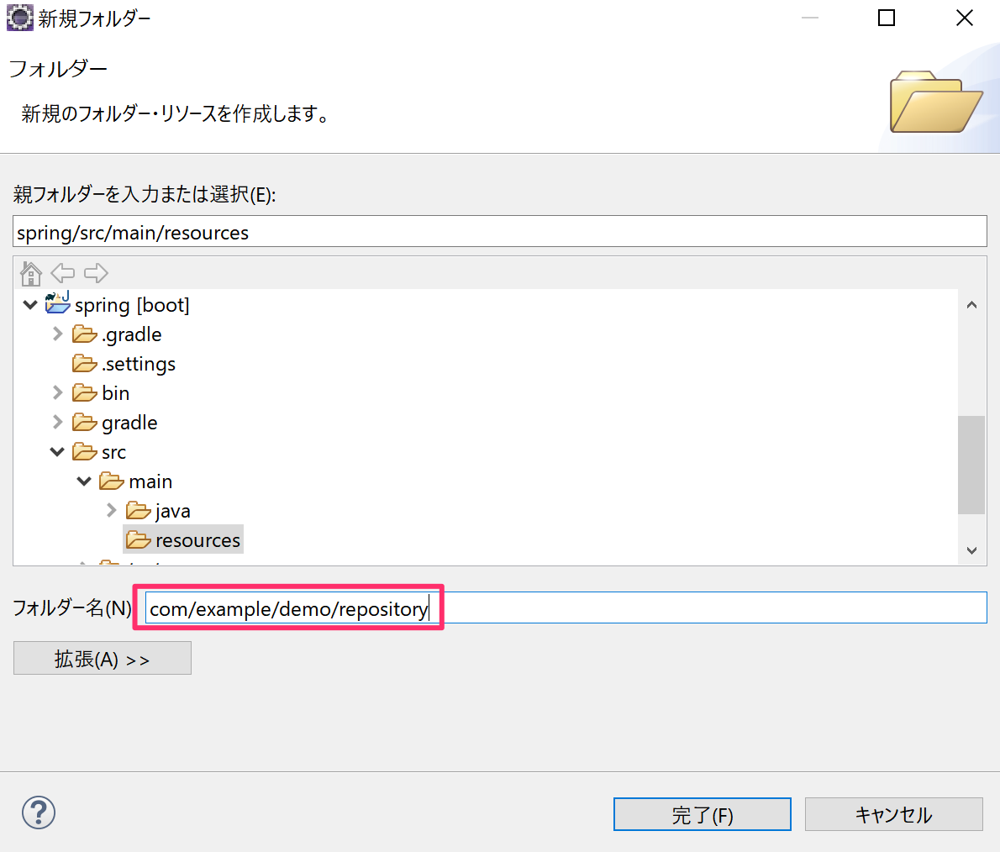

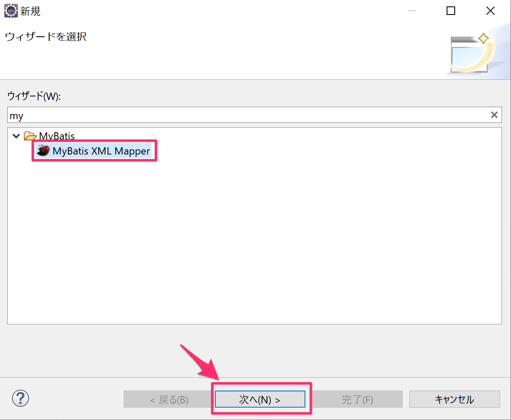

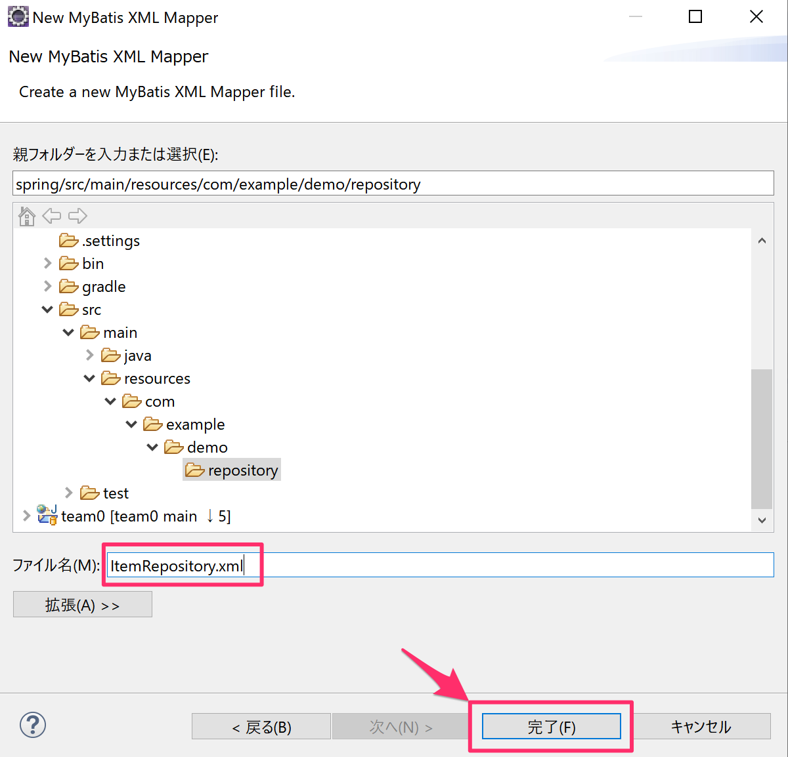

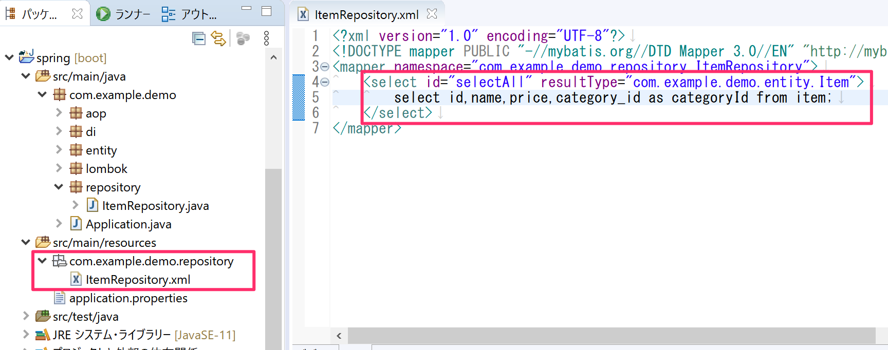

### テストクラスの作成

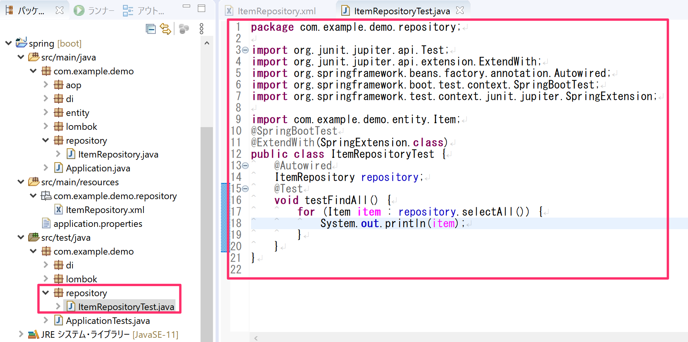

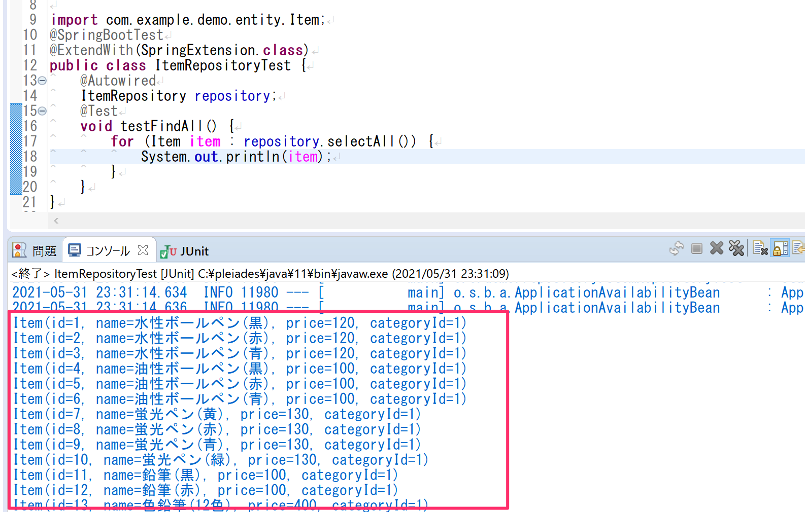

## 演習問題

### 基本的なCRUDの問題

- 上記とテキストを参考に`ItemRepository.java`と`ItemRepository.xml`を更新してレコードを1件登録する処理を実装してください
  - 登録の確認は`ItemRepositoryTest.java`にテストケースを作り確認してください。
- 上記とテキストを参考に`ItemRepository.java`と`ItemRepository.xml`を更新してレコードを1件更新する処理を実装してください
  - 更新の確認は`ItemRepositoryTest.java`にテストケースを作り確認してください。
- 上記とテキストを参考に`ItemRepository.java`と`ItemRepository.xml`を更新してレコードを1件削除する処理を実装してください
  - 削除の確認は`ItemRepositoryTest.java`にテストケースを作り確認してください。
