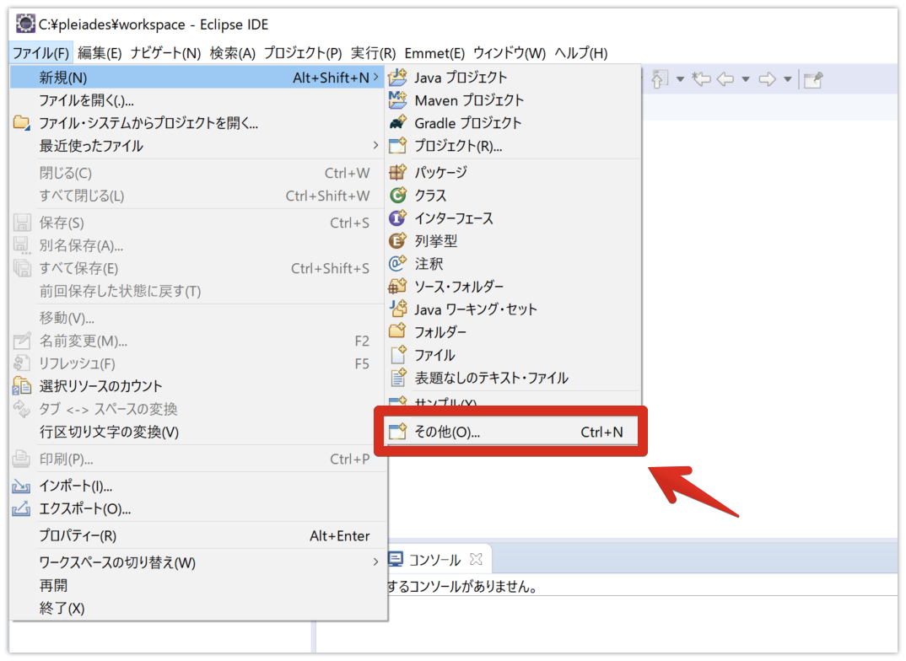
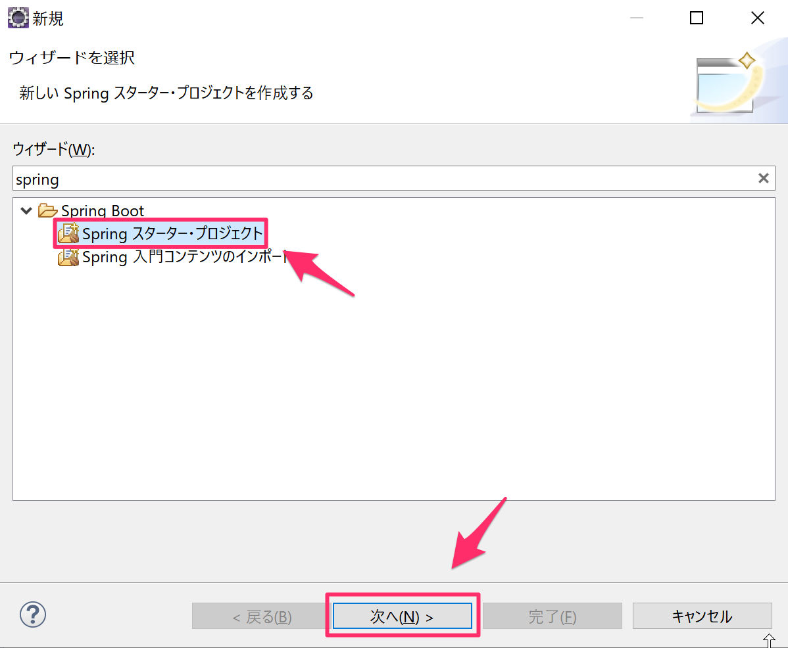
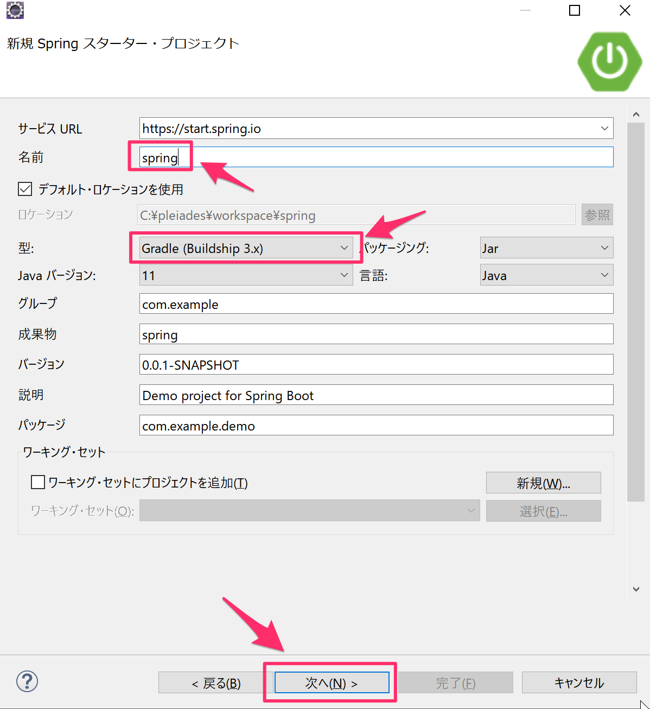
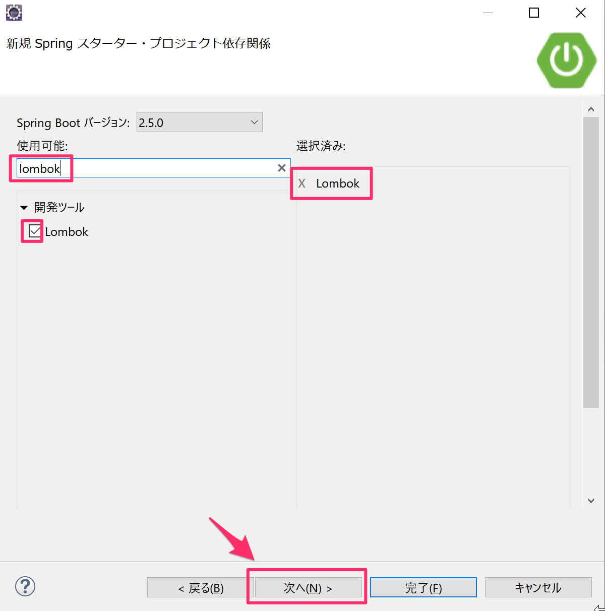
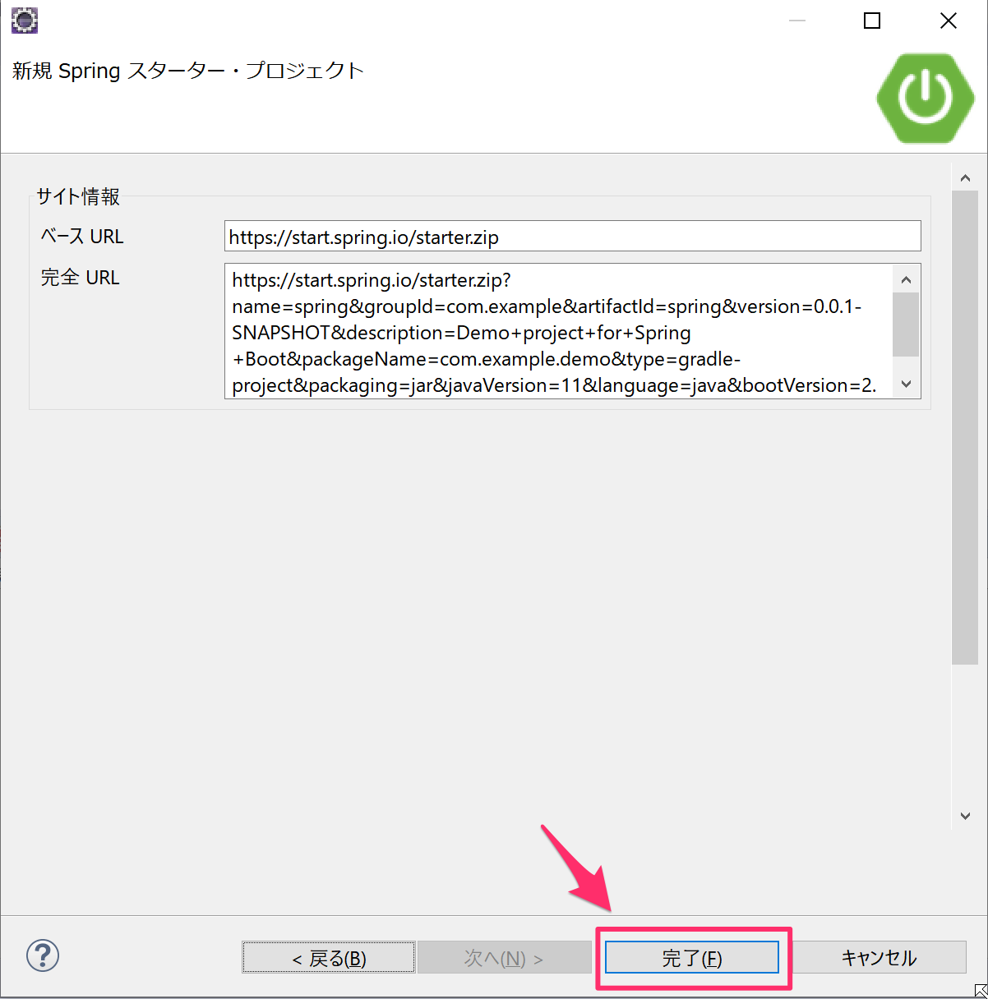
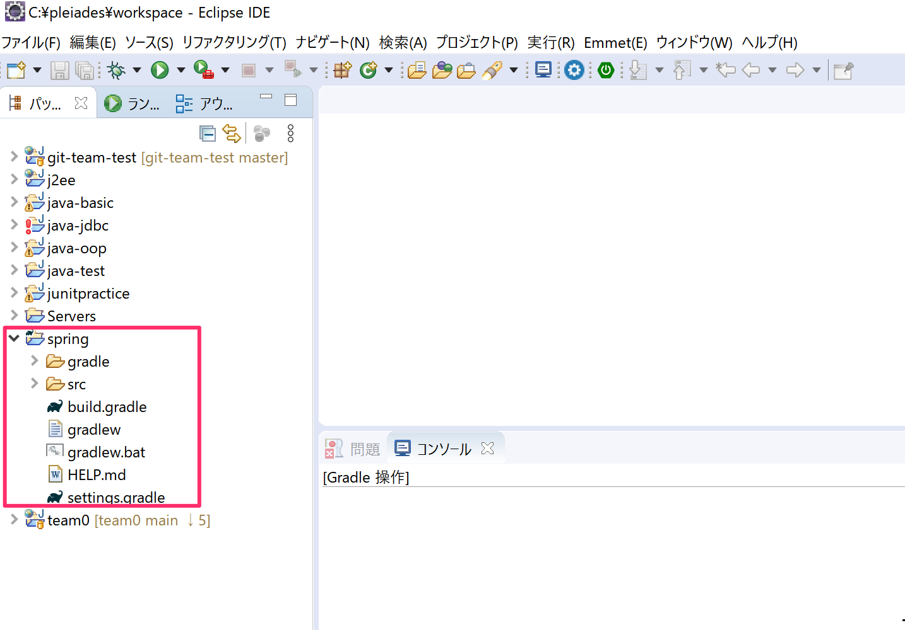
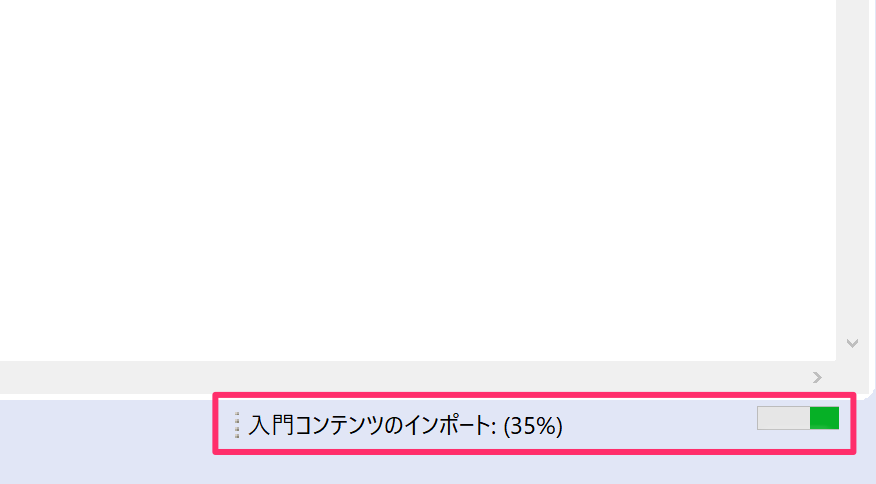
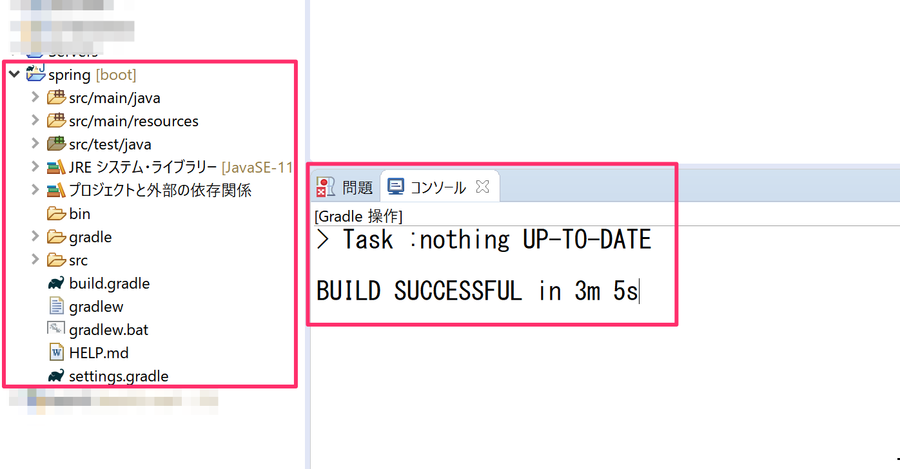
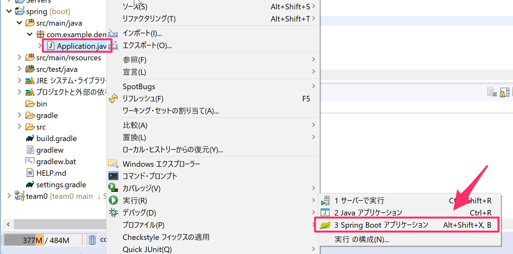
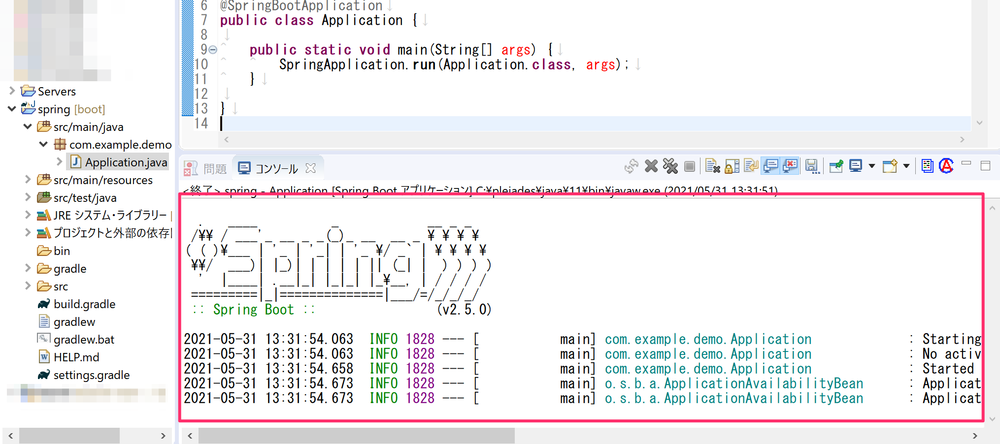

# Spring Bootプロジェクトの作成

## eclipseでSpring Bootプロジェクトの作成

eclipseを起動して「ファイル -> 新規 -> その他」を選択します。

「Spring Boot」の中の「Springスターター・プロジェクト」を選択して「次へ」をクリックします。

名前は「spring」にし型は「Gradle（Buildship 3.x）」を選択して「次へ」をクリックします。

プロジェクトの依存関係の画面は入力欄に「lombok」を入力し、開発ツールの「Lombok」にチェックをして「次へ」をクリックします。

次の画面は「完了」ボタンをクリックします。

Spring Bootのプロジェクトが作成されました。

プロジェクト作成直後は依存関係のダウンロードでしばらく時間がかかります。

コンソールにて下図のうように「BUILD SUCCESSFUL」と表示される事を確認してください。

## Spring Bootアプリケーションの実行

プロジェクトの中の`src/main/java`の中の`com.example.demo`の中の`Application.java`の箇所で右クリックして「Spring Bootアプリケーション」を選択します。

しばらくすると下図のように「Spring」のアスキーアートが表示されればSpring Bootが起動している事が確認できます。

## Spring Bootプロジェクトの構成

