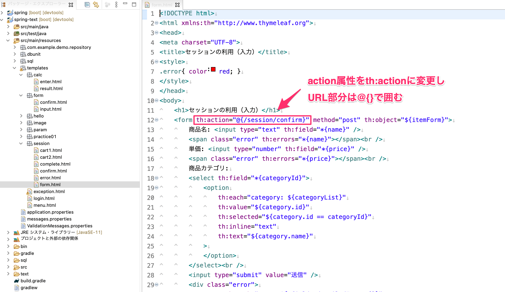
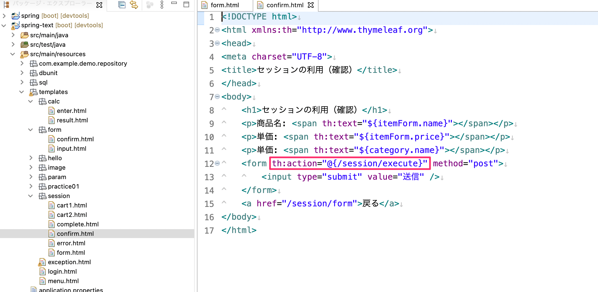
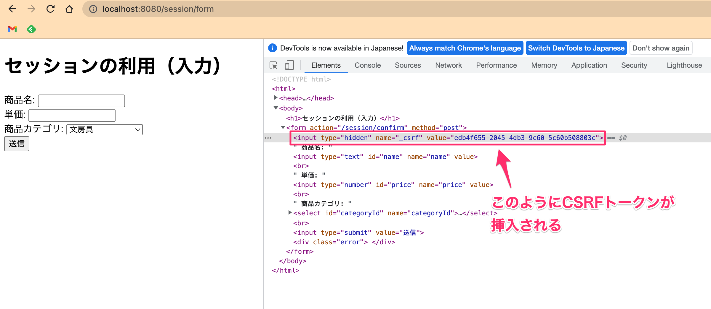

# Spring SecurityのCSRF対策

- Spring Securityを利用している場合、セッション毎にランダムなトークンを発行してViewに埋め込み、サーバに送信されたトークンがセッションに保 存されているトークンと一致しているかをチェックする仕組みになっている。

## CSRF対策の実装

- セッションを利用しているSessionControllerのViewにてCSRF対策を追加します。
  - formタグの部分の`action`属性を`th:action`属性に変更
  - `th:action`属性の値のURLは`@{}`で囲む
- これで自動的にCSRF対策してのランダムなトークンがフォームに挿入されます。

_src/main/resources/templates/session/form.html_

_src/main/resources/templates/session/confirm.html_

- 次のように入力画面や確認画面のformタグの中に隠し項目（input type=hidden）としてCSRF対策のランダムなトークンが払い出されていることが確認できます。

