# Spring Securityの認証・認可の動作確認

Spring Secrityを使った認証・認可機能の実装について確認していきます。

## 環境構築

Spring Secrityを使った認証・認可機能に必要な環境を構築していきます。

### テーブル定義ファイル作成

まず、認証・認可に必要なDBのテーブルを`src/main/resources/sql`の中に`accounnt_data.sql`として定義します。

- このSQLを使ってTestクラスで再帰的にテストできるテストデータとして作成しています。
- 作成しているテーブルは次のものです。
  - `account`テーブル
    - ユーザアカウント情報テーブル
  - `account_role`テーブル
    - ユーザアカウントの権限テーブル

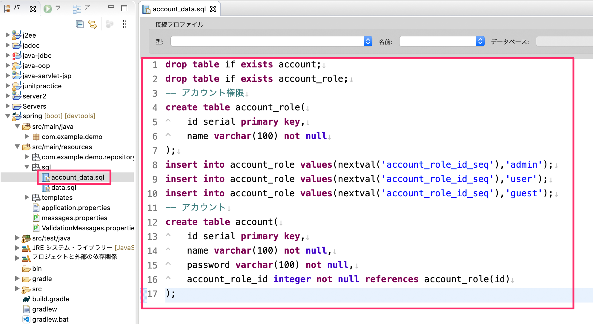

### 依存関係の追加

Spring Security関連の依存関係を追加します。

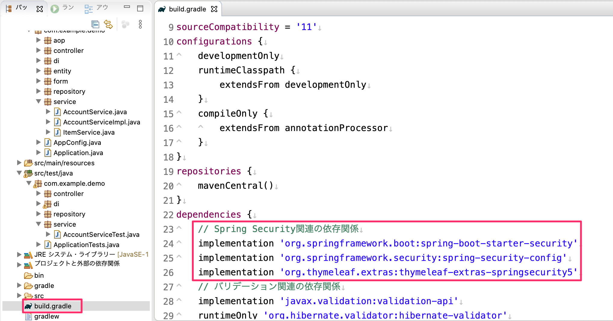

## ユーザアカウントの登録機能実装

それではまずユーザアカウント登録機能を実装します。

### 処理の流れ

今回のユーザアカウント登録の処理の流れは下図のシーケンス図のとおりです。

- Mybatisを使ってユーザアカウントをDBに登録する処理です。
  - テストクラス`AccountServiceTest`からEntityの`Account`インスタンスを作る
  - `Account`インスタンスのパスワードを暗号化する
  - `AccountService`の`addAccount`メソッドを呼びユーザアカウント登録を依頼する
  - `AccountService`から`AccountRepository`へ`insert`メソッドを使ってDBにたいして　ユーザアカウント登録を行う

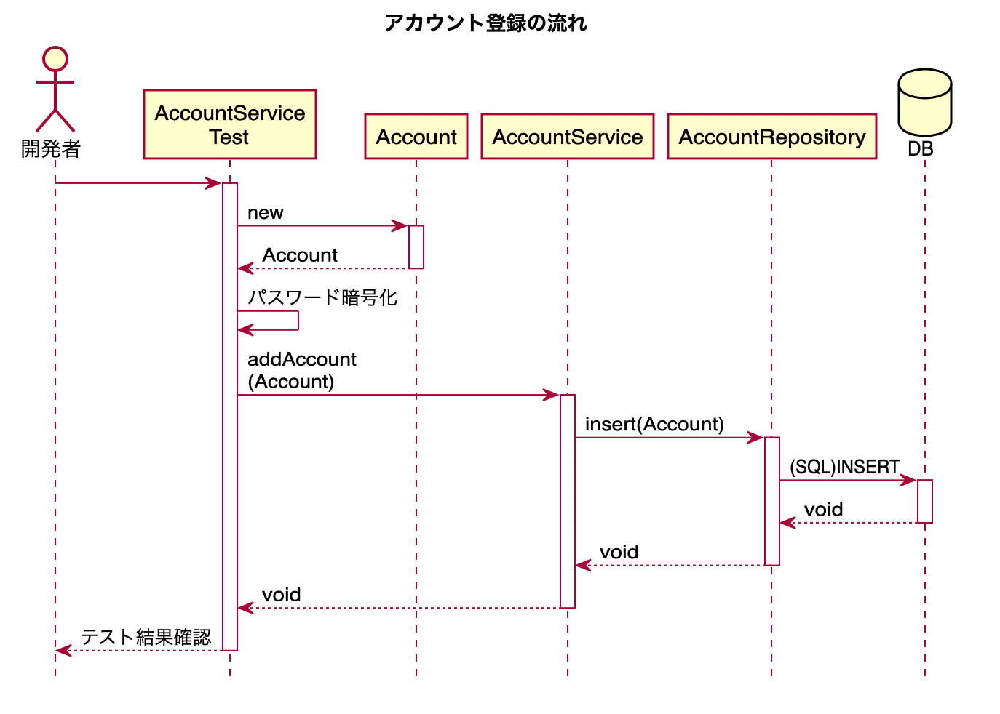

[このシーケンスのplantumlはこちら](img/sprinng-security-add-account-sequence-plantuml.png)

### Entityの実装

DBのアカウントとアカウント権限テーブルに合わせたEntityクラスを実装します。

_(src/main/java)com.example.demo.entity.AccountRole.java_

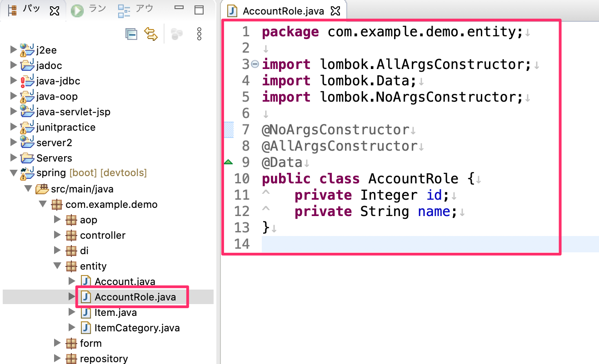

_(src/main/java)com.example.demo.entity.Account.java_

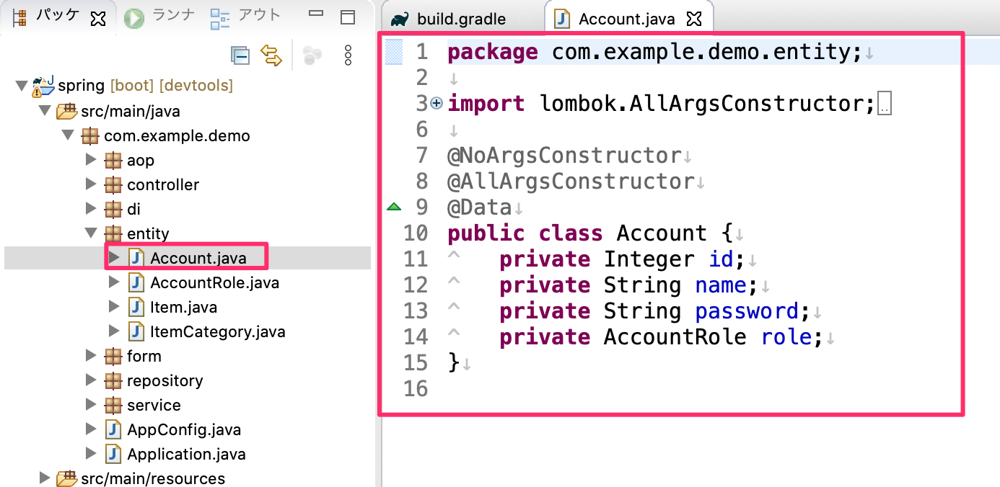

### Repositoryの実装

MybatisでのデータのCRUDの実装方法に習って`AccountRepository.java`のMapperインターフェースと、`AccountRepository.xml`のMapperXMLを作成します。

_(src/main/java)com.example.demo.repository.AccountRepository.java_

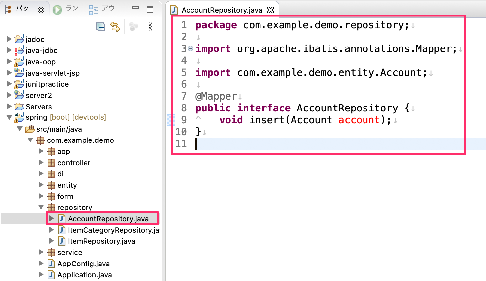

_src/main/resource/com/example/demo/repository/AccountRepository.xml_

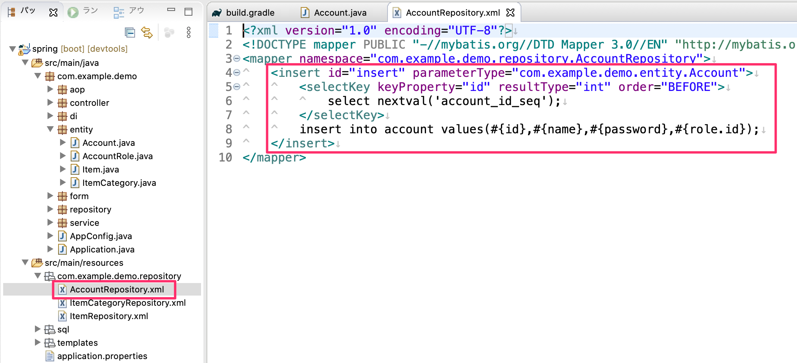

### Serviceの実装

`AccountRepository`のMapperインターフェースをインジェクションしてユーザアカウント登録処理を依頼する`AccountService.java`インターフェースと、`AccountServiceImpl.java`クラスを作ります。

- ControllerからこのServiceクラスを呼ばれることを想定して、ControllerからServiceをインターフェース依存するために`com.example.demo.service`パッケージの中に`AccountService`インターフェースを作っています。
  - `AccountService`インターフェースを実装した`AccountServiceImpl`クラスを作り、そこで`AccountRepository`をインジェクションしてユーザアカウント登録を依頼しています。

_(src/main/java)com.example.demo.service.AccountService.java_

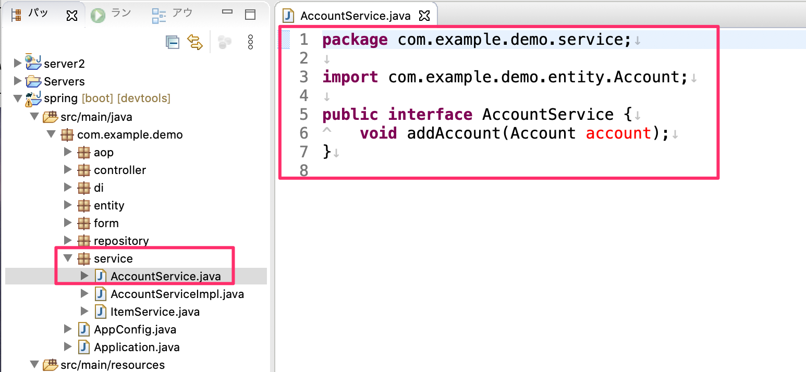

_(src/main/java)com.example.demo.service.AccountServiceImpl.java_

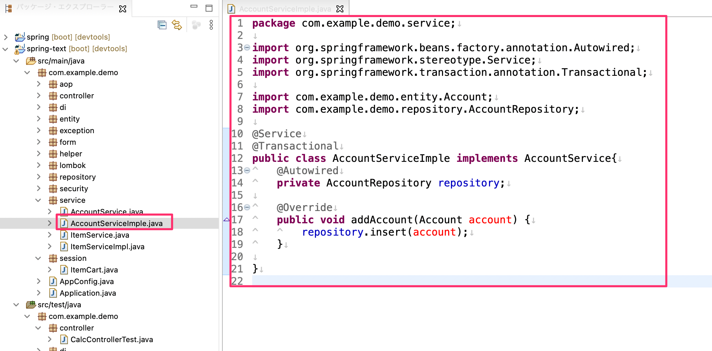

### パスワードエンコードのDI設定

ユーザアカウント情報をDBに登録する前にパスワード情報を暗号化するためにSpring Securityが提供している`PasswordEncoder`インターフェースのインスタンスをDIするよう設定しています。

- ベースパッケージ（`com.example.demo`）直下に`AppConfig.java`のクラスを作成します。
- 今回はBcryptという暗号アルゴリズムを使うのでインジェクションするインスタンスは`BCryptPasswordEncoder`にしています。

_(src/main/java)com.example.demo.AccountConfig.java_

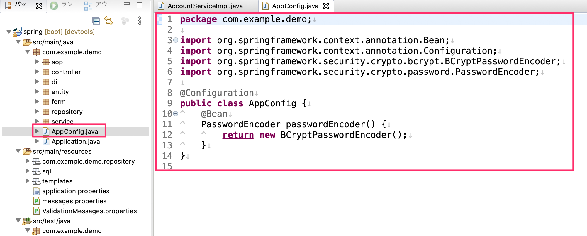

### Serviceのテスト

それでは実装した`AccountService`の実装クラスを使ってユニットテストを行い、ユーザアカウント登録されるか確認します。

`src/test/java`フォルダに`com.example.demo.service`パッケージの中に`AccountServiceTest.java`のテストクラスを作成します。

- `AccountService`インタフェースの変数に`AccountServiceImpl`クラスをインジェクションするようにしています。
- `PasswordEncoder`インタフェースの変数に`BCryptPasswordEncoder`クラスをインジェクションするようにしています。
- `testAddAccount`メソッド（テストケース）を作りユーザアカウント登録の動作確認を行っています。
  - `AccountService`の`addAccount`メソッドの引数にパスワードをエンコードした`Account`インスタンスを入れて登録処理を行っています。
  - それぞれのユーザアカウントには権限を異なるものになるように`AccountRole`をインスタンス化しています。

_(src/test/java)com.example.demo.service/AccountServiceTest.java_

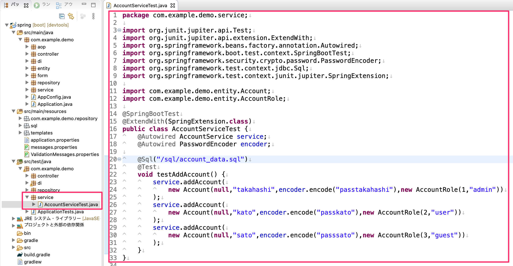

テストを実行して合格する事を確認してください。

- 今回はアサートメソッドを入れていないので、登録処理が正常に完了したら合格します。

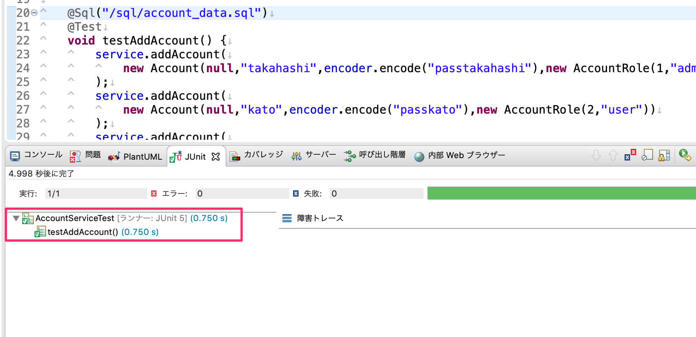

psqlなどDBを操作するツールを使いaccountテーブルにレコードが追加されていることを確認してください。

- パスワード情報がエンコードされていることも確認してください。


## 認証・認可機能の実装

続いて、DBに登録したユーザアカウント情報にて認証・認可を実装していきます。

### 処理の流れ

ログイン画面から認証を行い、認証成功したらメニュー画面へ遷移する流れは下図のようになります。

- ユーザはControllerから提供されるログイン画面にてユーザとパスワードを入力してSpring Security本体に認証依頼を行います。
- Spring Security本体は送られたユーザ名を使って`AccountUserDetailsService`の`loadUserByUserName`メソッドを呼び出してユーザ名の情報取得の依頼をします。
- `AccountUserDetailsService`は`AccountRepository`の`selectByUserName`を呼び出して該当するユーザ名のレコードを取得処理を行います。
- 該当するユーザ名のユーザアカウントが取得できた場合は、`AccountUserDetailsService`は`Account`のEntityからSpring Security本体で認証ができる`AccountUserDetails`に変換します。
- `AccountUserDetailsService`からSpring Security本体に`AccountUserDetails`を戻し、Spring Securityは認証を行います。
- 認証に成功するとSpring Security本体はユーザアカウント情報をセッションに格納してログイン成功後の画面（今回はメニュー画面）に遷移するようリダイレクト要求を出します。
- ユーザはメニュー画面に遷移します。

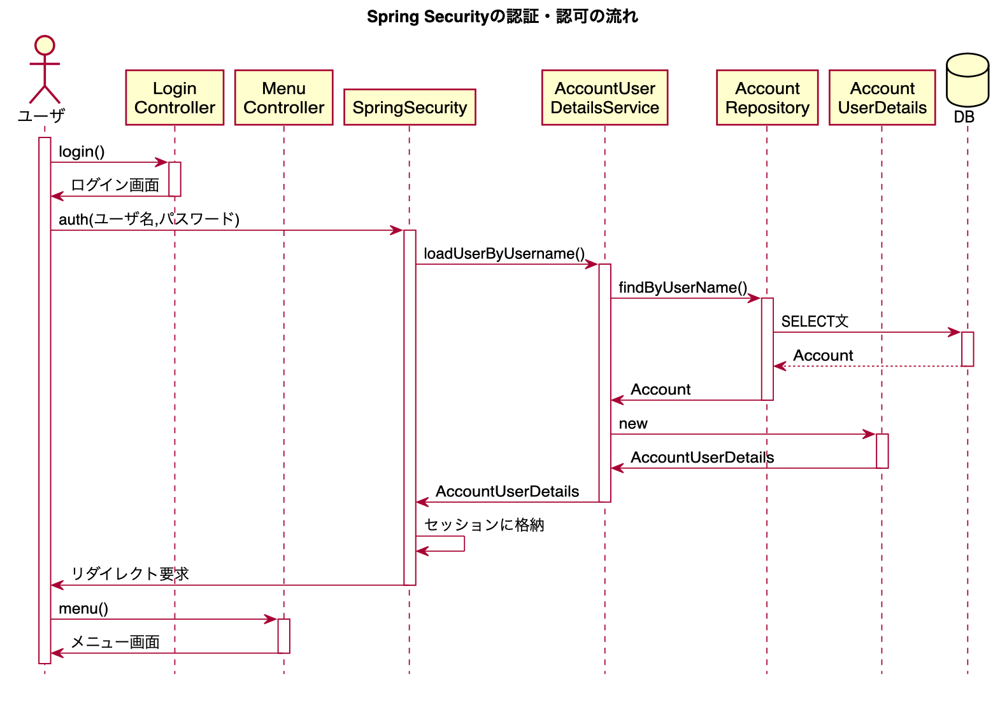

[このシーケンス図のplantumlはこちら](img/spring-security-sequence-plantuml.png)

### AccountReposirotyの更新

ユーザ名からユーザ情報をDBから取得できるように`AccountRepository.java`インターフェースと`AccountRepository.xml`のMapperXMLを更新します。

_(src/main/java)com.example.demo.repository.AccountRepository.java_

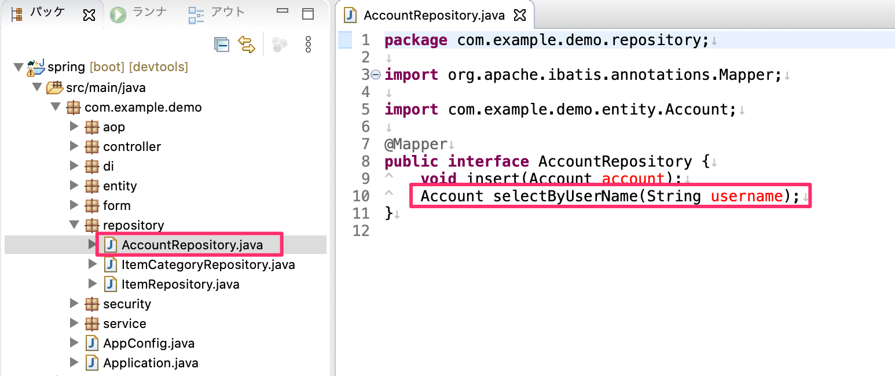

_src/main/resource/com/example/demo/repository/AccountRepository.xml_

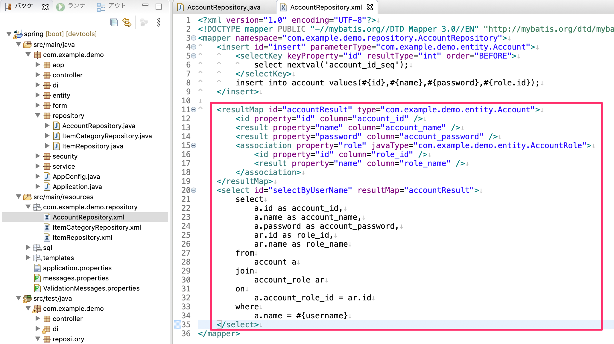

### UserDetailssインターフェース実装クラスの実装

DBから`AccountRepository`で取得した`Account`インスタンスをSpring Security本体で認証できるように`UserDetails`インターフェースを実装した`AccountUserDetails`クラスに変換するためのクラスを実装します。

- ユーザアカウント情報を保持するための`Account`のフィールドを追加します。
- ユーザアカウント権限を保持するための`Collection<GrantedAuthority>`のフィールドを追加します。
- インスタンス生成時にフィールドの値を初期化するための引数付きコンストラクタを定義します。
- `UserDetails`インターフェースを実装することによりオーバーライドしないといけない次のメソッドを定義します。
  - `getAuthorities`メソッド
    - ユーザアカウント権限情報を戻します。
  - `getPassword`メソッド
    - ユーザアカウントのパスワードを戻します。
  - `getUsername`メソッド
    - ユーザアカウントのユーザ名を戻します。
  - `isAccountNotExpired`メソッド
    - アカウント自体の有効期限を今回は無効にするので戻り値を`true`にしています。
  - `isAccountNotLocked`メソッド
    - 認証時のアカウントロックを今回は無効にするので戻り値を`true`にしています。
  - `isConfidentialsNotExpired`メソッド
    - 認証時の有効期限を今回は無効にするので戻り値を`true`にしています。
  - `isEnabled`メソッド
    - アカウントを有効にするため戻り値を`true`にしています。

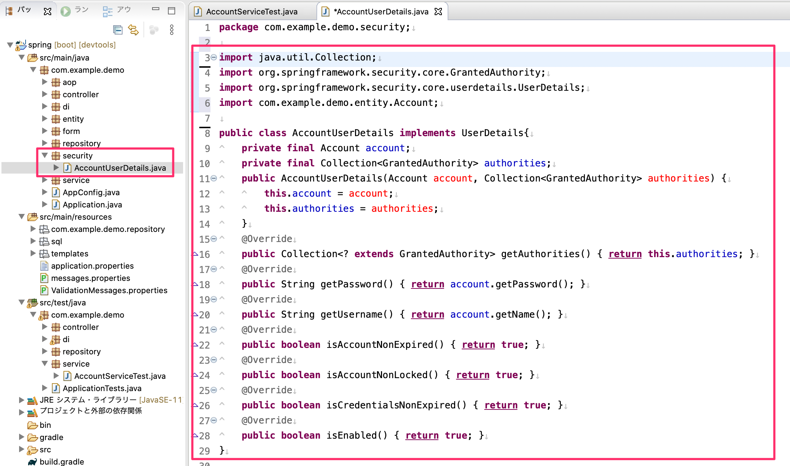

### UserDetailsServiceインターフェース実装クラスの実装

Spring Security本体から呼ばれ、`AccountRepository`にて`Account`インスタンスを受け取り、`AccountUserDetails`インスタンスに変換させるサービスクラス`AccountUserDetailsService`クラスを実装します。

- `AccountRepository`インターフェースのフィールドを用意してDIします。
- `getAuthorise`のprivateなメソッドを定義します。
  - `AccountUserDetails`をインスタンス化するための権限情報`authorities`をDBからの権限情報をもとにセットするためです。
  - その中で`Account`の中の`AccountRole`の権限名を`switch-case`文で条件分岐して`AuthrityUtils`の`createAuthorityList`のスタティックメソッドを使ってSpring Securityが認識できる権限に変換しています。

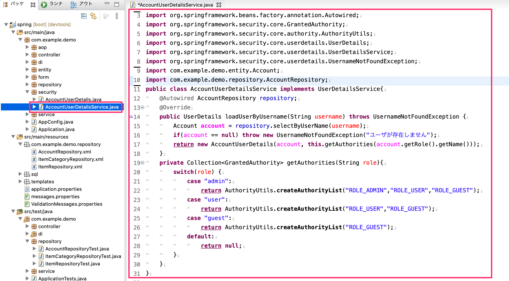

### SecurityConfigクラスの実装

Spring Security本体の設定を行う`SeruciryConfig`クラスを実装します。

- `com.example.demo.seruciry`パッケージに`SeruciryConfig.java`クラスを作成します。
- クラス部分には`@EnableWebSecurity`アノテーションを付与します。
- `WebSecurityConfigreAdapter`クラスを継承します。
- `AccountUserDetails`インスタンスを取得するために`AccountUserDetailsService`のフィールドを宣言しDIでインジェクションします。
- 画面から入力されたパスワードをエンコードするための`PasswordEncoder`フィールドを宣言しDIでインジェクションします。
- `@Autowired`を付与した`configreAuthenticateManager`メソッドを実装します。
  - これによりSpring Boot起動時にこのメソッドが実行されます。
  - 継承している`WebSecurityConfigreAdapter`の`auth`フィールドの`userDetailsService`メソッドと、`passwordEncoder`メソッドを使い、今回Spring Securityの認証時に使うサービスとパスワードエンコーダーを登録しています。
- `configure(WebSecurity web)`メソッドをオーバーライドして認証を無視するURLを指定しています。
  - 画像やcssファイルなどのファイルは認証対象にしないよう今回は`/public`配下のファイルを対象外にしています。
- `configure(HttpSecurity web)`メソッドをオーバーライドして認証のルールや、ログイン画面、ログアウト画面のルールを設定しています。

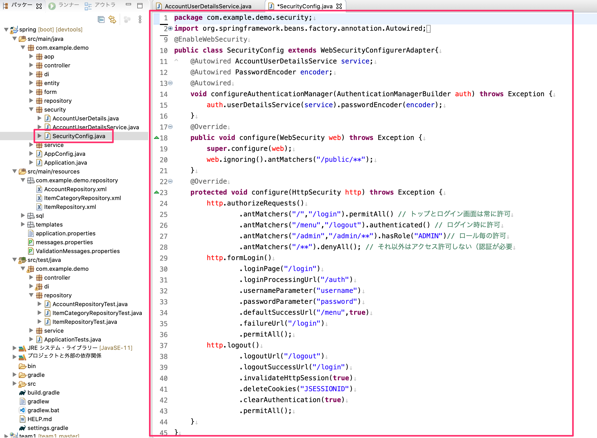

### コントローラーの実装

Spring Security本体にユーザ名とパスワードを送るためのログイン画面と、認証後のメニュー画面を表示させるためのコントローラーを作成します。

_com.example.demo.controller.LoginController.java_

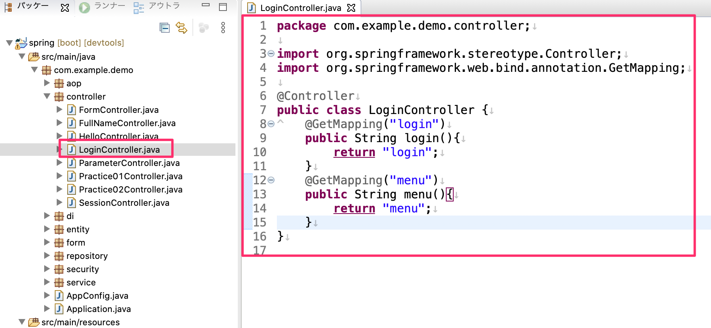

### Viewの実装

#### ログイン画面の作成

ログイン画面のViewを作成します。

- 認証失敗時のエラーメッセージを表示するために`th:if`を使ってセッションに`SPRING_SECURITY_LAST_EXCEPTION`がnullか確認しnullでない場合は`th:text`にてセッションの`SPRING_SECURITY_LAST_EXCEPTION`のキーの内容のメッセージを出力するようにしています。
- `form`タグのaction属性は`th:action`にしてSpring Securityの認証URLにPOSTで送信しています。
  - `th:action`によりCSRF対策のトークンが生成されます。
    - CSRF対策のトークンが生成されないとSpring Securityで認証しません。

_src/main/resources/templates/login.html_

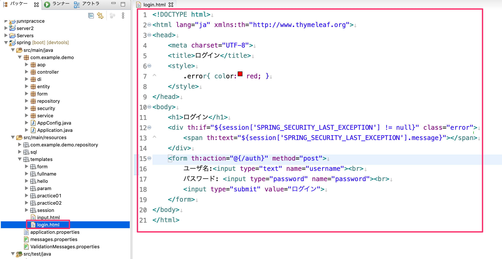

#### メニュー画面の作成

- `html`タグの箇所にThymeleaf対応させるための`xmlnns:th`属性に加え、`xmlns:sec`属性も追加します。
  - `xmlns:sec`属性はSpring Security関連のThymeleaf属性を追加するための設定です。
- `div`タグの`sec:authorize="isAuthenticated"`を指定することにより認証済みの場合に子要素を表示させる動作になります。
- `sec:authentication="principal.username"`にて認証しているユーザ名を出力できます。
- `sec:authorize="hasRole('GUEST')"`などの指定によりユーザアカウント権限毎にHTML要素を出し分ける事ができます。
- ログアウトボタンは`form`タグでPOST通信で`th:action="@{/logout}"`でSpring Securityに送信しログアウトできます。
  - `th:action`にてform送信先を指定しないとCSRFトークンが生成されないのでログアウト処理が正常にいきません。

_src/main/resources/templates/menu.html_

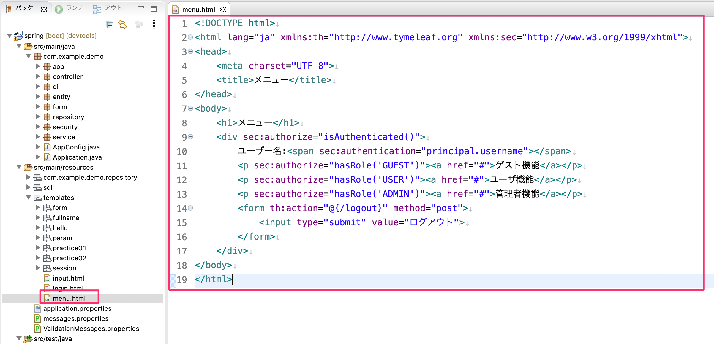

### ログイン認証時のエラーメッセージの定義

ログイン画面で認証失敗時のエラーメッセージはデフォルトは英語なので、日本語に変更したい場合には下図のように`messages.properties`に追加する必要があります。

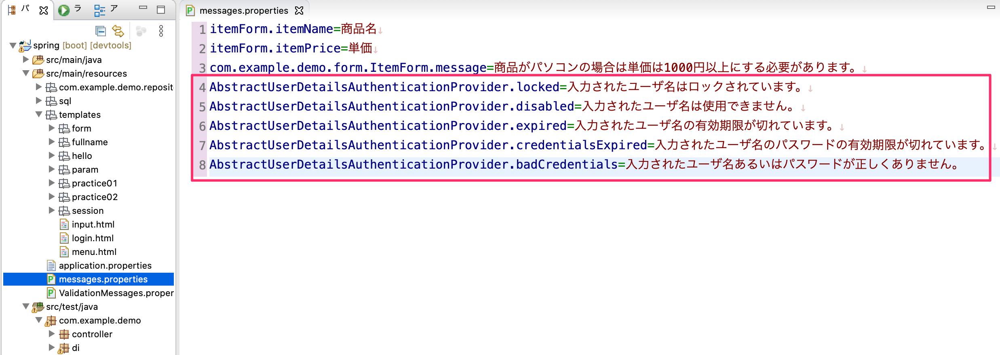

_(src/main/resources)messages.properties_

```properties
AbstractUserDetailsAuthenticationProvider.locked=入力されたユーザ名はロックされています。
AbstractUserDetailsAuthenticationProvider.disabled=入力されたユーザ名は使用できません。
AbstractUserDetailsAuthenticationProvider.expired=入力されたユーザ名の有効期限が切れています。
AbstractUserDetailsAuthenticationProvider.credentialsExpired=入力されたユーザ名のパスワードの有効期限が切れています。
AbstractUserDetailsAuthenticationProvider.badCredentials=入力されたユーザ名あるいはパスワードが正しくありません。
```

### 動作確認

それではログイン画面にアクセスして認証・認可機能が動作するか確認します。

- **AccountServiceTest.java**を実行して暗号化されたパスワードでユーザを登録している状態にしておいてください。

_ログイン画面_


_メニュー画面（権限がadminの場合）_

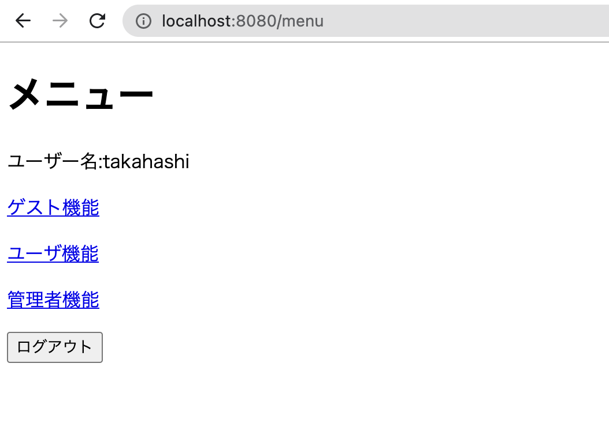

_メニュー画面（権限がuserの場合）_

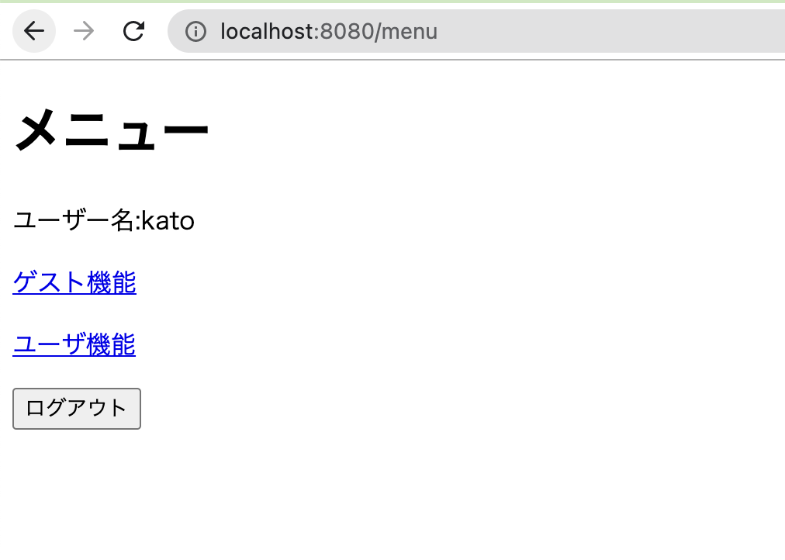

_メニュー画面（権限がguestの場合）_

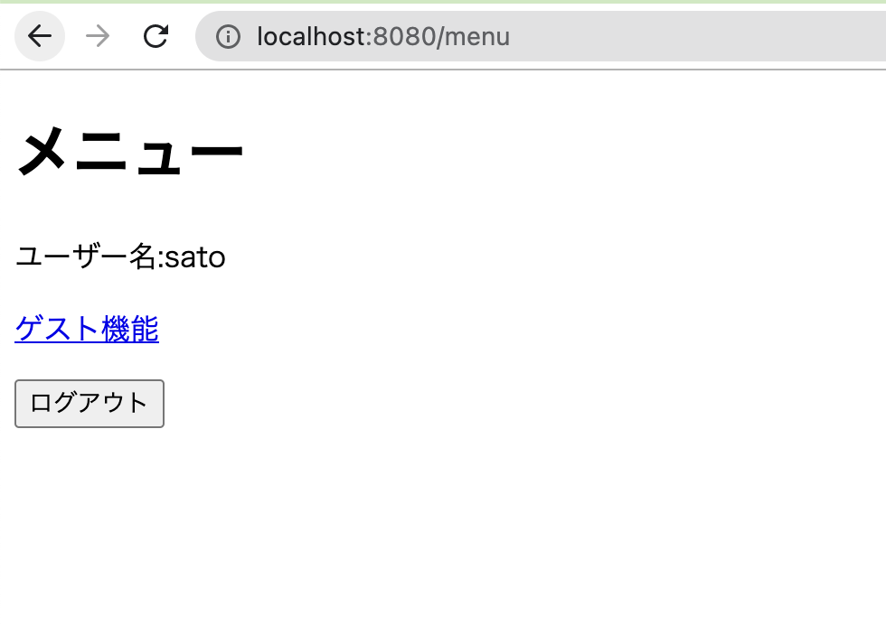