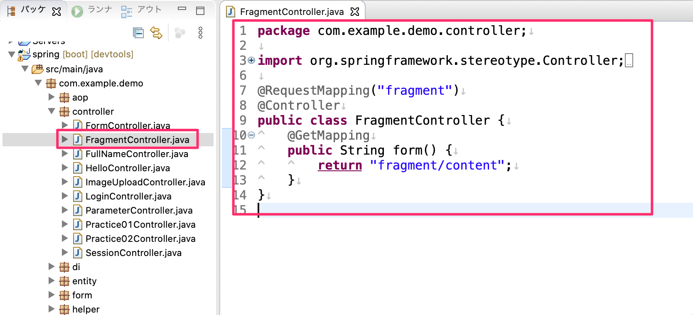
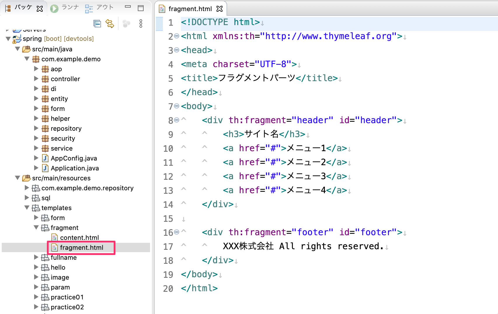
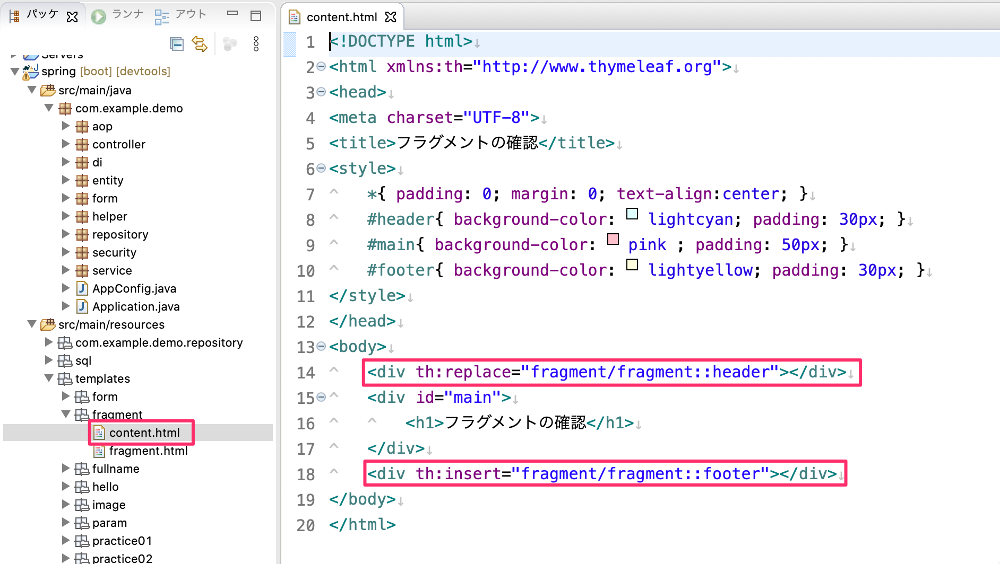
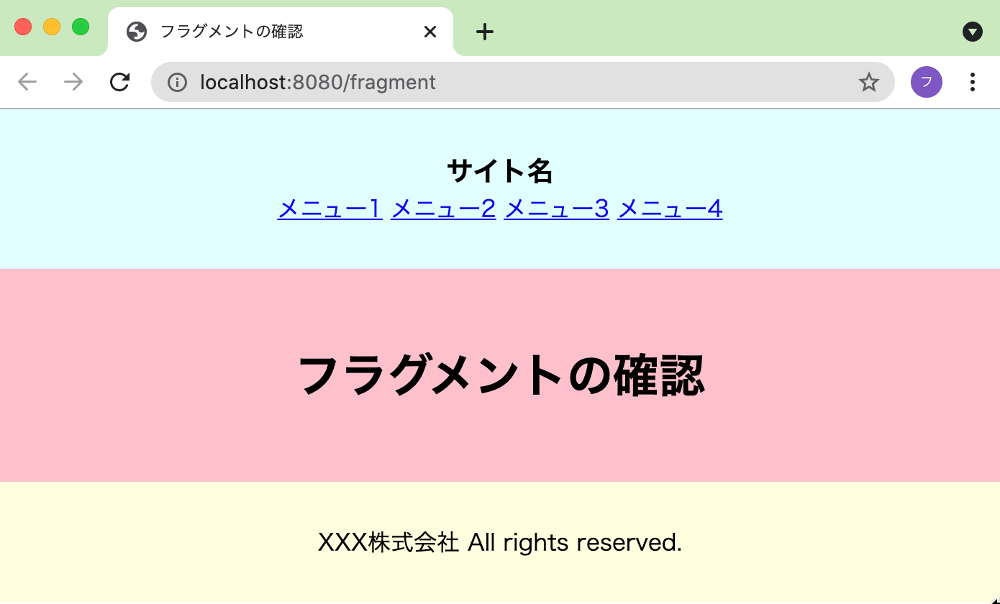

# ThymeleafでHTMLをパーツに分解して利用する

Thymeleafを使ってHTMLをパーツに分解して利用する方法を確認していきます。

## コントローラーの作成

`FragmentController`クラスを作成して下図のようにハンドラメソッドを追加してください。

## Viewの作成

`FragmentController`のハンドラメソッドを呼び出すときに呼ばれるビューをパーツに分解して表示していきます。

### フラグメント（読み込まれる側）の作成

まず、読み込まれる側のフラグメントを作成します。
- `tempaltes`フォルダの中に`fragment`フォルダを作成してその中に`fragment.html`を作成します。
  - `fragment.html`の中に2つのフラグメント（HTMLパーツ）を作成しています。
    - `th:fragment:="header"`の属性をもつ`div`タグの部分
      - ヘッダー部分のHTMLのパーツ
    - `th:fragment:="footer"`の属性をもつ`div`タグの部分
      - フッター部分のHTMLのパーツ
- このようにフラグメントは一つのHTMLファイルの中に複数のフラグメント（HTMLのパーツ）を定義することができます。

### 読み込む側のViewの作成

次に、フラグメントの`fragment.html`を読み込むHTLMファイルを作成します。
- `tempaltes/fragment`フォルダの中に`content.html`を作成します。
  - `content.html`にはフラグメントを読み込む指定をしています。
    - `th:replace="fragment/fragment::header"`の属性をもつ`div`タグ
      - `th:replace`は指定しているタグをフラグメントのタグに置換して読み込みます。
      - `fragment/fragment::header`は「fragmentフォルダのfragment.htmlの中のheaderというフラグメント」という意味です。
    - `th:insert="fragment/fragment::footer"`の属性をもつ`div`タグ
      - `th:insert`は指定しているタグの中にフラグメントのタグに挿入するかたちで読み込みます。
      - `fragment/fragment::footer`は「fragmentフォルダのfragment.htmlの中のfooterというフラグメント」という意味です。

### 動作確認

それでは動作確認をしましょう。`http://localhost:8080/fragment`にアクセスして下図の表示になっている事を確認してください。

